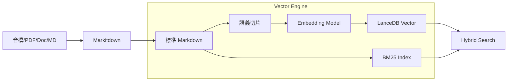

# 07 — 知識庫 (KM) 與 AI 長期記憶 (LTM) 架構設計

## 設計理念：智能助理，深度記憶

open333CRM 的 AI 核心不僅是提供建議回覆，其目標是成為具備「集團知識」與「個人記憶」的客服助理：
- **混合檢索 (Hybrid Search)**：結合 LanceDB (語意) 與 BM25 (關鍵字)，確保搜尋準確度。
- **長期記憶 (LTM)**：基於「似曾相識」觸發機制，自動喚醒與特定聯繫人的歷史對話背景。
- **多模態轉換 (Markitdown)**：自動將音檔、PDF、Docx 轉換為標準 Markdown，實現自動化入庫。

---

## 知識庫 (KM) 技術棧

### 儲存與檢索層
- **向量資料庫**：**LanceDB** (檔案型、Serverless)，部署於實例的專屬 Workspace。
- **混合搜尋**：LanceDB Native Vector Search + BM25 關鍵字搜尋，解決專業術語匹配問題。
- **Embedding 抽象層**：支援本地 `BGE-M3` (隱私/免費) 與雲端 `Gemini Embedding 2` / `OpenAI` (高精確度)。

### 知識多態管理 (Versioning & Namespacing)
1. **併存機制**：不同版本的產品知識 (如 冷氣 v1 vs v2) 採併存策略，而非覆蓋。
2. **Metadata 過濾**：
   - 搜尋時自動從 `Contact.attributes` 撈出型號等標籤作為 Filter。
   - 範例：`WHERE version = '2024_pro' AND teamId = 'service_dept'`
3. **部門隔離 (Namespacing)**：
   - **Global (公用)**：全集團共享文章。
   - **Team-specific (專屬)**：維修部技術手冊或銷售部底價表，僅特定 Team 權限可檢索。

---

## 長期記憶 (Long-Term Memory, LTM)

### 觸發機制：似曾相識 (On-demand Retrieval)
系統不預先載入所有歷史（節省 Token），而是採取相似度觸發機制：

```ascii
[ 新訊息進來 ]
      │
      ▼
1. 向量檢索分析 (Vector Score)
      │
      ├─ Score < 0.82 ──▶ [ 純 KM 文章建議 ] (新情境回答)
      │
      └─ Score >= 0.82 ─▶ [ 觸發長期記憶 ] (舊事重提)
                               │
                               ▼
                [ 檢索該 Contact 過去對話摘要 ] ──▶ [ 綜合建議回覆 ]
```

---

## 知識入庫流程 (Ingestion Canvas)



---

## 實作細節與設定

### 1. 部門與權限範例
| 知識類型 | 儲存路徑 | 權限邊界 |
|------|------|------|
| 通用問答 | `/workspace/km/global` | 全集團可讀 |
| 維修手冊 | `/workspace/km/repair` | `teamId: repair_dept` |
| 內部話術 | `/workspace/km/sales` | `teamId: sales_dept` |

### 2. 多模型 Provider 設定
```typescript
interface BrainConfig {
  embedding: {
    provider: 'local_ollama' | 'gemini' | 'openai';
    model: string; // 'bge-m3' | 'text-embedding-004'
  };
  search: {
    hybrid: boolean;
    topK: number;
    thresholdLTM: number; // 預設 0.82，觸發長期記憶
  };
}
```

---

## 成本與隱私控制

1. **Local-First**：針對敏感文件（如內部電路圖），可強制定向至本地 BGE-M3 模型處理，永不傳遞至雲端。
2. **摘要快取**：對話歷史會被非同步摘要化並存儲向量，減少每次讀取長文本的成本。
3. **Token Quota**：計費系統會根據 License 剩餘額度，自動在 Gemini 與本地模型間切換（Automatic Fallback）。
