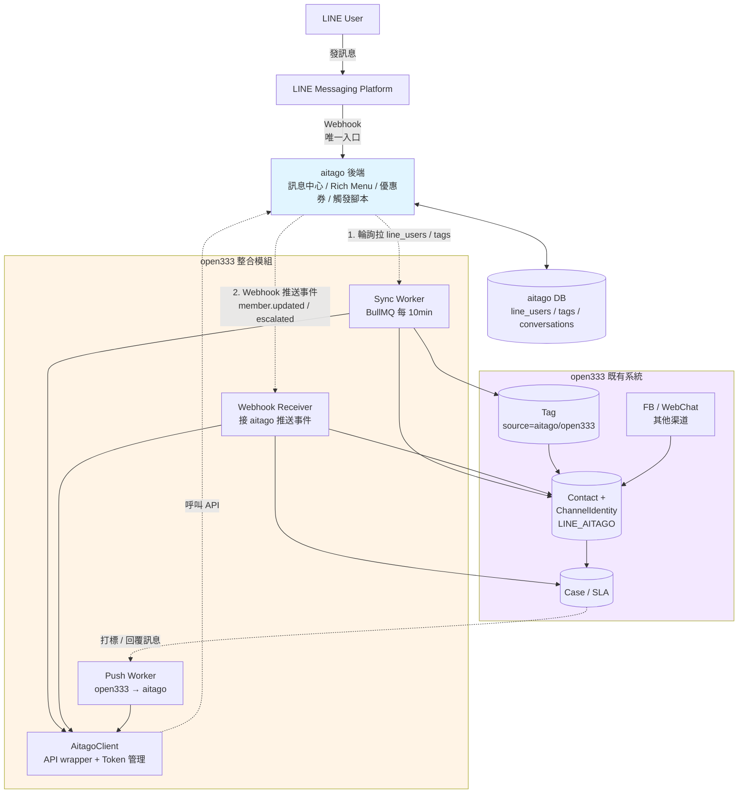
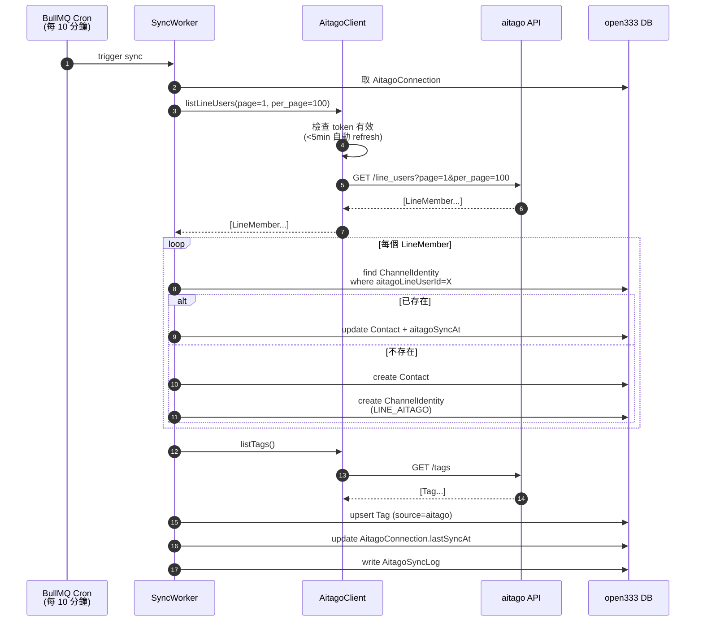
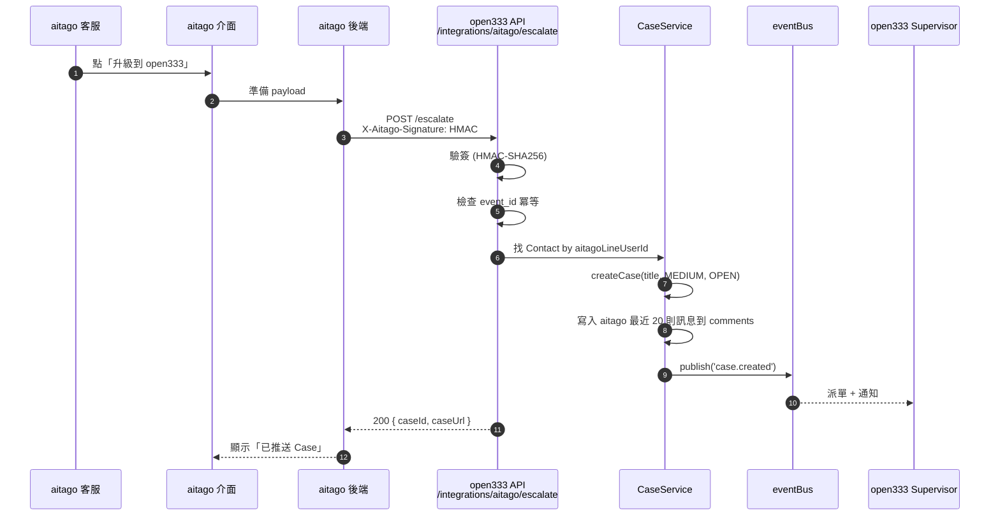
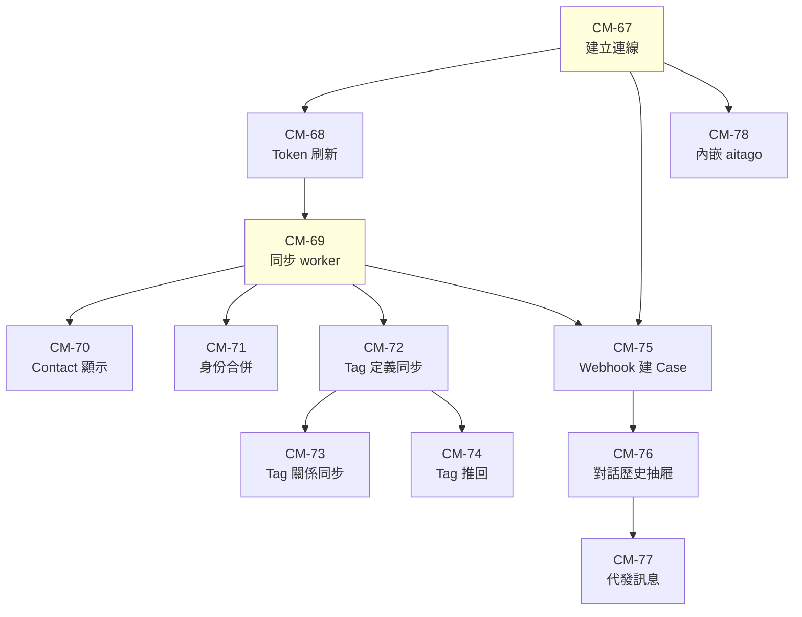

# 24. aitago 整合規格（淺整合）

> **版本**：v1.0 草案
> **日期**：2026-04-20
> **狀態**：規劃中
> **適用範圍**：open333 v1.2（整合 Phase）

---

## 1. 背景

### 1.1 兩個系統現況

| 面向 | aitago（既有）| open333（本專案）|
|---|---|---|
| 定位 | LINE OA 行銷中心 | 跨渠道客服中心 |
| 技術棧 | Vue 3 + Laravel（推測）| Next.js + Fastify + Prisma |
| LINE 整合 | ✅ 成熟（Rich Menu、優惠券、觸發腳本、關鍵字回覆）| ✅ 基礎（Webhook、發訊息、Flex）|
| 其他渠道 | ❌ 僅 LINE | ✅ FB、WebChat、（Email 規劃中）|
| Case / SLA / 團隊 | ❌ 無 | ✅ 有 |
| 訊息中心 | ✅ 已有 | ✅ 收件匣 |
| 會員 / 標籤 | ✅ 已有 | ✅ Contact / Tag |
| 短連結 | ✅ 已有 | ✅ Phase 17 |
| 分析報表 | ✅ 已有 | ✅ Phase 11 |

### 1.2 為何採「淺整合」

- **避免重複造輪子**：兩邊都做完的功能（訊息中心、會員、短連結）不合併，各自獨立運作
- **不動 LINE Webhook**：一個系統專心收 LINE，避免訊息去重與狀態同步災難
- **最小可行整合**：先把**會員資料**打通，其他功能視需求再擴展
- **保留 aitago 既有客戶的使用習慣**：客戶繼續在 aitago 操作 LINE，open333 補客服 + 其他渠道

### 1.3 整合目標（優先序）

| 優先 | 目標 | 說明 |
|---|---|---|
| P0 | 會員資料共享 | aitago 的 LINE 會員能被 open333 識別為 Contact |
| P0 | 跨系統身份識別 | 同一個 LINE User 在兩邊系統被視為同一人 |
| P1 | Tag 同步 | 任一邊打的標籤，另一邊能看到 |
| P2 | 對話透傳 | open333 能看到 LINE 對話歷史（唯讀或代發）|
| P2 | 客服升級通知 | aitago 偵測需人工介入 → open333 開 Case |
| P3 | Rich Menu / 優惠券連結 | open333 透過 iframe 嵌入 aitago 管理介面 |

---

## 2. aitago API 盤點

**Base URL**：`https://feature-line-crm.aitago.tw/api`（Feature）、正式需確認

**認證**：Bearer Token（`POST /token` 取得、`POST /token/refresh` 刷新、`POST /token/revoke` 撤銷）

**總 104 個端點**，關鍵模組：

### 2.1 會員相關（`line_users`）

| Method | Path | 用途 |
|---|---|---|
| GET | `/line_users` | 列表（分頁）|
| GET | `/line_users/{id}` | 單筆詳情 |
| PUT | `/line_users/{id}` | 更新（email / phone）|
| GET | `/line_users/export` | 匯出 |
| GET | `/line_users/check_binding_status` | 檢查綁定狀態 |
| PUT | `/line_users/tagging_tag` | 單一會員貼標 |
| POST | `/line_users/batch_tagging_tag` | 批次貼標 |
| GET | `/line_users/profile/{lineUserId}` | 取得補登資料 |
| PUT | `/line_users/profile/{lineUserId}` | 更新補登資料 |

**LineMember schema**：
```
id, display_id, line_user_id, name, picture_url,
status_message, orig_lang, email, phone, phone_country_code,
last_msg_at, unfollow_at, reward_points,
created_at, updated_at
```

### 2.2 標籤（`tags`）

| Method | Path | 用途 |
|---|---|---|
| GET / POST | `/tags` | 列表 / 新增 |
| GET / DELETE | `/tags/{id}` | 查詢 / 刪除 |
| POST | `/tags/bulk` | 批次新增 |
| GET | `/tags/exists` | 存在檢查 |

### 2.3 對話（`conversations` / `messages`）

| Method | Path | 用途 |
|---|---|---|
| GET | `/conversations` | 對話列表 |
| GET | `/conversations/by-user/{user_id}` | 依 LINE user 找對話 |
| PATCH | `/conversations/{id}` | 更新狀態 / 指派 |
| GET / POST | `/conversations/{id}/messages` | 訊息記錄 / 發送訊息 |
| GET | `/conversations/{id}/export` | 匯出對話 |

### 2.4 其他

- `audiences` — 受眾分群
- `coupons` — 優惠券 + 核銷
- `rich_menus` — 圖文選單
- `short_urls` — 短連結
- `campaigns` — 行銷活動
- `marketing_scripts` — 觸發腳本
- `keywords` — 關鍵字回覆
- `tenant_settings` — 租戶設定
- `metrics` — 指標
- `POST /line/webhook` — LINE Webhook（aitago 自己的接收端點）

---

## 3. 整合架構

### 3.1 系統整體圖



### 3.2 會員同步序列圖



### 3.3 客服升級序列圖（CM-75）



### 3.4 資料流（文字版）

```
┌─────────────────────────────────────────────────────────────────┐
│  LINE User 傳訊息                                                │
└──────────────────────┬──────────────────────────────────────────┘
                       │
                       ▼
┌─────────────────────────────────────────────────────────────────┐
│  LINE Messaging Platform                                         │
│  Webhook URL → https://aitago.tw/line/webhook（唯一入口）        │
└──────────────────────┬──────────────────────────────────────────┘
                       │
                       ▼
┌─────────────────────────────────────────────────────────────────┐
│  aitago 後端                                                     │
│  - 訊息落庫                                                      │
│  - 關鍵字比對 / Rich Menu / 自動回覆                            │
│  - 觸發腳本                                                      │
│  - 客服介面顯示                                                  │
└──────┬───────────────────────────────────────┬──────────────────┘
       │                                       │
       │ 輪詢拉取 line_users / tags           │ webhook 推送事件
       │ （open333 主動）                      │ （aitago → open333）
       ▼                                       ▼
┌─────────────────────────────────────────────────────────────────┐
│  open333 aitago Sync Module                                      │
│  - AitagoClient (aitago API wrapper)                             │
│  - SyncWorker (每 10min 拉會員 + tag)                            │
│  - WebhookReceiver（接 aitago 推來的事件）                       │
│  - upsert Contact / ChannelIdentity / Tag                        │
└──────┬──────────────────────────────────────────────────────────┘
       │
       ▼
┌─────────────────────────────────────────────────────────────────┐
│  open333 既有 Contact / Tag / Case / Conversation               │
│  LINE 身份以 ChannelType='LINE_AITAGO' 區分                      │
│  FB / WebChat 仍走 open333 自己的渠道                            │
└─────────────────────────────────────────────────────────────────┘
```

### 3.2 同步方向

| 資料 | aitago → open333 | open333 → aitago |
|---|---|---|
| 會員基本資料 | ✅ 拉取（主）| ❌ 不推回 |
| Tag 定義（master）| ✅ 拉取 | ❌ 僅查詢 |
| 會員打標關係 | ✅ 拉取 | ✅ 推送（open333 打標時）|
| 訊息歷史 | ✅ 唯讀拉取（P2）| ❌ |
| 發送訊息 | ❌ | ✅ 代 aitago 發送（P2）|
| Case | ❌ | ❌ aitago 不知道 Case |
| 短連結 / 分析 | ❌ | ❌ 各自獨立 |

### 3.3 身份識別規則

- **主鍵**：`aitago.line_user_id`（LINE User ID）
- open333 的 `ChannelIdentity` 新增 channelType：`LINE_AITAGO`
  - 與既有 `LINE`（open333 自己綁的）區隔
- Contact 以 `tenantId + externalId` 對應 aitago 的 `line_user_id`

---

## 4. Open333 資料模型擴充

### 4.1 新增 Channel 類型

```prisma
enum ChannelType {
  LINE          // open333 自己接 LINE Webhook
  LINE_AITAGO   // 透過 aitago 整合的 LINE ← 新增
  FB
  WEBCHAT
}
```

### 4.2 新增 AitagoConnection 模型

```prisma
model AitagoConnection {
  id            String   @id @default(uuid())
  tenantId      String
  name          String
  apiBaseUrl    String   // https://feature-line-crm.aitago.tw/api
  clientId      String
  clientSecret  String   // 加密儲存
  accessToken   String?  // 快取的 token
  tokenExpireAt DateTime?
  webhookSecret String?  // 接收 aitago 推送事件的簽章密鑰
  lastSyncAt    DateTime?
  syncStatus    String   // idle / syncing / error
  syncError     String?
  isActive      Boolean  @default(true)
  createdAt     DateTime @default(now())
  updatedAt     DateTime @updatedAt

  @@unique([tenantId, apiBaseUrl])
  @@map("aitago_connections")
}
```

### 4.3 擴充 ChannelIdentity

```prisma
model ChannelIdentity {
  // 既有欄位...
  aitagoLineUserId  String?   // aitago 的 line_user_id
  aitagoMemberId    Int?      // aitago 的 internal id
  aitagoSyncAt      DateTime? // 上次從 aitago 同步時間
  aitagoRaw         Json?     // 保留 aitago 原始 payload
}
```

### 4.4 擴充 Tag

```prisma
model Tag {
  // 既有欄位...
  aitagoTagId   Int?      // aitago 的 tag id（若來自 aitago）
  source        String    @default("open333")  // open333 | aitago
}
```

---

## 5. User Stories

### Epic：EP-AITAGO-SYNC — aitago 整合（淺整合）

**身為** aitago 與 open333 的雙系統使用者，
**我希望** 兩個系統的 LINE 會員資料互通、Tag 同步、必要時能互相轉介客服，
**這樣** 我不用重複維護會員資料，LINE 行銷繼續用 aitago，但能在 open333 統一看到跨渠道客戶全貌。

---

### 5.1 P0：連線設定與認證

#### CM-67：系統管理員建立 aitago 連線

**身為** ADMIN
**我希望** 在 open333 設定頁建立一個 aitago 連線
**這樣** 系統就能定期與 aitago 同步資料

**驗收條件**
- [ ] `/dashboard/settings/integrations/aitago` 頁面顯示連線設定
- [ ] 可填入 API Base URL、Client ID、Client Secret、Webhook Secret
- [ ] 點「測試連線」按鈕呼叫 `POST /token` 取 token 並呼叫一次 `GET /line_users?per_page=1` 驗證
- [ ] 連線成功顯示綠色狀態、失敗顯示錯誤原因
- [ ] Client Secret 存入 DB 前以 AES-256 加密
- [ ] UI 不回顯 Secret 明文（只顯示最後 4 碼）

**技術細節**
- 後端新增 `apps/api/src/modules/aitago/`
- `AitagoConnection` CRUD + 加密 helper
- Axios instance 帶自動刷新 token 機制（401 時自動 refresh）

---

#### CM-68：系統自動刷新 aitago Token

**身為** open333 後端
**我希望** Token 過期前自動刷新
**這樣** 同步工作不會因 token 失效中斷

**驗收條件**
- [ ] Token 剩餘 < 5 分鐘時自動 `POST /token/refresh`
- [ ] Refresh 失敗退回 `POST /token` 重新登入
- [ ] 連續 3 次失敗標記 `syncStatus='error'` 並通知 ADMIN（notify）

---

### 5.2 P0：會員同步（主軸）

#### CM-69：排程任務自動拉 aitago 會員

**身為** open333 系統
**我希望** 每 10 分鐘自動從 aitago 拉會員資料並同步到 Contact
**這樣** open333 看到的 LINE 會員與 aitago 一致（最多延遲 10 分鐘）

**驗收條件**
- [ ] 背景 worker 每 10 分鐘呼叫 `GET /line_users?page=1&per_page=100`
- [ ] 分頁完整拉完（follow `pagination.next`）
- [ ] 每筆 `line_user` upsert：
  - 找 `ChannelIdentity` where `aitagoLineUserId = line_user_id`
  - 存在 → 更新 Contact（name、phone、email、picture）+ `aitagoSyncAt`
  - 不存在 → 新建 Contact + 新建 ChannelIdentity（channelType=`LINE_AITAGO`）
- [ ] 失敗的單筆記入 `AitagoSyncLog` 表（不中斷整批）
- [ ] `AitagoConnection.lastSyncAt` 更新
- [ ] 同步數量記入 metrics（成功/失敗/新建/更新）
- [ ] 可手動觸發同步（設定頁「立即同步」按鈕）

**技術細節**
- `apps/workers/src/aitago-sync.worker.ts`（BullMQ 定時 job）
- `AitagoClient.listLineUsers({ page, perPage })`
- 使用 `incremental` 模式：帶 `updated_at > lastSyncAt` 減少拉取量（若 aitago 支援）

---

#### CM-70：單一會員詳情即時查詢

**身為** 客服人員
**我希望** 在 open333 Contact 詳情頁看到 aitago 的最新資料（點數、最後訊息時間）
**這樣** 我不用切 aitago 也能掌握會員動態

**驗收條件**
- [ ] Contact 詳情頁若有 `channelType=LINE_AITAGO` 的 identity，顯示「aitago 資料」區塊
- [ ] 區塊顯示：reward_points、last_msg_at、unfollow_at、orig_lang
- [ ] 點「查看 aitago 原頁」按鈕跳到 aitago 該會員頁面（新分頁）
- [ ] 「即時同步」按鈕呼叫 `GET /line_users/{id}` 更新單筆
- [ ] aitago API 錯誤時顯示 fallback「無法取得即時資料，顯示 XX 分鐘前同步結果」

---

#### CM-71：跨渠道身份合併

**身為** 客服人員
**我希望** 一個 LINE 會員（透過 aitago 同步進來）能跟 open333 裡已經有的 FB / WebChat 聯絡人合併
**這樣** 客戶在 LINE 和 FB 用同手機號註冊時，我看到的是同一人

**驗收條件**
- [ ] Contact 列表若偵測到相同 email / phone 出現在兩個 Contact，顯示「可能重複」badge
- [ ] 合併時 aitago LINE identity 保留在 primary，secondary archived
- [ ] 合併後新的 LINE 訊息仍正確對應到 primary
- [ ] 合併不影響 aitago 那邊的原始資料

---

### 5.3 P1：Tag 同步

#### CM-72：aitago 的 Tag 同步到 open333

**身為** open333 客服
**我希望** aitago 定義的 Tag 能在 open333 看到並用於篩選
**這樣** 行銷團隊打的標籤，客服也能利用

**驗收條件**
- [ ] 同步 worker 額外拉 `GET /tags`
- [ ] upsert 到 open333 Tag 表（`source='aitago'` + `aitagoTagId`）
- [ ] aitago 刪除的 Tag 在 open333 軟刪除（保留歷史關聯）
- [ ] Tag 名稱衝突時：同 tenantId + 同名 → 視為同一 Tag（不重複）
- [ ] 管理介面顯示 Tag 來源 badge（open333 / aitago）

---

#### CM-73：會員 Tag 關係同步

**身為** open333 客服
**我希望** aitago 幫某會員打的 Tag 能在 open333 Contact 詳情頁看到
**這樣** 我知道這個會員被行銷歸類為什麼客群

**驗收條件**
- [ ] 會員同步時順便同步 `line_user.tags` 關聯
- [ ] upsert 到 `ContactTag`（preserve `source='aitago'`）
- [ ] aitago 移除的 Tag 關聯同步移除
- [ ] open333 自己加的 Tag（`source='open333'`）不會被 aitago 同步覆蓋

---

#### CM-74：open333 打 Tag 推回 aitago

**身為** open333 客服
**我希望** 我在 open333 幫客戶打 Tag 時，aitago 也能看到
**這樣** 行銷團隊能用我標註的屬性做受眾分群

**驗收條件**
- [ ] open333 `POST /contacts/:id/tags` 成功後，若該 Tag 有 `aitagoTagId` 且 Contact 有 `aitagoLineUserId`：
  - 呼叫 aitago `PUT /line_users/tagging_tag`
- [ ] 推送失敗不影響 open333 操作（記 log 後 retry 最多 3 次）
- [ ] aitago 呼叫需要新 Tag 時（open333 端新建但 aitago 沒有）：
  - 先 `POST /tags` 建立 aitago 那邊
  - 再 `PUT tagging_tag`
  - 寫回 `aitagoTagId`

---

### 5.4 P2：對話透傳（客服升級）

#### CM-75：aitago 客服升級推送事件

**身為** aitago 客服
**我希望** 當我判斷某對話需要 open333 團隊（例如涉及案件流程），能一鍵推送過去
**這樣** open333 客服能看到完整前情並接手處理

**驗收條件**
- [ ] aitago 呼叫 open333 webhook：`POST /api/v1/integrations/aitago/escalate`
- [ ] Payload：`{ lineUserId, conversationId, reason, lastMessages[] }`
- [ ] open333 驗證 HMAC-SHA256 簽章（`X-Aitago-Signature` header vs `webhookSecret`）
- [ ] 找到對應 Contact，建立 Case（title=reason、priority=MEDIUM、status=OPEN）
- [ ] 將 aitago 最近 20 則訊息寫入 Case comments（`source='aitago-history'`）
- [ ] 發送 `case.created` 事件，觸發指派流程
- [ ] 回應 aitago：`{ caseId, caseUrl }` 供 aitago 介面顯示「已推送」

---

#### CM-76：open333 讀取 aitago 對話歷史（唯讀）

**身為** open333 客服
**我希望** 在 Case 詳情頁看到 LINE 上的完整對話（不是只有升級時那 20 則）
**這樣** 我能掌握前因後果

**驗收條件**
- [ ] Case 詳情頁有「aitago 對話歷史」側邊抽屜
- [ ] 點開時呼叫 `GET /conversations/by-user/{line_user_id}` 取得 conversationId
- [ ] 再 `GET /conversations/:id/messages?per_page=50` 拉訊息
- [ ] 訊息即時渲染（不落 open333 DB）
- [ ] 抽屜底部「前往 aitago 對話」按鈕（跳轉 aitago 介面）

---

#### CM-77：open333 回覆 LINE（透過 aitago 發送）

**身為** open333 客服
**我希望** 處理 Case 時能直接回 LINE 訊息
**這樣** 我不用切 aitago 介面

**驗收條件**
- [ ] Case 詳情的回覆框偵測 Contact 有 `LINE_AITAGO` identity，顯示「透過 aitago 回覆 LINE」
- [ ] 送出時呼叫 `POST /conversations/:id/messages`
- [ ] 發送成功把該訊息寫入 open333 本地訊息紀錄（與 Case 關聯）
- [ ] 失敗顯示清楚錯誤（token 過期 / aitago API 錯誤 / rate limit）
- [ ] 回覆支援純文字（P2 階段不支援 Flex，避免重複維護）

---

### 5.5 P3：導引到 aitago（UI 整合）

#### CM-78：open333 內嵌 aitago Rich Menu 管理

**身為** 行銷人員
**我希望** 在 open333 行銷頁看到「Rich Menu」分頁，點進去能直接操作 aitago
**這樣** 我不用記兩個網址

**驗收條件**
- [ ] `/dashboard/marketing/rich-menu` 頁面
- [ ] 以 iframe 嵌入 aitago Rich Menu 頁（需 aitago 配合 CORS / X-Frame-Options）
- [ ] 若 aitago 未開啟 iframe 允許：顯示「前往 aitago」按鈕 + aitago 最新 3 個 Rich Menu 的縮圖 + 名稱（透過 `GET /rich_menus` 拉）
- [ ] 同樣模式套用：優惠券（`/coupons`）、觸發腳本（`/marketing_scripts`）

---

## 6. Webhook 事件契約（aitago → open333）

### 6.1 端點

```
POST /api/v1/integrations/aitago/webhooks
Header: X-Aitago-Signature: sha256=<hmac(body, webhookSecret)>
Header: X-Aitago-Event: <event_type>
```

### 6.2 事件類型

| Event | Payload | 觸發 |
|---|---|---|
| `member.updated` | `{ line_user_id, changes }` | 會員資料變更（減少輪詢延遲）|
| `member.tagged` | `{ line_user_id, tag_ids }` | 會員被貼標 |
| `member.untagged` | `{ line_user_id, tag_ids }` | Tag 被移除 |
| `member.unfollowed` | `{ line_user_id }` | 取消追蹤 |
| `conversation.escalated` | `{ line_user_id, conversation_id, reason, last_messages }` | 客服升級請求 |

### 6.3 處理原則

- **冪等**：每個事件帶 `event_id`，open333 記錄已處理過的 ID（24h TTL）
- **錯誤回應**：2xx 代表已受理、5xx 讓 aitago 重試、4xx 請 aitago 停止重試並記錯
- **延遲處理**：事件落 BullMQ queue 後立刻回 202，真正處理在 worker

---

## 7. 非功能需求

### 7.1 效能

- 單次同步批次：100 筆/頁，全量同步 10,000 會員應在 5 分鐘內完成
- aitago API Rate Limit 保守估計 60 req/min，本地端做 token bucket 限流
- 同步過程記憶體佔用 < 200 MB

### 7.2 可靠性

- aitago API 失敗採指數退避重試（1s / 4s / 16s / 64s），最多 4 次
- `AitagoSyncLog` 保留 30 天，可查失敗原因
- 設定頁顯示最近 24 小時同步成功率

### 7.3 安全性

- Client Secret / Webhook Secret 以 AES-256-GCM 加密
- Webhook 必驗 HMAC 簽章
- 呼叫 aitago API 時帶固定 User-Agent：`open333-crm/{version}`
- open333 UI 不顯示 Secret 明文

### 7.4 觀測性

- 每次同步 job 寫入 `AitagoSyncLog`：start/end time、processed/new/updated/failed 計數
- 錯誤落 Sentry（帶 aitago request ID）
- 設定頁儀表板：最近 7 天同步次數、成功率、平均耗時

---

## 8. 錯誤情境與處理

| 情境 | 處理 |
|---|---|
| aitago 401 | 自動 refresh token；連 3 次失敗切 error 狀態 |
| aitago 5xx | 指數退避重試 4 次後放棄 |
| 網路 timeout | 10s timeout，同上重試 |
| 會員重複（同 line_user_id 多筆 Contact）| 挑最早建立的為 primary，其餘建議合併 |
| Tag 衝突（同名不同 aitagoTagId）| 合併為同一 Tag，記錄所有 aitagoTagId |
| Webhook 簽章驗證失敗 | 401 回應、不重試 |
| Webhook 重複事件 | 以 event_id 冪等，直接回 200 |

---

## 9. 實作拆分與開工順序

### 9.1 Jira 結構

- **Epic**：CM-66 [EP-AITAGO] aitago 整合（淺整合）
- **父單（功能協調單）**：CM-67 ~ CM-78（12 張，全部 assignee=Daniel）
- **子單（實作單）**：CM-79 ~ CM-100（22 張 BE / FE / QA）

### 9.2 父單 × 子單 總覽

| 父單 | 功能 | BE 子單 | FE 子單 | QA 子單 |
|---|---|---|---|---|
| CM-67 | 建立連線 | CM-79 @劉柏毅 | CM-80 @johnchen | CM-81 |
| CM-68 | Token 自動刷新 | @劉柏毅 直接實作 | — | CM-82 |
| CM-69 | 同步 worker | @劉柏毅 直接實作 | — | CM-83 |
| CM-70 | Contact 顯示 | CM-84 @劉柏毅 | CM-85 @johnchen | CM-86 |
| CM-71 | 身份合併 | CM-87 @劉柏毅 | CM-88 @johnchen | CM-89 |
| CM-72 | Tag 定義同步 | @劉柏毅 直接實作 | — | CM-90 |
| CM-73 | Tag 關係同步 | @劉柏毅 直接實作 | — | CM-91 |
| CM-74 | Tag 推回 | @劉柏毅 直接實作 | — | CM-92 |
| CM-75 | Webhook 建 Case | @劉柏毅 直接實作 | — | CM-93 |
| CM-76 | 對話歷史抽屜 | CM-94 @劉柏毅 | CM-95 @johnchen | CM-96 |
| CM-77 | 代發訊息 | CM-97 @劉柏毅 | CM-98 @johnchen | CM-99 |
| CM-78 | 內嵌 aitago | — | @johnchen 直接實作 | CM-100 |

**總計**：22-24 人天（含測試、文件）

**人員分配**：
- 劉柏毅（後端）：主擔 12 單位後端工作（7 張直接實作 + 5 張 BE 子單）
- johnchen（前端）：主擔 6 單位前端工作（1 張直接實作 + 5 張 FE 子單）
- QA：12 張子單待指派

### 9.3 依賴關係圖



### 9.4 可驗收階段

不分 Sprint，依依賴完成度分階段驗收：

| 階段 | 完成單 | 可驗收結果 |
|---|---|---|
| 連線可用 | CM-67 + CM-68 | ADMIN 建連線、測試通過、Token 自動刷新 |
| 會員打通 | CM-69 + CM-70 + CM-71 | LINE 會員每 10 分鐘同步、Contact 詳情見 aitago 資料、能合併 |
| Tag 雙向 | CM-72 + CM-73 + CM-74 | Tag 定義與關係雙向同步完成 |
| 客服升級 | CM-75 | aitago 能推 Case 到 open333 |
| 跨系統溝通 | CM-76 + CM-77 | Case 看 LINE 對話、能代發訊息 |
| UI 整合 | CM-78 | Rich Menu / 優惠券入口完成 |

### 9.5 並行機會

- **CM-68 與 CM-69**：CM-67 一完成，劉柏毅可連續做（同一人的工作可平滑銜接）
- **CM-70 / CM-71 / CM-72**：三單都只依賴 CM-69，可同時開工
- **CM-70、CM-71 本身**：BE 子單（CM-84、CM-87）與 FE 子單（CM-85、CM-88）可並行（BE 先把 API 介面定好，FE 即可 mock 資料開始）
- **CM-78**：只依賴 CM-67，可提早做（不必等 CM-69 以後）
- **CM-73、CM-74**：都只依賴 CM-72，可同時開工

### 9.6 關鍵阻塞點

- **CM-67**（建立連線）是整個 Epic 的起點：阻擋 CM-68、CM-75、CM-78
- **CM-69**（會員同步）是會員/Tag/Case 的共同前置：阻擋 CM-70、CM-71、CM-72、CM-75
- **建議第一週**：johnchen 主導 CM-80（FE 連線設定頁），劉柏毅 主導 CM-79（BE 連線 API）+ CM-68（Token 刷新），並同步開始 CM-69 的 Prisma schema 擴充

### 9.7 風險與外部依賴

可行性建立在 aitago 團隊回覆 `AITAGO_ALIGNMENT_QUESTIONS.md` 的 15 個問題：

| 若未回 | 影響 |
|---|---|
| Q1 正式 URL / Q3 Client 憑證 | CM-67 無法真實驗證，只能用 Feature 環境 |
| Q8 Outbound Webhook | CM-75 需重新設計為純輪詢觸發模式 |
| Q14 iframe 政策 | CM-78 降級為「連結預覽 + 跳轉」 |

完整風險速查見 Epic CM-66 description。

### 9.8 子單結構說明

本 Epic 採「父單 + 子單」兩層結構：

**父單（CM-67~78）**：
- **定位**：功能協調單
- **assignee**：Daniel（楊思賢）
- **職責**：
  - 整合工作的 owner
  - 驗收 BE/FE/QA 子單全部完成後才 close
  - 對齊清單問題追蹤
  - 不直接寫 code（除非父單沒有對應的 BE/FE 子單）

**BE / FE / QA 子單**：
- **定位**：實作單 — 工程師實際動手的最小工作單位
- **issue type**：Subtask（Jira 子任務）
- **assignee**：對應工程師（劉柏毅 / johnchen / 待指派）

**純後端 / 純前端父單**：
- CM-68、CM-69、CM-72、CM-73、CM-74、CM-75 為純後端 → 無 BE 子單，後端工作由劉柏毅直接在父單上完成
- CM-78 為純前端 → 無 FE 子單，前端工作由 johnchen 直接在父單上完成
- 所有父單皆有 QA 子單（無論純單邊或混合）

**不分 Sprint**：
- 工作節奏由 Blocks 依賴（Jira 上 `is blocked by` 連結）決定
- 工程師開啟一張子單時，若其 Blocks 依賴已完成即可開工，不需等 Sprint 週期
- 進度透明化：打開 Epic CM-66 一眼看出 12 個功能的 BE/FE/QA 進度

---

## 10. 待確認（需與 aitago 團隊對齊）

- [ ] aitago 正式環境 API Base URL
- [ ] aitago 是否支援 `updated_at > X` 增量查詢（減少輪詢成本）
- [ ] aitago 是否支援 Webhook 訂閱機制（`POST /webhook_subscriptions`？）
- [ ] aitago Rate Limit 政策實際數字
- [ ] aitago iframe 嵌入政策（X-Frame-Options / CSP frame-ancestors）
- [ ] aitago token 有效期、refresh 邏輯（目前僅看到 API 存在，未見規格）
- [ ] 跨 tenant：aitago 是否多租戶？一個 open333 tenant 對一個 aitago 帳號？
- [ ] 計費與用量：整合是否影響雙邊計費

---

## 11. 相關文件

- `01_DOMAIN_MODEL.md` — Contact / ChannelIdentity / Tag
- `03_CHANNEL_PLUGIN.md` — Channel 插件架構
- `05_CONTACT_AND_TAG.md` — Tag 系統
- `13_CHANNEL_BINDING.md` — 渠道綁定流程
- aitago OpenAPI：`/Users/danielyang/Documents/前端/開發版本/aitago-admin-frontend-v2/aitago-api-251106.json`
