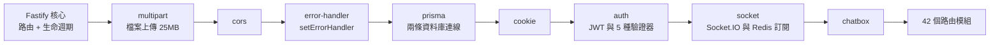
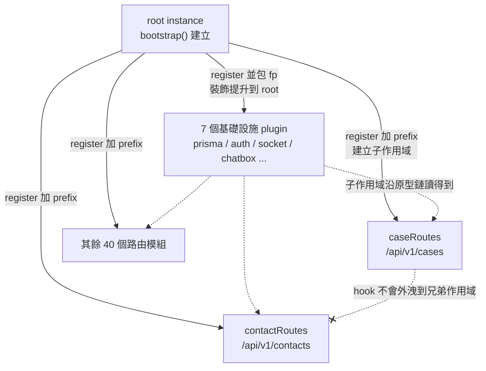
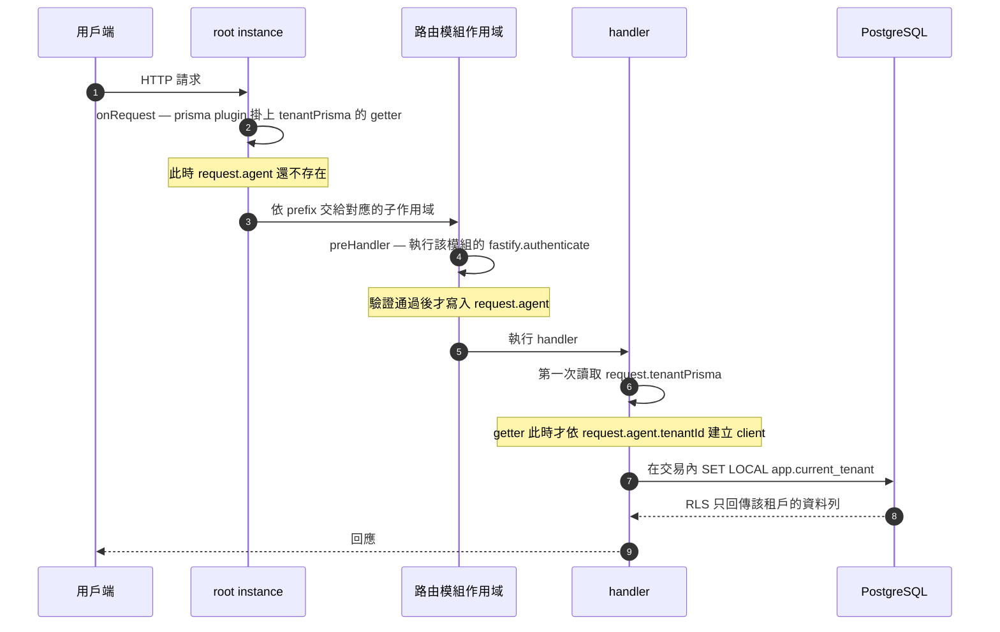

# API 外掛架構 — apps/api 的設計模式

本文件說明 `apps/api` 為什麼寫成現在這個樣子：Fastify 5 的外掛機制屬於哪些設計模式、每一層模式解決什麼問題，以及這個寫法帶來哪些限制。

- **資料來源**：`apps/api/src/index.ts`、`apps/api/src/plugins/*.ts`、`apps/api/src/modules/*/*.routes.ts`
- **圖表格式**：Mermaid 的 `flowchart` 與 `sequenceDiagram`。GitHub 直接渲染，讀者不需要安裝額外工具。
- **與其他文件的分工**：
  - 系統整體結構請看 [`SYSTEM-MINDMAP.md`](./SYSTEM-MINDMAP.md)。
  - 多租戶與 RLS 的接線規則請看 [`../../AGENTS.md`](../../AGENTS.md) 與 `postgres-rls-tenant-isolation` skill。
  - 本文件只談**架構模式**，不重複那兩份的內容。

---

## 四層模式總覽

Fastify 的外掛機制不是單一一種模式，而是四層疊在一起。四層都出現在 `apps/api`：

| 層  | 模式                              | 在程式碼中的體現                                              |
| --- | --------------------------------- | ------------------------------------------------------------- |
| 1   | 微核心架構（Microkernel）         | `bootstrap()` 依序 `register()` 7 個基礎設施 plugin           |
| 2   | 控制反轉（IoC）                   | plugin 交出函式，由 Fastify 決定執行與清理時機                |
| 3   | 服務定位器（Service Locator）     | `fastify.decorate()` 掛依賴，handler 用 `fastify.prisma` 取用 |
| 4   | 封裝情境（Encapsulation Context） | `register()` 建立子作用域；`fastify-plugin` 打破封裝          |

另外還有兩個區域性的模式：hook 管線是**責任鏈**，`request.tenantPrisma` 的 getter 是**虛擬代理**。

---

## 第 1 層 — 微核心架構

Fastify 核心只提供路由與生命週期，其他能力全部由外掛裝進去。核心不認識任何具體功能，功能反過來註冊進核心。

`apps/api/src/index.ts` 的 `bootstrap()` 就是組裝過程。註冊順序如下：



同一家族的架構還有 VS Code 的 extension host、Eclipse RCP 與 Webpack 的 loader 機制。

---

## 第 2 層 — 控制反轉

外掛不呼叫框架，外掛把函式交給框架，由框架決定何時執行。`prisma.plugin.ts` 是最完整的例子：

```ts
async function prismaPlugin(fastify: FastifyInstance) {
  await prisma.$connect();                    // 啟動時執行，時機由 Fastify 決定
  fastify.decorate('prisma', prisma);
  fastify.addHook('onClose', async () => {    // 關閉時執行，由 Fastify 回呼
    await prisma.$disconnect();
  });
}
```

連線與斷線的時機都不由這段程式控制。外掛只宣告「在這兩個時間點要做什麼」。

---

## 第 3 層 — 服務定位器

`fastify.decorate(名稱, 值)` 把依賴掛到實例上。handler 透過 `fastify.prisma` 取用，而不是 `import` 一個模組層級的單例。

### 七個 plugin 各自裝飾了什麼

| plugin          | 裝飾到 instance                                                   | 裝飾到 request          | 其他作用                                             |
| --------------- | ----------------------------------------------------------------- | ----------------------- | ---------------------------------------------------- |
| `cors`          | 無                                                                | 無                      | 註冊 `@fastify/cors`                                 |
| `error-handler` | 無                                                                | 無                      | `setErrorHandler`                                    |
| `prisma`        | `prisma`、`prismaAdmin`                                           | `tenantPrisma`          | `onRequest` 掛 getter；`onClose` 斷線                |
| `cookie`        | 無                                                                | 無                      | 註冊 `@fastify/cookie`                               |
| `auth`          | `authenticate` 等 5 個驗證器                                      | `agent`、`platformUser` | 註冊 `@fastify/jwt`                                  |
| `socket`        | `io`                                                              | 無                      | 訂閱 `socket:emit` 與 `domain:event`；`onClose` 收尾 |
| `chatbox`       | `chatboxMessageRegistry`、`chatboxI18n`、`chatboxSessionVerifier` | 無                      | 無                                                   |

### 這是服務定位器，不是建構子注入

兩者的差別在於取得依賴的方向：

|          | 服務定位器（Fastify）        | 建構子注入（NestJS、Spring）       |
| -------- | ---------------------------- | ---------------------------------- |
| 取得方式 | 程式主動跟容器要一個名字     | 容器主動把依賴傳進建構子           |
| 漏註冊時 | 執行期才發現值是 `undefined` | 容器啟動時就報錯                   |
| 額外成本 | 幾乎沒有                     | 需要 decorator metadata 與容器設定 |

### 型別安全靠 declaration merging 補回

服務定位器在編譯期抓不到「忘了註冊」。Fastify 用 TypeScript 的介面合併補這個洞。每個 plugin 頂端都有一段：

```ts
declare module 'fastify' {
  interface FastifyInstance {
    prisma: PrismaClient;
    prismaAdmin: PrismaClient;
  }
}
```

這是**型別層的 decorate**，與執行期的 `decorate()` 成對出現。只寫其中一邊會出問題：只寫型別會編譯通過但執行時取到 `undefined`；只寫執行期則型別檢查不過。

---

## 第 4 層 — 封裝情境

這是 Fastify 與 Express 差最多的一層。

`register()` 建立一個**子實例**，子實例用原型鏈繼承父實例。在子實例上裝的東西，父實例與兄弟實例看不到。`fastify-plugin`（慣例縮寫 `fp`）的作用是**打破這層封裝**，把裝飾提升到父層。

`apps/api` 的用法分成兩種，而且分得很乾淨：

|                 | 是否包 `fp` | 數量 | 效果                        |
| --------------- | ----------- | ---- | --------------------------- |
| 基礎設施 plugin | 全部包      | 7    | 裝飾提升到 root，全域可用   |
| 路由模組        | 全部不包    | 42   | 各自獨立作用域，hook 不外洩 |



封裝情境的實際用途，看 `case.routes.ts` 這一行：

```ts
export default async function caseRoutes(fastify: FastifyInstance) {
  fastify.addHook('preHandler', fastify.authenticate);
  // ...
}
```

這個 `preHandler` **只作用在本模組的路由上**，不會影響 `/api/v1/contacts`。全專案有 34 個路由模組用這個寫法各自掛驗證。如果路由模組也包了 `fp`，這些 hook 會全部提升到 root，變成每一條路由都要驗證，包括本來就該公開的 webhook 端點。

「基礎設施包 `fp` 提升，路由不包 `fp` 保持隔離」是 Fastify 的慣用分工。

---

## 請求的生命週期

把上述四層合起來，一個請求會這樣走。特別注意 `tenantPrisma` 的建立時機：



---

## 兩個區域性模式

### 責任鏈 — hook 管線

`onRequest` → `preHandler` → handler → `onSend` → `onResponse` 是一條責任鏈。Express 的 middleware 是同一個模式的簡化版：只有一條鏈，沒有作用域概念。

### 虛擬代理 — `tenantPrisma` 的延遲建立

`prisma.plugin.ts` 的 `onRequest` hook 早於 `auth` 的 `preHandler`，掛 hook 的當下 `request.agent` 還不存在。解法是掛一個 getter，把建立時機延後到第一次取用：

```ts
Object.defineProperty(request, 'tenantPrisma', {
  configurable: true,
  get() {
    const tid = request.agent?.tenantId;
    if (!tid) throw new Error('tenantPrisma 需要已認證的租戶身分');
    return tenantScopedClient(prisma, tid);
  },
});
```

這是虛擬代理模式：物件在第一次被存取之前不真正建立。它繞開了註冊順序造成的時間差，也讓未認證的路徑在取用時明確拋錯，而不是安靜地拿到一個沒有租戶約束的 client。

---

## 與其他框架的對照

| 框架        | 模式組合                       | 主要差別                                                         |
| ----------- | ------------------------------ | ---------------------------------------------------------------- |
| **Fastify** | 微核心 + 服務定位器 + 封裝情境 | 作用域用原型鏈實作，執行期成本低；型別安全靠 declaration merging |
| NestJS      | IoC 容器 + 建構子注入          | 有真正的 DI 容器與 decorator metadata，啟動期就能檢查相依        |
| Express     | 純 middleware 管線             | 只有責任鏈，沒有依賴注入，也沒有作用域                           |
| Spring      | IoC 容器                       | NestJS 的思路來源                                                |

---

## 這個寫法的取捨

### 全域裝飾讓 `prismaAdmin` 在每個檔案都可呼叫

7 個基礎設施 plugin 全部包了 `fp`，所有裝飾都提升到 root。對單體 API 而言這是合理選擇，否則每個路由模組都要重新註冊資料庫連線。

代價是 `declare module 'fastify'` 的型別增補也是全域的。因此 `fastify.prismaAdmin` 在**每一個**檔案都看得到、都可以呼叫，而它是 `BYPASSRLS` 的連線。型別系統擋不住這件事。

這正是 `scripts/check-prisma-admin-usage.mjs` 必須存在的原因：架構上開放的東西，只能用自訂檢查在 CI 擋下。這個檢查在 `.github/workflows/ci.yml` 以 `--strict` 執行，非白名單檔案使用 `prismaAdmin` 會讓建置失敗。

### 相依宣告不一致

`fastify-plugin` 支援 `dependencies` 選項，用來宣告「本外掛需要哪個外掛先註冊」。目前只有一個外掛用了：

| plugin    | 是否用到其他 plugin 的裝飾 | 是否宣告 `dependencies` |
| --------- | -------------------------- | ----------------------- |
| `chatbox` | 用 `fastify.prisma`        | 是，宣告 `['prisma']`   |
| `auth`    | 用 `fastify.prismaAdmin`   | **否**                  |
| 其餘 5 個 | 沒有用到                   | 不需要                  |

兩者的用法其實一樣，都是在 handler 閉包內取用，執行時機在請求階段而非註冊階段。因此即使調換註冊順序，兩者都不會在啟動時失敗。差別只在 `chatbox` 多做了一層防護：如果有人刪掉 `prisma` plugin，`chatbox` 會在啟動時就報錯，`auth` 則要等到第一個帶 CLI token 或 partner key 的請求進來才失敗。

補上 `dependencies: ['prisma']` 到 `auth.plugin.ts` 可以讓兩者一致，代價只有一行。

### 註冊順序目前靠 `index.ts` 的呼叫順序維持

由於只有一個外掛宣告相依，實際順序完全取決於 `bootstrap()` 裡 `register()` 的先後。這段順序有其道理：`error-handler` 要早於會拋錯的外掛，`prisma` 要早於用到資料庫的外掛，`auth` 要早於需要身分的外掛。這些理由目前寫在本文件，程式碼中沒有記錄。
