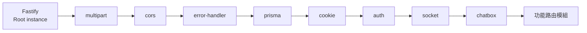
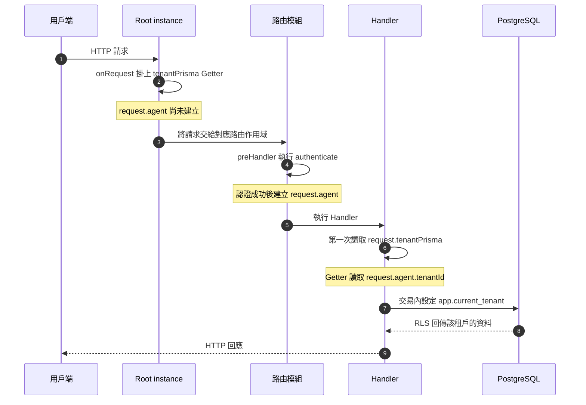
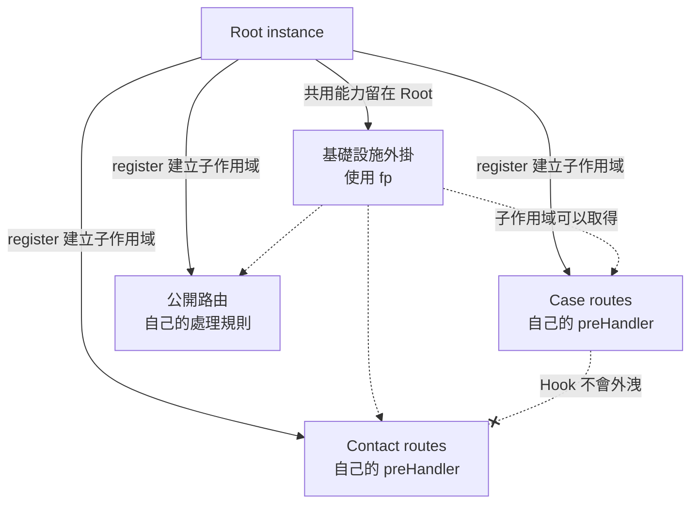

# API 外掛如何運作

本文件說明 `apps/api` 如何註冊 Fastify 外掛、隔離路由，以及建立租戶資料庫 client。設計模式名稱集中在最後一節；閱讀正文不需要先理解這些名稱。

- **資料來源**：`apps/api/src/index.ts`、`apps/api/src/plugins/*.ts`、`apps/api/src/modules/*/*.routes.ts`
- **系統總覽**：[`system/README.md`](./system/README.md)
- **多租戶規則**：[`../../AGENTS.md`](../../AGENTS.md)

## 先理解三條規則

1. `bootstrap()` 先註冊共用基礎設施，再註冊功能路由。
2. 基礎設施外掛使用 `fastify-plugin`，讓所有路由都能取得共用能力。路由模組不使用 `fastify-plugin`，因此模組 Hook 不會影響其他路由。
3. 認證 Hook 先建立 `request.agent`。Handler 之後才讀取 `request.tenantPrisma`，並取得綁定該租戶的 client。

## API 如何組裝

`apps/api/src/index.ts` 的 `bootstrap()` 負責組裝整個 API。它先直接註冊 `@fastify/multipart`，再註冊 7 個本地基礎設施外掛。



### 基礎設施外掛

| 外掛            | 提供給 Fastify instance                  | 提供給 request          | 其他作用                             |
| --------------- | ---------------------------------------- | ----------------------- | ------------------------------------ |
| `cors`          | 無                                       | 無                      | 註冊 `@fastify/cors`                 |
| `error-handler` | 無                                       | 無                      | 統一轉換應用程式、Zod 與 Prisma 錯誤 |
| `prisma`        | `prisma`、`prismaAdmin`                  | `tenantPrisma`          | 建立資料庫連線；關閉時斷線           |
| `cookie`        | 無                                       | 無                      | 註冊 `@fastify/cookie`               |
| `auth`          | 多種認證函式                             | `agent`、`platformUser` | 註冊租戶與平台 JWT                   |
| `socket`        | `io`                                     | 無                      | 訂閱 Redis 事件；關閉時清理資源      |
| `chatbox`       | Message Registry、i18n、Session Verifier | 無                      | 初始化 Chatbox 共用服務              |

`multipart` 由 `bootstrap()` 直接註冊，不屬於 `apps/api/src/plugins/` 的 7 個本地外掛。

## 一個租戶請求如何執行

以下流程以需要租戶認證及資料庫查詢的路由為例。公開路由與平台路由不應讀取 `request.tenantPrisma`。



這個流程有一個重要前提：Handler 必須在認證成功後才能讀取 `request.tenantPrisma`。未認證的路徑若讀取該屬性，Getter 會拋出錯誤。

## 外掛作用域

Fastify 的 `register()` 會建立子作用域。子作用域可以讀取父作用域的裝飾，但父作用域和兄弟作用域讀不到子作用域新增的內容。

`fastify-plugin`（以下簡稱 `fp`）會跳過這層封裝。基礎設施外掛使用 `fp`，將共用能力留在 Root instance。路由模組不使用 `fp`，讓每個模組的 Hook 保持隔離。



例如，`case.routes.ts` 在自己的作用域加入認證 Hook：

```ts
export default async function caseRoutes(fastify: FastifyInstance) {
  fastify.addHook("preHandler", fastify.authenticate);
  // 註冊案件路由
}
```

這個 Hook 只處理 Case 路由，不會影響 Contact 或公開 Webhook 路由。若路由模組也使用 `fp`，Hook 可能提升到 Root，並影響不該套用認證的路由。

## 依賴如何提供

基礎設施外掛使用 `decorate()` 將共用能力掛到 Fastify instance。路由與 Handler 再從 instance 或 request 取得能力。

```ts
const rows = await fastify.prisma.case.findMany(...);
const db = request.tenantPrisma;
```

這種取得方式有兩個部分，而且兩者缺一不可：

| 部分                              | 用途                       | 缺少時的結果                                  |
| --------------------------------- | -------------------------- | --------------------------------------------- |
| `decorate()`、`decorateRequest()` | 在執行時建立屬性           | TypeScript 可能通過，但執行時取得 `undefined` |
| `declare module "fastify"`        | 讓 TypeScript 認得屬性型別 | 執行時有屬性，但程式無法通過型別檢查          |

Declaration merging 只提供屬性型別。它不會驗證對應外掛是否已註冊，也不會建立執行時屬性。

```ts
declare module "fastify" {
  interface FastifyInstance {
    prisma: PrismaClient;
    prismaAdmin: PrismaClient;
  }
}
```

## `tenantPrisma` 為什麼使用 Getter

Prisma 外掛的 `onRequest` Hook 早於路由模組的認證 `preHandler`。執行 `onRequest` 時，`request.agent` 尚未建立，因此外掛不能立即綁定租戶。

外掛先在 request 掛上 Getter。Handler 第一次讀取 `tenantPrisma` 時，Getter 才讀取 `request.agent.tenantId`。

```ts
Object.defineProperty(request, "tenantPrisma", {
  configurable: true,
  get() {
    const tenantId = request.agent?.tenantId;
    if (!tenantId) {
      throw new Error("tenantPrisma 需要已認證的租戶身分");
    }
    return tenantScopedClient(prisma, tenantId);
  },
});
```

這個設計同時處理兩個需求：

1. 認證完成後才取得租戶 ID。
2. 未認證的路徑無法取得未綁定租戶的 client。

`tenantScopedClient()` 執行資料庫操作時，會在交易內設定 `app.current_tenant`。交易內的查詢必須使用該交易提供的 client。

## 註冊順序與相依宣告

外掛的實際註冊順序寫在 `bootstrap()`。`fastify-plugin` 也支援 `dependencies`，可在啟動時檢查具名外掛是否已經註冊。

目前的順序不是任意的，其中兩項相依可以直接從原始碼確認：

| 約束 | 依據 |
| --- | --- |
| `prisma` 早於 `auth` 與 `chatbox` | `auth` 的認證函式使用 `fastify.prismaAdmin`；`chatbox` 的 session verifier 使用 `fastify.prisma` |
| `auth` 早於 `socket` | `socket` 驗證連線時呼叫 `fastify.jwt.verify()`，這個裝飾由 `auth` 註冊 `@fastify/jwt` 時提供 |

這兩項相依都在 handler 或連線回呼內解析，不在註冊階段解析。因此調換順序不會讓啟動立即失敗，而是等到對應的請求或連線進入後才出錯。

`error-handler` 排在最前面幾個位置，是為了讓它涵蓋後續註冊的內容。這一項屬於慣例，本文件沒有驗證改變它的實際影響。

目前只有 `chatbox` 明確宣告 `dependencies: ["prisma"]`。`auth` 會在認證函式內使用 `fastify.prismaAdmin`，但沒有宣告對 `prisma` 的相依。

因此目前存在兩種保護程度：

- 移除或錯排 `prisma` 時，`chatbox` 可以在啟動階段回報相依問題。
- `auth` 的問題可能要等到 CLI Token 或 Partner Key 請求進入後才出現。

## 關閉生命週期

HTTP 請求完成後會經過 `onSend`、`onResponse` 等請求 Hook。這些 Hook 屬於單一請求的生命週期。

`onClose` 屬於應用程式的關閉生命週期，不是單一 HTTP 請求的一部分。目前 Prisma 與 Socket 外掛使用 `onClose` 關閉資料庫、Socket.IO 及 Redis 資源。

## 架構取捨

### `prismaAdmin` 全域可見

Prisma 外掛使用 `fp`，所以所有路由模組都能讀取 `fastify.prismaAdmin`。這條連線具有 `BYPASSRLS`，TypeScript 無法限制哪些檔案可以呼叫它。

CI 使用 `scripts/check-prisma-admin-usage.mjs --strict` 彌補這個限制。非白名單檔案使用 `prismaAdmin` 時，檢查會失敗。

### 部分相依只靠註冊順序

多數外掛沒有宣告 `dependencies`。維護者必須保留 `bootstrap()` 的註冊順序，或在使用其他外掛能力時補上具名相依。

### 型別宣告可能與執行時接線不同步

Declaration merging 與 `decorate()` 分別存在於型別階段和執行階段。新增或移除裝飾時，維護者必須同步修改兩邊。

## 設計模式名稱對照

下表提供設計模式的對照名稱。這些名稱是描述同一套機制的不同角度，不是依序執行的六個架構層。

| Fastify 機制                    | 可對應的設計模式 | 本文件中的用途                       |
| ------------------------------- | ---------------- | ------------------------------------ |
| `bootstrap()` 組裝外掛          | 微核心架構       | 核心保持精簡，能力由外掛加入         |
| Fastify 呼叫外掛與生命週期 Hook | 控制反轉         | 外掛宣告工作，框架決定執行時機       |
| `decorate()` 與按名稱取用       | 服務定位器       | Handler 從 Fastify instance 取得依賴 |
| `register()` 與 `fp`            | 封裝情境         | 控制裝飾與 Hook 的作用範圍           |
| Request Hooks                   | 責任鏈／管線     | 請求依序通過多個處理階段             |
| `tenantPrisma` Getter           | 虛擬代理         | 延後建立租戶 client                  |
