# 資料庫 ERD — open333CRM

本文件描述 open333CRM 資料庫的資料表關聯與每張表儲存的資料類型。

- **資料來源**：`packages/database/prisma/schema.prisma`
- **資料庫**：PostgreSQL 16 + pgvector + pgcrypto
- **規模**：78 張資料表、24 個 enum、114 條外鍵關聯
- **圖表格式**：Mermaid `erDiagram`，GitHub 會直接渲染，不需要額外工具

> 本文件說明資料表**關聯**與**存什麼資料**。欄位定義以 `packages/database/prisma/schema.prisma` 為唯一真實來源；設計決策、索引策略與已知落差請看 `docs/16_DB_SCHEMA.md`。

---

## 怎麼讀這份文件

1. 每個領域先給一張 ERD，圖上只畫**有外鍵約束的關聯**。
2. 圖後面接一張表格，說明每張資料表**存什麼資料**、**關鍵欄位型別**。
3. 圖上的實體名稱是**實際資料表名稱**（snake_case）；表格會同時列出對應的 Prisma model 名稱（PascalCase）。

Mermaid 關聯符號的意思：

| 符號         | 意思                       |
| ------------ | -------------------------- |
| `\|\|--o{`   | 一對多，多的那端可以是零筆 |
| `\|\|--o\|`  | 一對一，右端可以不存在     |
| `\|\|--\|\|` | 一對一，兩端都必定存在     |

有 6 張資料表完全沒有外鍵關聯，因此不出現在任何 ERD 圖上，只在領域表格中說明。`audience_groups` 與 `insight_snapshots` 靠鬆耦合欄位連到 `channels`；`sla_policies` 靠鬆耦合的 `tenant_id` 歸屬租戶。`model_pricings`、`platform_settings`、`trial_signups` 則是獨立的設定或流水資料。

---

## 全域骨幹

先看跨領域的主軸。租戶（`tenants`）底下有客服人員與渠道。聯絡人透過渠道發起對話。對話可以升級為案件。

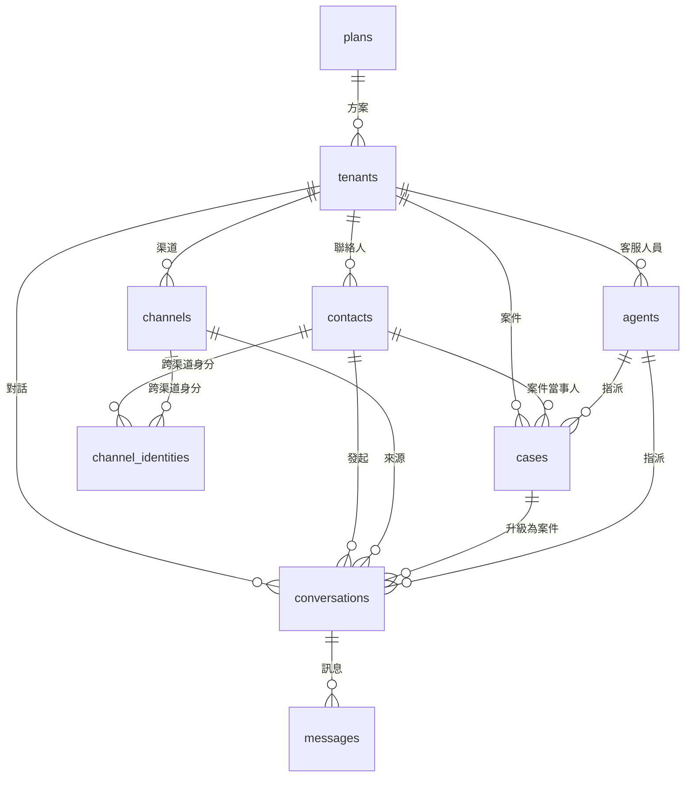

---

## A. 平台控制層

平台方（非租戶）使用的控制台資料。這一層的資料表**不帶 `tenant_id`**，因為這些資料表管理的對象就是租戶本身。

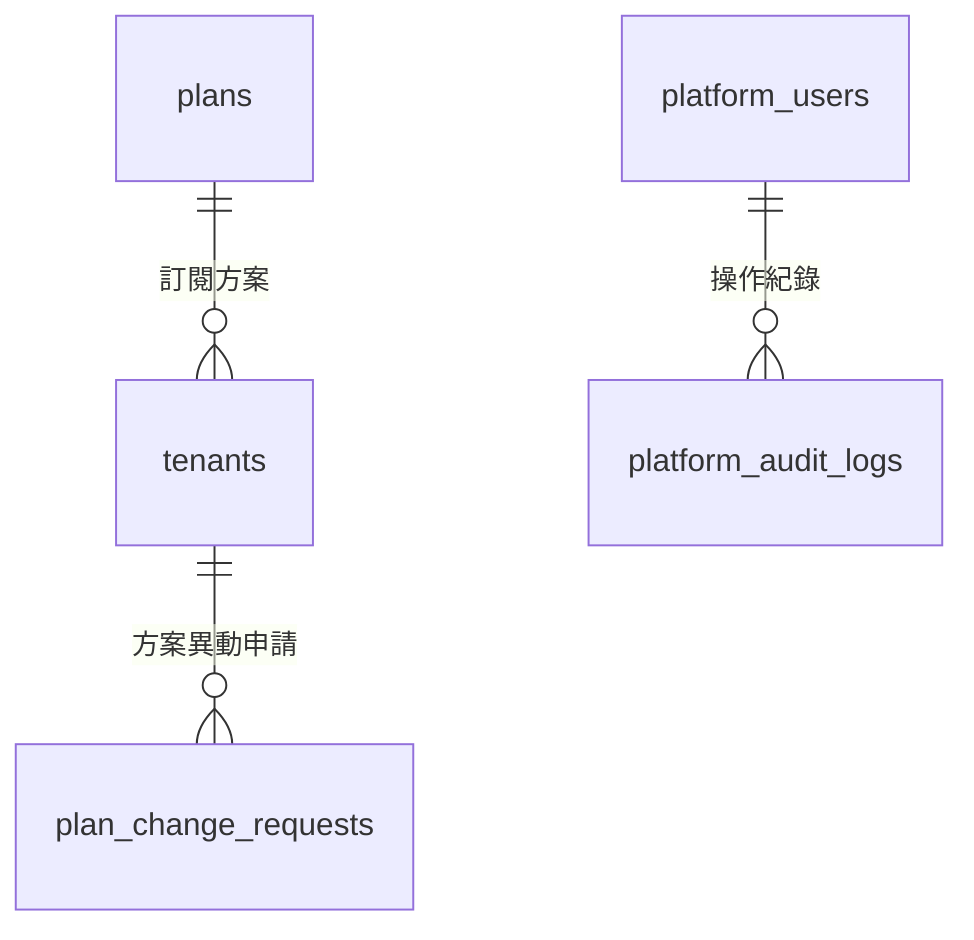

| 資料表                 | Prisma model        | 儲存什麼                                                                         | 關鍵欄位型別                                                                                            |
| ---------------------- | ------------------- | -------------------------------------------------------------------------------- | ------------------------------------------------------------------------------------------------------- |
| `plans`                | `Plan`              | 訂閱方案定義：功能開關、各項用量上限、可用渠道類型、權限覆寫、月費               | `features`／`limits`／`allowedChannelTypes`／`permissionOverrides` 皆為 `Json`；`priceMonthly` 為 `Int` |
| `tenants`              | `Tenant`            | 租戶主檔：名稱、啟用狀態、所屬方案、上限覆寫、試用到期日、合約起訖日、軟刪除時間 | `limitOverrides`／`trialRemindersSent` 為 `Json`；`purgedAt`／`trialEndsAt` 為 `DateTime?`              |
| `platform_users`       | `PlatformUser`      | 平台 superuser 帳號，與租戶端的 `agents` 完全分離                                | `passwordHash` 為 bcrypt 字串                                                                           |
| `platform_audit_logs`  | `PlatformAuditLog`  | 平台端操作稽核：誰對哪個目標做了什麼                                             | `payload` 為 `Json?`；`targetType`／`targetId` 為多型參照                                               |
| `platform_settings`    | `PlatformSetting`   | 平台層 key-value 設定，主鍵就是 `key`                                            | `value` 為 `Json`                                                                                       |
| `trial_signups`        | `TrialSignup`       | 試用註冊流程：驗證信 token、寄送次數、開通結果                                   | `verifyTokenHash` 為雜湊字串；`tenantId` 為鬆耦合欄位，開通後才寫入                                     |
| `plan_change_requests` | `PlanChangeRequest` | 租戶提出的方案升降級或加購 token 申請，含審核狀態                                | `topupTokens` 為 `Int?`                                                                                 |
| `model_pricings`       | `ModelPricing`      | 各 LLM 模型的計價表，支援分級計價與生效日                                        | `inputPer1M`／`outputPer1M`／`cachedPer1M` 為 `Decimal`                                                 |

---

## B. 身分、組織與認證

租戶內部的人員、角色權限，以及各種登入與 API 存取憑證。

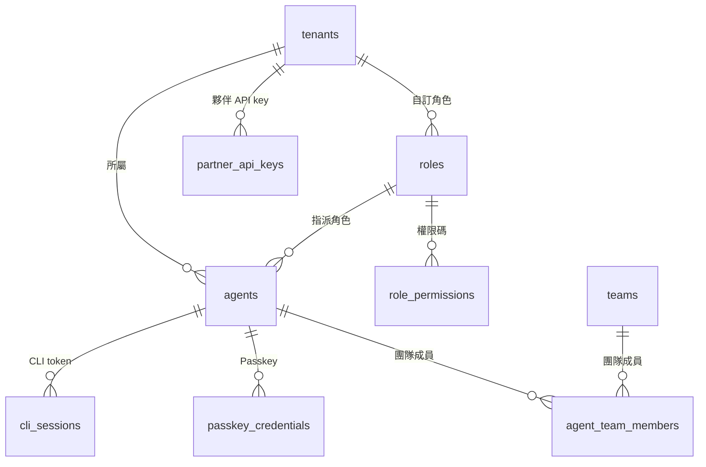

| 資料表                | Prisma model        | 儲存什麼                                                        | 關鍵欄位型別                                                                         |
| --------------------- | ------------------- | --------------------------------------------------------------- | ------------------------------------------------------------------------------------ |
| `agents`              | `Agent`             | 客服人員帳號：email、姓名、頭像、角色、密碼雜湊、啟用狀態       | `role` 為 `AgentRole` enum（粗粒度）；`roleId` 指向 `roles`（細粒度 RBAC），兩者並存 |
| `roles`               | `Role`              | 租戶自訂角色，`isSystem` 標記系統內建角色                       | `slug` 在租戶內唯一                                                                  |
| `role_permissions`    | `RolePermission`    | 角色擁有的權限碼，一列一碼                                      | `permissionCode` 為字串常數                                                          |
| `teams`               | `Team`              | 客服團隊。`licenseTeamId` 對應外部授權系統的團隊                | `tenantId` 有欄位但**沒有** FK 關聯                                                  |
| `agent_team_members`  | `AgentTeamMember`   | 人員與團隊的多對多中介表，複合主鍵                              | 主鍵為 `[agentId, teamId]`                                                           |
| `passkey_credentials` | `PasskeyCredential` | WebAuthn 憑證：公鑰、簽章計數器、裝置類型、備份狀態             | `publicKey` 為 `Bytes`；`counter` 為 `BigInt`；`transports` 為 `Json`                |
| `cli_sessions`        | `CliSession`        | `open333` CLI 與 LLM 使用的 token：只存雜湊，另存頭尾片段供辨識 | `scopes` 為 `Json`；`tokenHash` 為雜湊，明文不落地                                   |
| `partner_api_keys`    | `PartnerApiKey`     | 夥伴系統串接用的 API key，同樣只存雜湊與頭尾片段                | `keyHash` 為雜湊字串                                                                 |

---

## C. 渠道

LINE、Facebook、Instagram、WebChat 等對外連接點，以及各渠道專屬的設定與統計。

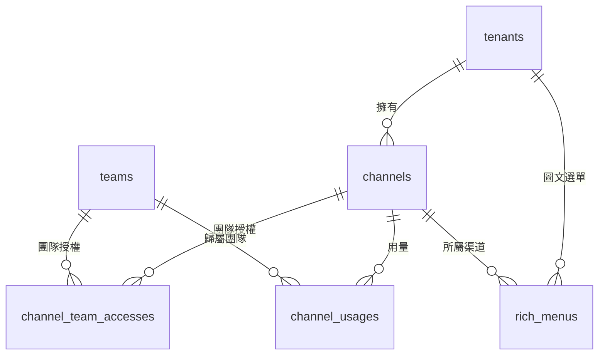

| 資料表                  | Prisma model        | 儲存什麼                                                       | 關鍵欄位型別                                                                                 |
| ----------------------- | ------------------- | -------------------------------------------------------------- | -------------------------------------------------------------------------------------------- |
| `channels`              | `Channel`           | 渠道設定：類型、顯示名稱、加密後的憑證、webhook 網址、驗證時間 | `channelType` 為 `ChannelType` enum；`credentialsEncrypted` 為加密字串；`settings` 為 `Json` |
| `channel_team_accesses` | `ChannelTeamAccess` | 哪個團隊能存取哪個渠道，以及存取層級                           | 複合主鍵 `[channelId, teamId]`                                                               |
| `channel_usages`        | `ChannelUsage`      | 逐筆訊息用量與費用，可歸戶到團隊                               | `direction` 為 `Direction` enum；`feeAmount` 為 `Float?`                                     |
| `rich_menus`            | `RichMenu`          | LINE 圖文選單：尺寸、點擊區域、圖片、發布狀態                  | `size`／`areas` 為 `Json`；`lineRichMenuId` 是 LINE 平台回傳的外部 ID                        |
| `audience_groups`       | `AudienceGroup`     | LINE 分眾受眾包，對應平台側的 audience group                   | `channelId`／`segmentId` 都是鬆耦合欄位，**沒有** FK                                         |
| `insight_snapshots`     | `InsightSnapshot`   | 每日渠道洞察快照：粉絲數、封鎖數、觸及數、人口統計             | `demographicsJson` 為 `Json?`；`channelId` 為鬆耦合欄位                                      |

---

## D. 聯絡人與身分識別

客戶主檔，以及身分識別機制。身分識別機制負責把同一個人在不同渠道的帳號，歸戶到同一筆聯絡人。

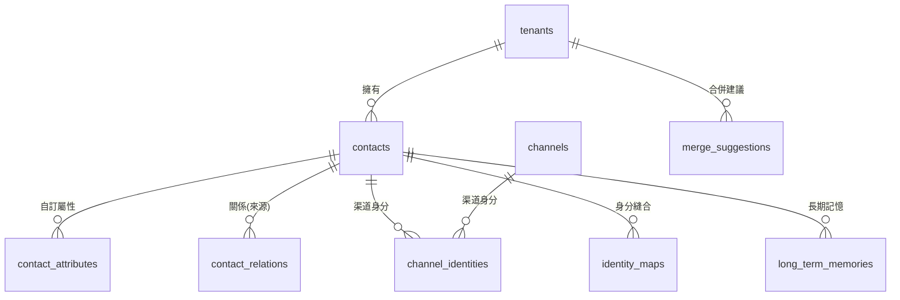

| 資料表               | Prisma model       | 儲存什麼                                                      | 關鍵欄位型別                                                     |
| -------------------- | ------------------ | ------------------------------------------------------------- | ---------------------------------------------------------------- |
| `contacts`           | `Contact`          | 聯絡人主檔：顯示名稱、頭像、電話、email、語言、封鎖與封存狀態 | `mergedIntoId` 指向合併後的主聯絡人，是鬆耦合欄位                |
| `contact_attributes` | `ContactAttribute` | 聯絡人的自訂 key-value 屬性，附帶型別註記                     | `dataType` 為字串，標示 `value` 該怎麼解讀                       |
| `contact_relations`  | `ContactRelation`  | 聯絡人之間的關係（例如同一公司、家庭成員），雙向自我參照      | 同時有 `fromContactId` 與 `toContactId` 兩條 FK                  |
| `channel_identities` | `ChannelIdentity`  | 聯絡人在特定渠道的身分：外部 uid、渠道側暱稱與頭像            | `uid` 為渠道方的使用者 ID；與 `channelId` 組成唯一鍵             |
| `identity_maps`      | `IdentityMap`      | 身分縫合結果：哪個外部 uid 被歸戶到哪個聯絡人、來源與信心值   | `source` 為 `StitchSource` enum；`confidence` 為 `Float`         |
| `merge_suggestions`  | `MergeSuggestion`  | 系統推測應該合併的聯絡人配對，待人工審核                      | `status` 為 `SuggestionStatus` enum；兩個 contact 欄位都是鬆耦合 |
| `long_term_memories` | `LongTermMemory`   | 聯絡人的長期記憶片段，供 AI 回覆時檢索                        | `embedding` schema 宣告為 `vector(1024)`，資料庫實際為 `vector(1536)`（見 `docs/16_DB_SCHEMA.md` 已知落差）                        |

---

## E. 對話與訊息

即時客服的核心資料流。

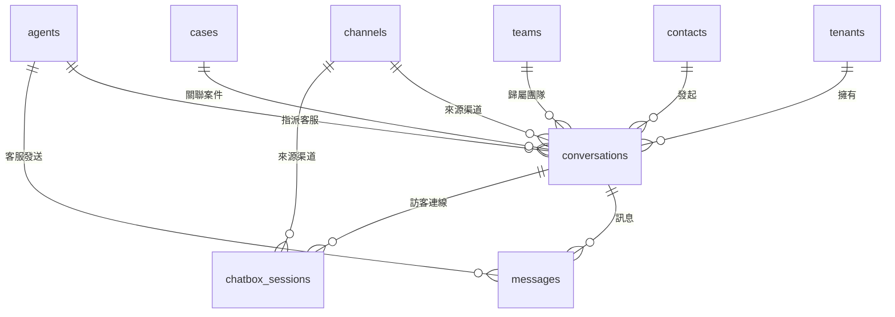

| 資料表             | Prisma model     | 儲存什麼                                                                 | 關鍵欄位型別                                                                                      |
| ------------------ | ---------------- | ------------------------------------------------------------------------ | ------------------------------------------------------------------------------------------------- |
| `conversations`    | `Conversation`   | 對話串：狀態、指派對象、未讀數、最後訊息時間、機器人回覆次數、轉真人原因 | `status` 為 `ConversationStatus` enum；`metadata` 為 `Json`                                       |
| `messages`         | `Message`        | 單則訊息：方向、發送者類型、內容、渠道側訊息 ID、序號、已讀狀態          | `content`／`metadata` 為 `Json`（可存文字、圖片、Flex 等結構）；`direction`／`senderType` 為 enum |
| `chatbox_sessions` | `ChatboxSession` | WebChat 訪客的安全連線：token 摘要、瀏覽器指紋、到期與撤銷時間、風險等級 | `tokenDigest`／`fingerprintHash` 為雜湊；`riskLevel` 為 `ChatboxSessionRiskLevel` enum            |

---

## F. 案件與 SLA

對話升級後的工單生命週期。

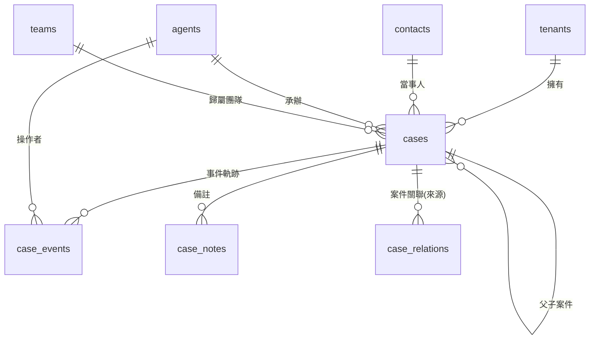

| 資料表           | Prisma model   | 儲存什麼                                                                                  | 關鍵欄位型別                                                                                  |
| ---------------- | -------------- | ----------------------------------------------------------------------------------------- | --------------------------------------------------------------------------------------------- |
| `cases`          | `Case`         | 案件主檔：標題、狀態、優先度、承辦人、SLA 到期時間、各階段時戳、CSAT 評分、合併與父子關係 | `status` 為 `CaseStatus` enum；`priority` 為 `Priority` enum；`channelId` 有欄位但**沒有** FK |
| `case_events`    | `CaseEvent`    | 案件的事件軌跡：誰在什麼時候做了什麼變更                                                  | `payload` 為 `Json`；`actorType` 區分人員或系統                                               |
| `case_notes`     | `CaseNote`     | 案件備註，`isInternal` 區分內部註記與對外回覆                                             | `agentId` 為鬆耦合欄位，**沒有** FK                                                           |
| `case_relations` | `CaseRelation` | 案件之間的關聯（重複、相關等），雙向自我參照                                              | `relationType` 為字串                                                                         |
| `sla_policies`   | `SlaPolicy`    | SLA 政策：首次回應與解決時限、預警提前量、是否預設                                        | 各時限為 `Int`（分鐘）；`tenantId` **沒有** FK                                                |

---

## G. 標籤

系統用一套標籤定義，同時貼到聯絡人、案件、對話三種目標上。

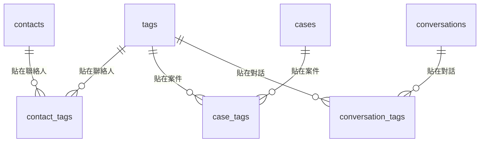

| 資料表              | Prisma model      | 儲存什麼                                 | 關鍵欄位型別                                                                                                  |
| ------------------- | ----------------- | ---------------------------------------- | ------------------------------------------------------------------------------------------------------------- |
| `tags`              | `Tag`             | 標籤定義：名稱、顏色、類型、適用範圍     | `type` 為 `TagType` enum；`scope` 為 `TagScope` enum；`tenantId` 可為 null（代表系統共用標籤），且**沒有** FK |
| `contact_tags`      | `ContactTag`      | 聯絡人貼標紀錄，含貼標來源與到期時間     | `expiresAt` 為 `DateTime?`，支援時效性標籤                                                                    |
| `case_tags`         | `CaseTag`         | 案件貼標紀錄，結構與 `contact_tags` 一致 | 同上                                                                                                          |
| `conversation_tags` | `ConversationTag` | 對話貼標紀錄，結構與 `contact_tags` 一致 | 同上                                                                                                          |

三張貼標表的 `addedBy`／`addedById` 都是鬆耦合欄位，用來記錄這個標籤由人員手動貼上，或由自動化規則貼上。

---

## H. 自動化與互動流程

兩套獨立引擎：規則式自動化（`automation_*`）與節點式互動流程（`interaction_*`／`flow_*`）。

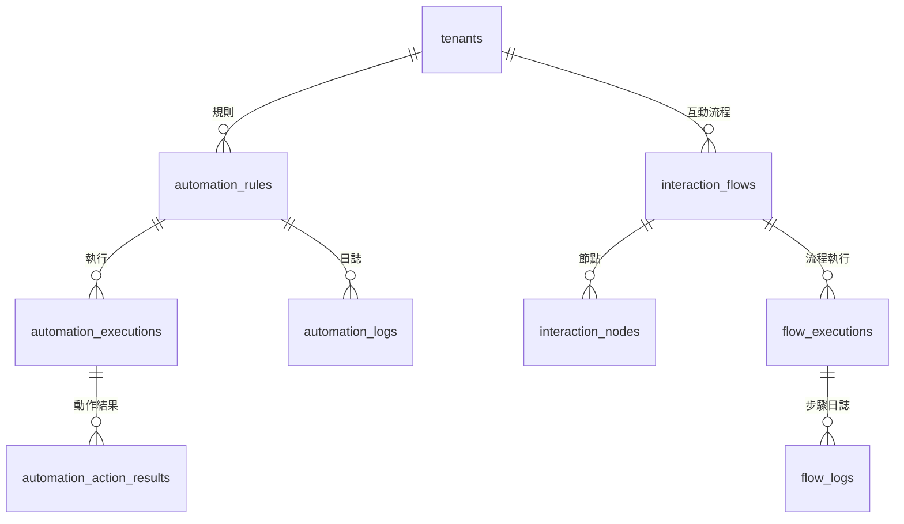

| 資料表                      | Prisma model             | 儲存什麼                                                               | 關鍵欄位型別                                                                                        |
| --------------------------- | ------------------------ | ---------------------------------------------------------------------- | --------------------------------------------------------------------------------------------------- |
| `automation_rules`          | `AutomationRule`         | 規則定義：觸發事件、條件、動作、優先序、是否中止後續規則、作用範圍     | `trigger`／`conditions`／`actions` 為 `Json`；`scopeType` 為 `ScopeType` enum                       |
| `automation_executions`     | `AutomationExecution`    | 一次事件觸發的完整執行紀錄：事實快照、候選與命中的規則、執行了哪些動作 | `factSnapshot`／`actionsExecuted` 為 `Json`；`candidateRuleIds`／`matchedRuleIds` 為 `String[]`     |
| `automation_action_results` | `AutomationActionResult` | 單一動作的執行結果，含執行前後快照以支援回滾                           | `beforeSnapshot`／`afterSnapshot` 為 `Json?`；`rollbackable` 為 `Boolean`                           |
| `automation_logs`           | `AutomationLog`          | 精簡版執行日誌，供列表快速查詢                                         | `actionsRan` 為 `Json`；`tenantId` **沒有** FK                                                      |
| `interaction_flows`         | `InteractionFlow`        | 互動流程定義：觸發方式、狀態、最大步數限制                             | `status` 為 `FlowStatus` enum；`triggerConfig` 為 `Json`                                            |
| `interaction_nodes`         | `InteractionNode`        | 流程中的單一節點：類型、設定、畫布座標、下一節點指標                   | `nodeType` 為 `NodeType` enum；`position` 為 `Json`；`nextNodeId`／`falseNodeId` 為流程內鬆耦合指標 |
| `flow_executions`           | `FlowExecution`          | 某個聯絡人跑某條流程的執行實例：目前節點、上下文變數、恢復時間         | `status` 為 `ExecutionState` enum；`contextVars` 為 `Json`；`contactId` **沒有** FK                 |
| `flow_logs`                 | `FlowLog`                | 流程逐步執行紀錄                                                       | `result` 為 `Json`                                                                                  |

---

## I. 知識庫與 AI 用量

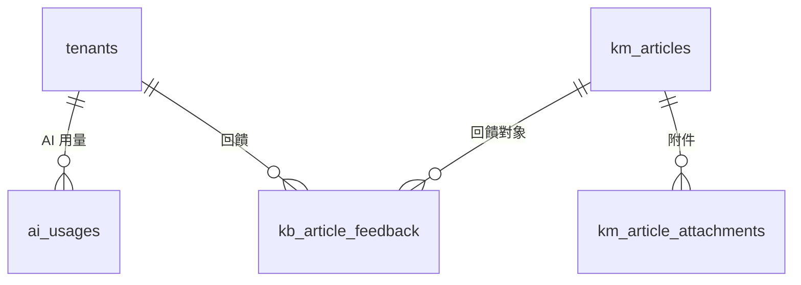

| 資料表                   | Prisma model          | 儲存什麼                                                           | 關鍵欄位型別                                                                                                                         |
| ------------------------ | --------------------- | ------------------------------------------------------------------ | ------------------------------------------------------------------------------------------------------------------------------------ |
| `km_articles`            | `KmArticle`           | 知識庫文章：標題、內文、摘要、分類、標籤、狀態、向量、外部同步來源 | `embedding` schema 宣告為 `vector(1024)`，資料庫實際為 `vector(1536)`，且目前沒有向量索引（見 `docs/16_DB_SCHEMA.md` 已知落差）；`tags` 為 `String[]`；`metadata`／`spec` 為 `Json?`；`tenantId` **沒有** FK |
| `km_article_attachments` | `KmArticleAttachment` | 文章附件：檔名、儲存 key、網址、MIME 類型、大小                    | `sizeBytes` 為 `Int`                                                                                                                 |
| `kb_article_feedback`    | `KbArticleFeedback`   | AI 回覆品質回饋：使用者問題、機器人回覆、信心值、評分              | `confidence` 為 `Float?`；`messageId`／`contactId` **沒有** FK                                                                       |
| `ai_usages`              | `AiUsage`             | 逐次 LLM 呼叫的 token 用量與成本，可歸戶到對話或案件               | 各 token 欄位為 `Int`；`costUsd` 為 `Decimal`；`conversationId`／`caseId` **沒有** FK                                                |

---

## J. 素材、模板與行銷

訊息素材庫、模板審核流程，以及分眾廣播。

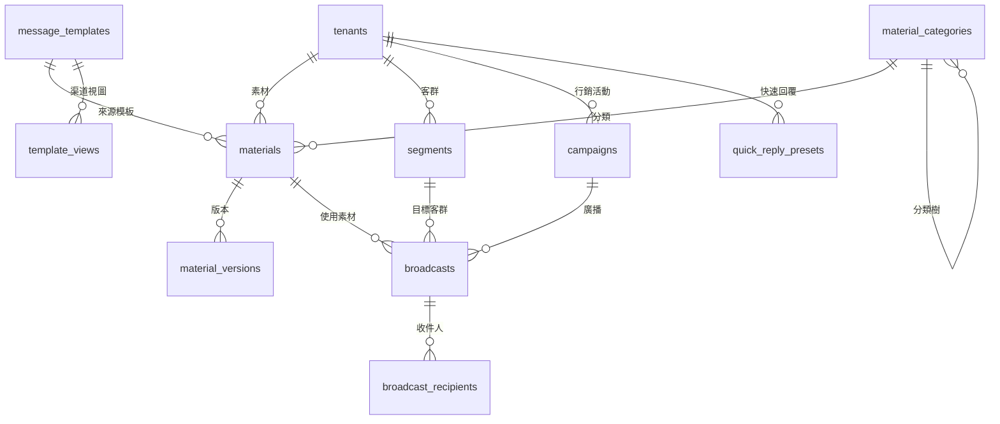

| 資料表                 | Prisma model         | 儲存什麼                                                                   | 關鍵欄位型別                                                                   |
| ---------------------- | -------------------- | -------------------------------------------------------------------------- | ------------------------------------------------------------------------------ |
| `message_templates`    | `MessageTemplate`    | 訊息模板：內容主體、變數定義、是否系統內建、使用次數                       | `body`／`variables` 為 `Json`；`tenantId` 可為 null（系統模板），**沒有** FK   |
| `template_views`       | `TemplateView`       | 模板針對特定渠道的呈現版本，含送審與核准流程                               | `status` 為 `TemplateViewStatus` enum；`body` 為 `Json`                        |
| `materials`            | `Material`           | 素材庫項目：內容主體、變數、適用渠道、預覽圖、治理欄位（分類、標籤、狀態） | `body`／`variables` 為 `Json`；`tags`／`targetChannels` 為 `String[]`          |
| `material_categories`  | `MaterialCategory`   | 素材分類，透過 `parentId` 自我參照形成樹狀結構                             | `sortOrder` 為 `Int`                                                           |
| `material_versions`    | `MaterialVersion`    | 素材的歷史版本快照                                                         | `body` 為 `Json`；`versionNo` 為 `Int`                                         |
| `quick_reply_presets`  | `QuickReplyPreset`   | 客服快速回覆組合                                                           | `items` 為 `Json`                                                              |
| `segments`             | `Segment`            | 客群分眾：篩選條件與邏輯運算子、預估人數                                   | `rules`／`conditions` 為 `Json`；`logic` 為 `AND`／`OR` 字串                   |
| `campaigns`            | `Campaign`           | 行銷活動：起訖日、狀態、成效指標                                           | `metrics` 為 `Json`                                                            |
| `broadcasts`           | `Broadcast`          | 單次廣播：目標設定、排程與實際發送時間、成功失敗與回覆統計                 | `targetConfig` 為 `Json`；`templateId`／`channelId`／`createdById` **沒有** FK |
| `broadcast_recipients` | `BroadcastRecipient` | 廣播逐一收件人的投遞狀態，以及是否回覆、是否因此開案                       | `contactId`／`caseId` **沒有** FK                                              |

---

## K. 粉絲活動與點數

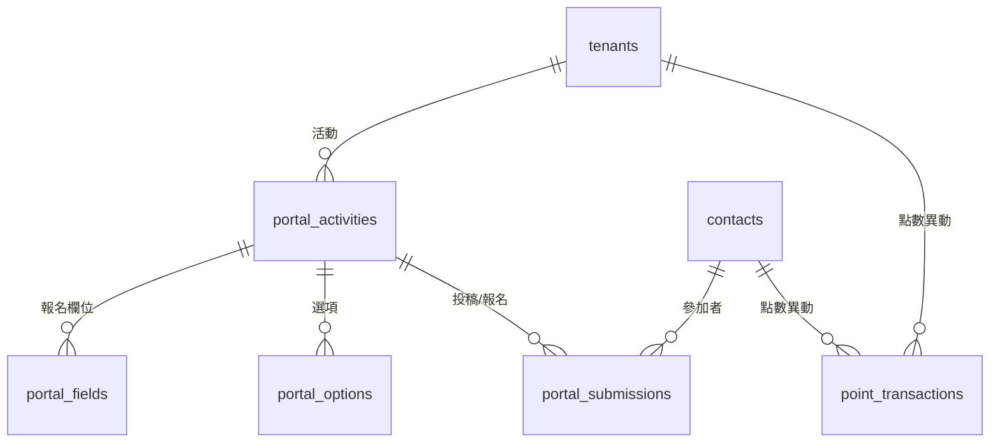

| 資料表               | Prisma model       | 儲存什麼                                             | 關鍵欄位型別                                                                                       |
| -------------------- | ------------------ | ---------------------------------------------------- | -------------------------------------------------------------------------------------------------- |
| `portal_activities`  | `PortalActivity`   | 粉絲活動：類型、狀態、封面、起訖與發布時間、活動設定 | `type` 為 `PortalActivityType` enum；`status` 為 `PortalActivityStatus` enum；`settings` 為 `Json` |
| `portal_fields`      | `PortalField`      | 活動的自訂報名欄位定義                               | `options` 為 `Json`；`isRequired` 為 `Boolean`                                                     |
| `portal_options`     | `PortalOption`     | 投票或測驗的選項，`isCorrect` 標記正解               | `sortOrder` 為 `Int`                                                                               |
| `portal_submissions` | `PortalSubmission` | 參加者的作答與報名內容、得分、是否中獎、獲得點數     | `answers` 為 `Json`；`score` 為 `Int?`                                                             |
| `point_transactions` | `PointTransaction` | 聯絡人點數異動流水帳，含異動後餘額                   | `amount`／`balance` 為 `Int`；`refId` 為多型參照，**沒有** FK                                      |

---

## L. 短連結與點擊追蹤

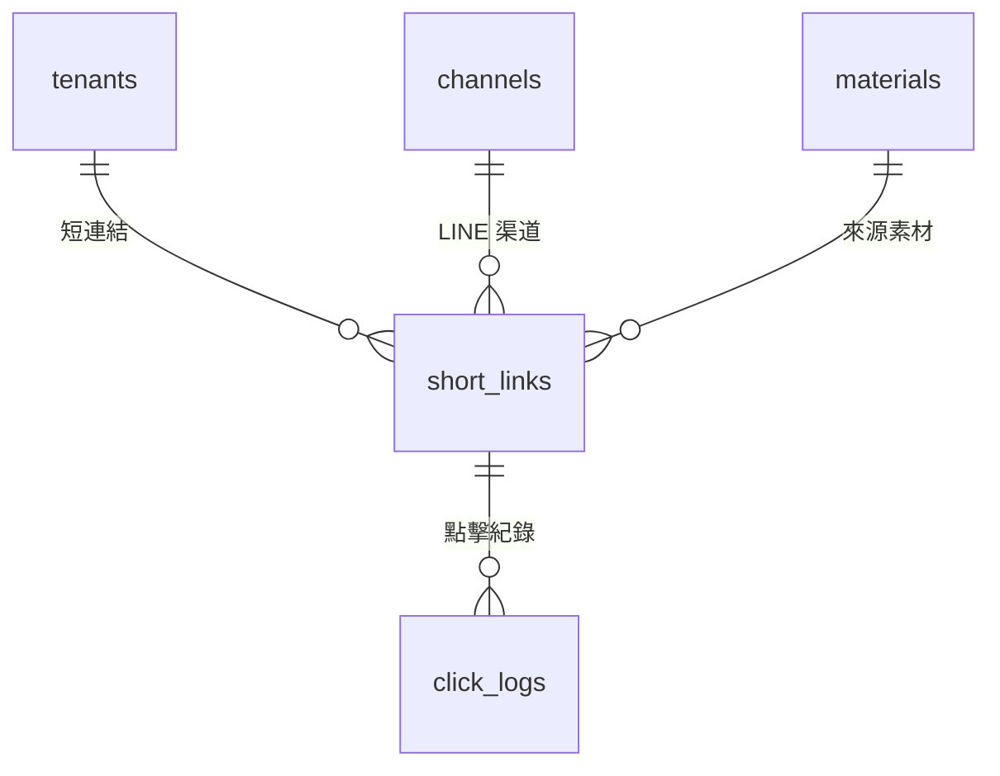

| 資料表        | Prisma model | 儲存什麼                                                                  | 關鍵欄位型別                                                      |
| ------------- | ------------ | ------------------------------------------------------------------------- | ----------------------------------------------------------------- |
| `short_links` | `ShortLink`  | 短連結：slug、目標網址、OG 中繼資料、UTM 參數、點擊後自動貼標、累計點擊數 | `tagOnClick` 存要貼的標籤；`totalClicks`／`uniqueClicks` 為 `Int` |
| `click_logs`  | `ClickLog`   | 逐次點擊紀錄：來源 IP、UA、referer、國家、可歸戶的聯絡人                  | `contactId` **沒有** FK；`lineUid` 供 LINE 點擊歸戶               |

---

## M. 系統周邊：設定、統計、通知、Webhook、法遵

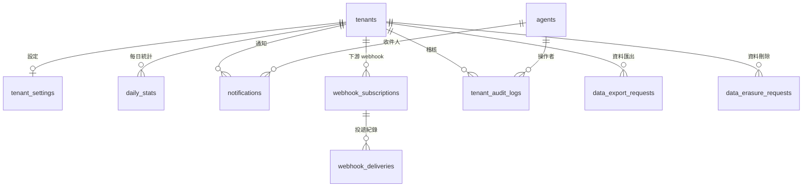

| 資料表                  | Prisma model          | 儲存什麼                                                                         | 關鍵欄位型別                                                                 |
| ----------------------- | --------------------- | -------------------------------------------------------------------------------- | ---------------------------------------------------------------------------- |
| `tenant_settings`       | `TenantSettings`      | 租戶設定：時區、營業時間、embedding 與 chat 模型參數、各種 system prompt、追蹤碼 | `officeHours` 為 `Json`；`geminiApiKeyEnc` 為加密字串；與 `tenants` 為一對一 |
| `daily_stats`           | `DailyStat`           | 每日預聚合統計，用 `statType` 與 `dimensionId` 區分不同維度                      | `data` 為 `Json`；`dimensionId` 為多型參照                                   |
| `notifications`         | `Notification`        | 站內通知：類型、標題、內文、點擊目標、已讀狀態                                   | `isRead` 為 `Boolean`                                                        |
| `webhook_subscriptions` | `WebhookSubscription` | 下游 webhook 訂閱：目標網址、訂閱事件、簽章密鑰                                  | `events` 為 `String[]`；`secret` 為簽章用密鑰                                |
| `webhook_deliveries`    | `WebhookDelivery`     | 每次投遞的結果：事件名稱、payload、HTTP 狀態碼、重試次數                         | `payload` 為 `Json`；`attempts` 為 `Int`                                     |
| `tenant_audit_logs`     | `TenantAuditLog`      | 租戶內操作稽核：操作者、動作、目標、來源 IP                                      | `payload` 為 `Json?`；`targetType`／`targetId` 為多型參照                    |
| `data_export_requests`  | `DataExportRequest`   | GDPR 資料匯出請求：範圍、產出檔案、下載次數、到期時間                            | `scope` 為 `Json?`；`fileSizeBytes` 為 `Int?`                                |
| `data_erasure_requests` | `DataErasureRequest`  | GDPR 資料刪除請求：刪除模式、影響範圍、執行結果                                  | `affected` 為 `Json?`；`contactId` **沒有** FK                               |

---

## 多租戶隔離

78 張資料表中有 46 張帶 `tenant_id` 欄位。其餘 32 張分成兩類：

1. **平台層資料表**：`tenants`、`plans`、`platform_users`、`platform_audit_logs`、`platform_settings`、`model_pricings`。這些資料表管理租戶本身，不屬於任何租戶。
2. **子表**：透過父表間接歸屬租戶，例如 `messages` 靠 `conversations`、`case_events` 靠 `cases`、`role_permissions` 靠 `roles`。

資料庫層另外用 Postgres RLS 強制隔離租戶資料。RLS 的接線規則、新增資料表時的必要步驟、以及排查方式，都寫在 `postgres-rls-tenant-isolation` skill，本文件不重複說明。

**注意**：以下 7 張資料表有 `tenant_id` 欄位，但是 Prisma schema **沒有**宣告對 `Tenant` 的關聯，資料庫層也就沒有對應的外鍵約束。這 7 張分成兩類。

**第 1 類：刻意不建外鍵（1 張）**

| 資料表          | Prisma model                   | 原因                                                                                                  |
| --------------- | ------------------------------ | ----------------------------------------------------------------------------------------------------- |
| `trial_signups` | `TrialSignup`（欄位可為 null） | 使用者送出試用申請時，租戶還不存在。系統在開通成功後才回填 `tenantId`。schema 註解已明示這是 soft ref。 |

**第 2 類：缺少外鍵，原因未記載（6 張）**

| 資料表              | Prisma model                       |
| ------------------- | ---------------------------------- |
| `teams`             | `Team`                             |
| `tags`              | `Tag`（欄位可為 null）             |
| `sla_policies`      | `SlaPolicy`                        |
| `km_articles`       | `KmArticle`                        |
| `message_templates` | `MessageTemplate`（欄位可為 null） |
| `automation_logs`   | `AutomationLog`                    |

第 2 類的 6 張表是 2026-04-02 多租戶改造的遺漏，不是設計決策。migration 證據、兩項不成立的常見理由，以及目前的實際影響，寫在 `docs/16_DB_SCHEMA.md` 的「已知落差」第 3 項。

---

## 鬆耦合參照

schema 裡有一批 `xxxId` 欄位只存 ID，沒有宣告 Prisma 關聯，因此資料庫不會建立外鍵約束。這是刻意的設計取捨，代價有兩項：查詢時無法用 Prisma 直接 join；刪除父資料時，資料庫不會保護參照完整性。

分成三類：

**1. 指向內部資料表，但刻意不建約束**

| 來源                    | 欄位                                     | 實際指向                        |
| ----------------------- | ---------------------------------------- | ------------------------------- |
| `cases`                 | `channelId`                              | `channels`                      |
| `case_notes`            | `agentId`                                | `agents`                        |
| `broadcasts`            | `templateId`、`channelId`                | `message_templates`、`channels` |
| `broadcast_recipients`  | `contactId`、`caseId`                    | `contacts`、`cases`             |
| `flow_executions`       | `contactId`                              | `contacts`                      |
| `click_logs`            | `contactId`                              | `contacts`                      |
| `ai_usages`             | `conversationId`、`caseId`               | `conversations`、`cases`        |
| `kb_article_feedback`   | `messageId`、`contactId`                 | `messages`、`contacts`          |
| `merge_suggestions`     | `primaryContactId`、`secondaryContactId` | `contacts`                      |
| `contacts`              | `mergedIntoId`                           | `contacts`                      |
| `audience_groups`       | `channelId`、`segmentId`                 | `channels`、`segments`          |
| `insight_snapshots`     | `channelId`                              | `channels`                      |
| `data_erasure_requests` | `contactId`                              | `contacts`                      |
| `trial_signups`         | `tenantId`                               | `tenants`                       |

**2. 建立者與操作者欄位**：`createdById`、`editedById`、`grantedById`、`reviewedById`、`addedById`、`requestedBy`、`reviewedBy` 這些欄位一律不建關聯，只記錄當下的操作者 ID。

**3. 多型或外部系統 ID**：`targetId`（稽核紀錄）、`dimensionId`（統計維度）、`refId`（點數來源）、`scopeId`（規則作用範圍）、`eventId`、`nextNodeId`／`falseNodeId`／`currentNodeId`（流程節點指標）、`lineRichMenuId`／`lineAudienceGroupId`／`channelMsgId`（渠道方 ID）、`externalDocId`（外部文件來源）、`licenseTeamId`（授權系統團隊）。

---

## 特殊資料型別

| 型別               | 用途                                | 使用範例                                                                             |
| ------------------ | ----------------------------------- | ------------------------------------------------------------------------------------ |
| `Json`（JSONB）    | 結構會隨渠道或設定變動的內容        | `messages.content`、`automation_rules.conditions`、`materials.body`、`plans.limits`  |
| `vector`           | pgvector 語意檢索向量。schema 宣告 1024 維，資料庫實際 1536 維，且尚未建立向量索引 | `km_articles.embedding`、`long_term_memories.embedding`                              |
| `Decimal`          | 金額，避免浮點誤差                  | `ai_usages.costUsd`、`model_pricings.inputPer1M`                                     |
| `String[]`         | 原生陣列，省去中介表                | `km_articles.tags`、`materials.targetChannels`、`webhook_subscriptions.events`       |
| `Bytes`            | 二進位資料                          | `passkey_credentials.publicKey`                                                      |
| `BigInt`           | 超過 32 位元的計數器                | `passkey_credentials.counter`                                                        |
| `String`（加密後） | 敏感憑證，加密後才落地              | `channels.credentialsEncrypted`、`tenant_settings.geminiApiKeyEnc`                   |
| `String`（雜湊後） | token 與金鑰，只存雜湊，明文不落地  | `cli_sessions.tokenHash`、`partner_api_keys.keyHash`、`chatbox_sessions.tokenDigest` |

---

## Enum 一覽

| Enum                                          | 用在哪                                                             | 值                             |
| --------------------------------------------- | ------------------------------------------------------------------ | ------------------------------ |
| `AgentRole`                                   | `agents.role`                                                      | ADMIN、SUPERVISOR、AGENT       |
| `ChannelType`                                 | `channels`、`conversations`、`channel_identities`、`identity_maps` | LINE、FB、WEBCHAT、WHATSAPP、TELEGRAM、THREADS |
| `ConversationStatus`                          | `conversations.status`                                             | 對話開啟、處理中、關閉等狀態   |
| `Direction`                                   | `messages`、`channel_usages`                                       | INBOUND、OUTBOUND              |
| `SenderType`                                  | `messages.senderType`                                              | 區分聯絡人、客服、機器人、系統 |
| `ChatboxSessionRiskLevel`                     | `chatbox_sessions.riskLevel`                                       | WebChat 訪客風險等級           |
| `CaseStatus`                                  | `cases.status`                                                     | 案件生命週期狀態               |
| `Priority`                                    | `cases`、`sla_policies`                                            | 優先度                         |
| `TagType` / `TagScope`                        | `tags`                                                             | 標籤類型與適用範圍             |
| `KmStatus`                                    | `km_articles.status`                                               | 知識庫文章狀態                 |
| `ScopeType`                                   | `automation_rules.scopeType`                                       | 規則作用範圍                   |
| `ExecutionStatus` / `ActionResultStatus`      | `automation_executions`、`automation_action_results`               | 自動化執行與動作結果狀態       |
| `ExecutionState`                              | `flow_executions.status`                                           | 互動流程執行狀態               |
| `FlowStatus` / `NodeType`                     | `interaction_flows`、`interaction_nodes`                           | 流程狀態與節點類型             |
| `CampaignStatus` / `BroadcastStatus`          | 行銷活動與廣播                                                     | 活動與廣播狀態                 |
| `PortalActivityType` / `PortalActivityStatus` | `portal_activities`                                                | 粉絲活動類型與狀態             |
| `TemplateViewStatus`                          | `template_views.status`                                            | 模板審核狀態                   |
| `StitchSource`                                | `identity_maps.source`                                             | 身分縫合來源                   |
| `SuggestionStatus`                            | `merge_suggestions.status`                                         | 合併建議審核狀態               |

完整的 enum 值請直接看 `packages/database/prisma/schema.prisma` 第 16 至 186 行。

---

## 維護方式

你改動 schema 之後，請同步更新本文件。你可以用這個指令列出目前所有的 model 與 enum：

```bash
grep -nE "^(model|enum) " packages/database/prisma/schema.prisma
```

若要重新產生完整的關聯清單，請解析 schema 檔案，抓出每個 model 中帶 `@relation(fields: [...])` 的欄位。只有這種欄位會建立外鍵約束。
