# 系統心智圖 — open333CRM

本文件用心智圖描述 open333CRM 的整體結構。心智圖上的每個節點對應原始碼中的一個實體：一個容器、一個 app、一個 package，或一個外部服務。

- **資料來源**：`docker-compose*.yml`、`Dockerfile*`、`pnpm-workspace.yaml`、各 `package.json`
- **圖表格式**：Mermaid 的 `mindmap`、`flowchart` 與 `sequenceDiagram`。GitHub 直接渲染這三種圖，讀者不需要安裝額外工具。
- **與其他文件的分工**：
  - 本文件說明系統由哪些元件組成，以及元件之間如何連接。
  - 資料表關聯請看 [`DATABASE-ERD.md`](./DATABASE-ERD.md)。
  - 服務職責與模組邊界的設計說明請看 [`../02_SYSTEM_ARCHITECTURE.md`](../02_SYSTEM_ARCHITECTURE.md)。
  - 開發規則請看 [`../../AGENTS.md`](../../AGENTS.md)。

**名稱約定**：本文件用「本機整合環境」指 `docker-compose.yml`，用「開發環境」指 `docker-compose.dev.yml`，用「正式環境」指 `docker-compose.prod.yml`。全文統一使用這三個名稱。

> **注意**：`docs/02_SYSTEM_ARCHITECTURE.md` 的「Docker Compose 服務清單（MVP）」是規劃階段的設計稿，內容與現在的 compose 檔案不一致。請以 compose 檔案與本文件為準。兩者的差異列在下面的〈與設計稿的落差〉。

---

## 展開進度

本文件分階段展開。維護者每次展開一個分支，展開完成後把該分支的狀態改成「已展開」。下表的 7 個階段目前全部展開完成。

| 階段 | 分支                             | 狀態   |
| ---- | -------------------------------- | ------ |
| 0    | 全系統大框架                     | 已展開 |
| 1    | 部署與執行環境（docker-compose） | 已展開 |
| 2    | 應用程式 `apps/*`                | 已展開 |
| 3    | 共用套件 `packages/*`            | 已展開 |
| 4    | 資料與基礎設施                   | 已展開 |
| 5    | 外部整合                         | 已展開 |
| 6    | 開發與交付流程                   | 已展開 |

---

## 階段 0 — 全系統大框架

這一層只列出六個主分支的名稱，以及每個分支底下的實體。這一層不列出更深的細節。

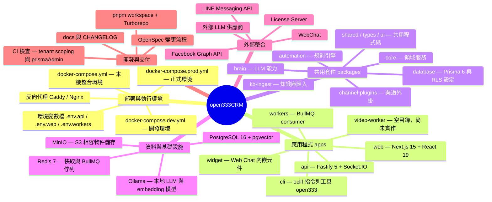

---

## 階段 1 — 部署與執行環境

這個專案有三個 compose 檔案。三個檔案的用途不同，因此這三個檔案不能互相取代。

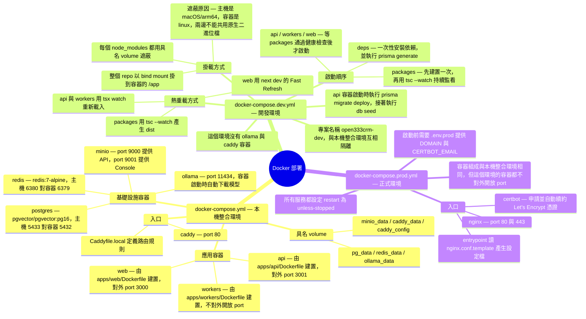

### 三個 compose 檔案的差異

| 項目             | `docker-compose.yml`                          | `docker-compose.dev.yml`                      | `docker-compose.prod.yml`           |
| ---------------- | --------------------------------------------- | --------------------------------------------- | ----------------------------------- |
| 用途             | 在本機用正式建置驗證整套系統                  | 日常開發，開發者修改主機檔案後容器立即生效    | 部署到伺服器                        |
| 程式碼來源       | 建置進 image                                  | 以 bind mount 掛載主機目錄                    | 建置進 image                        |
| 反向代理         | Caddy，只開 port 80                           | 無，開發者直接連各服務的 port                 | Nginx 加 Certbot，開 port 80 與 443 |
| Ollama           | 有                                            | 無                                            | 有                                  |
| 資料庫 migration | 由 image 的啟動流程執行                       | `api` 容器啟動時執行 `migrate deploy` 與 seed | 由 image 的啟動流程執行             |
| 對外開放的 port  | 80、3000、3001、5433、6380、9000、9001、11434 | 3000、3001、5433、6380、9000、9001            | 80、443                             |

### 服務對照表

| 服務       | 映像檔或建置來源          | 對外開放的 port              | 依賴                              | 出現在哪些環境         |
| ---------- | ------------------------- | ---------------------------- | --------------------------------- | ---------------------- |
| `postgres` | `pgvector/pgvector:pg16`  | 5433（正式環境不開放）       | 無                                | 三個環境都有           |
| `redis`    | `redis:7-alpine`          | 6380（正式環境不開放）       | 無                                | 三個環境都有           |
| `minio`    | `minio/minio`             | 9000、9001（正式環境不開放） | 無                                | 三個環境都有           |
| `ollama`   | `ollama/ollama`           | 11434（正式環境不開放）      | 無                                | 本機整合環境、正式環境 |
| `api`      | `apps/api/Dockerfile`     | 3001（正式環境不開放）       | 等 postgres 與 redis 通過健康檢查 | 三個環境都有           |
| `workers`  | `apps/workers/Dockerfile` | 不開放                       | 等 postgres 與 redis 通過健康檢查 | 三個環境都有           |
| `web`      | `apps/web/Dockerfile`     | 3000（正式環境不開放）       | api                               | 三個環境都有           |
| `caddy`    | `caddy:2-alpine`          | 80                           | api、web                          | 只有本機整合環境       |
| `nginx`    | `nginx:alpine`            | 80、443                      | api、web                          | 只有正式環境           |
| `certbot`  | `certbot/certbot`         | 不開放                       | 無                                | 只有正式環境           |
| `deps`     | `Dockerfile.dev`          | 不開放                       | 無                                | 只有開發環境           |
| `packages` | `Dockerfile.dev`          | 不開放                       | 等 `deps` 執行完成                | 只有開發環境           |

### 開發環境的啟動鏈

開發環境比另外兩個環境多了 `deps` 與 `packages` 兩個服務。這兩個服務不提供產品功能。它們只負責把容器帶到「可以啟動 app」的狀態，並且在完成之前擋住 `api`、`workers` 與 `web`，不讓這三個 app 提早啟動。

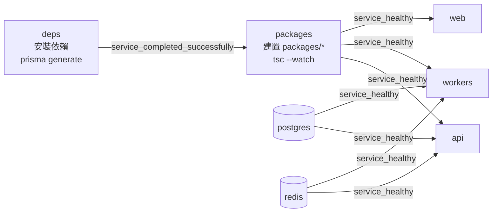

#### `deps` — 一次性安裝依賴

`deps` 設定 `restart: "no"`，執行完兩個指令就結束：

```bash
pnpm install --frozen-lockfile
pnpm --filter @open333crm/database exec prisma generate
```

重點是 `deps` **在容器啟動後才安裝依賴，不在 image build 階段安裝**。以下兩個原因必須同時成立，才需要 `deps` 這個服務：

1. **bind mount 會遮蔽 image 的內容。** `docker-compose.dev.yml` 把整個 repo 掛到容器的 `/app`，image 裡原本建置好的 `/app/node_modules` 因此被蓋住。巢狀的具名 volume（例如 `nm_root:/app/node_modules`）從掛載後的 `/app` 取得初始內容。該 volume 取得內容時看到的是主機目錄，不是 image 目錄，所以它取不到 image 安裝好的依賴。
2. **主機與容器的平台不同。** 主機是 macOS/arm64，容器是 linux。`esbuild`、Prisma engine、`next-swc` 都是平台專屬的原生二進位檔。容器若直接使用主機安裝的 `node_modules`，執行時會失敗。

所以 `deps` 的職責是：**在掛載完成之後，把 linux 版的依賴安裝進具名 volume，讓所有服務共用同一份**。

`Dockerfile.dev` 在 build 階段也執行過一次 `pnpm install --frozen-lockfile --ignore-scripts`。那一次不是為了產生 `node_modules`，而是為了**預先填滿 pnpm store**。pnpm store 位於 `/app` 之外，bind mount 不會遮蔽它。因此 `deps` 這次安裝從 store 建立連結，不必重新下載套件。第一次啟動之後，`deps` 的執行時間明顯縮短。

#### `packages` — 建置、監看，並擔任啟動閘門

`packages` 執行兩個階段：

```bash
pnpm -r --filter './packages/*' build            # 依相依順序全部建置一次
pnpm -r --parallel --filter './packages/*' run dev  # 再各自 tsc --watch
```

`packages` 同時是 `api`、`workers`、`web` 的**啟動閘門**。這個服務的健康檢查確認三個檔案是否存在：

```
packages/core/dist/index.js
packages/shared/dist/index.js
packages/types/dist/index.js
```

這三個 app 都用 `condition: service_healthy` 等這個健康檢查通過，因此這三個 app 不會在 `dist` 產生之前啟動。少了這個閘門，app 會在啟動時找不到模組而失敗。

`tsc --watch` 把 `dist` 寫回 bind mount 的主機目錄。`api` 與 `workers` 的 `tsx watch` 偵測到 `dist` 變動後重新載入。因此開發者修改 `packages/` 原始碼之後，這兩個 app 會自動重載。

**但是 `packages` 只監看 9 個 package 中的 7 個。** 以下是各 package 的 script 現況：

| package           | `build`  | `dev`（`tsc --watch`） |
| ----------------- | -------- | ---------------------- |
| `automation`      | 有       | 有                     |
| `brain`           | 有       | 有                     |
| `channel-plugins` | 有       | 有                     |
| `core`            | 有       | 有                     |
| `shared`          | 有       | 有                     |
| `types`           | 有       | 有                     |
| `ui`              | 有       | 有                     |
| `database`        | 有       | **沒有**               |
| `kb-ingest`       | **沒有** | **沒有**               |

`packages` 只在第一階段建置 `database` 一次，之後不監看它。**開發者修改 `packages/database/src` 之後，這個 package 不會自動重新編譯**，開發者必須手動重新建置，或重啟 `packages` 容器。`kb-ingest` 兩個 script 都沒有，因為 `kb-ingest` 以 `tsx` 直接執行原始碼，不產生 `dist`。

#### 為什麼另外兩個環境沒有這兩個服務

本機整合環境與正式環境不需要「等依賴安裝」與「等編譯完成」，因為這兩件事都已經在 image build 階段完成：

| 項目         | 開發環境                               | 本機整合環境與正式環境                                 |
| ------------ | -------------------------------------- | ------------------------------------------------------ |
| 程式碼來源   | bind mount 主機目錄                    | `COPY` 進 image                                        |
| 依賴安裝     | 容器啟動後由 `deps` 安裝進具名 volume  | image build 階段安裝，一併寫入 image                   |
| package 編譯 | 容器啟動後由 `packages` 建置並持續監看 | image build 階段編譯完成（例如 `apps/web/Dockerfile`） |
| 需要啟動閘門 | 需要，因為 `dist` 在 runtime 才產生    | 不需要，因為 `dist` 已在 image 內                      |

`deps` 與 `packages` 存在的唯一理由，是繞開 bind mount 造成的遮蔽問題。這個問題只在開發環境出現。

### 反向代理路由

在本機整合環境中，`Caddyfile.local` 把 port 80 收到的請求轉給兩個容器：

| 路徑             | 轉給       |
| ---------------- | ---------- |
| `/api/*`         | `api:3001` |
| `/mcp`           | `api:3001` |
| `/socket.io/*`   | `api:3001` |
| `/s/*`（短連結） | `api:3001` |
| `/webchat/*`     | `web:3000` |
| 其餘全部         | `web:3000` |

### 與設計稿的落差

`docs/02_SYSTEM_ARCHITECTURE.md` 列出的服務清單寫於規劃階段。目前的實作與該設計稿有四點不同：

1. 設計稿把 worker 拆成 `worker-auto`、`worker-broadcast`、`worker-sla` 三個容器。目前只有一個 `workers` 容器，這個容器在同一個 process 內執行所有 queue consumer。
2. 設計稿沒有 `ollama`。本機整合環境與正式環境都有 `ollama`，用來執行本地 chat 模型與 embedding 模型。
3. 設計稿把 `widget` 列為獨立服務。目前 `apps/widget` 建置後產生靜態資源，由 `apps/web` 提供這些資源，`widget` 沒有自己的容器。
4. 設計稿只提到 Caddy。目前本機整合環境用 Caddy，正式環境用 Nginx 加 Certbot。

### 已知待清理項目

- `apps/video-worker` 目錄下只剩 `node_modules`，沒有原始碼，也沒有 `package.json`。但是 `docker-compose.dev.yml` 仍為該目錄保留 `nm_videoworker` volume 與對應的掛載點。

---

## 階段 2 — 應用程式 apps

`apps/` 底下有 6 個目錄。其中 3 個有自己的容器（`api`、`web`、`workers`），2 個以其他形式出貨（`widget`、`cli`），1 個是空目錄（`video-worker`）。

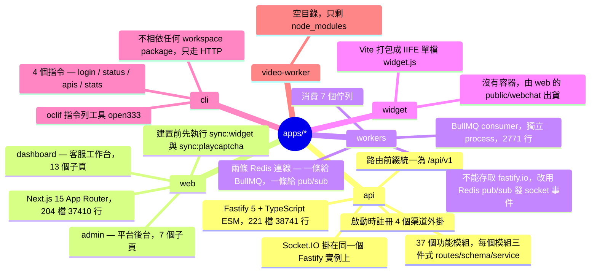

### 應用程式對照表

| app            | 技術                             | 進入點                          | 檔案數 | 行數    | 容器 | 相依的 workspace package                                               |
| -------------- | -------------------------------- | ------------------------------- | ------ | ------- | ---- | ---------------------------------------------------------------------- |
| `api`          | Fastify 5 + Socket.IO            | `src/index.ts` 的 `bootstrap()` | 221    | 38741   | 有   | `automation`、`channel-plugins`、`core`、`database`、`shared`、`types` |
| `web`          | Next.js 15 + React 19 + Tailwind | App Router                      | 204    | 37410   | 有   | `automation`、`shared`                                                 |
| `workers`      | BullMQ + ioredis                 | `src/index.ts`                  | 19     | 2771    | 有   | `automation`、`channel-plugins`、`core`、`shared`、`types`             |
| `widget`       | Vite + socket.io-client          | `src/index.ts`                  | 4      | 約 700  | 無   | `shared`                                                               |
| `cli`          | oclif                            | `src/index.ts`                  | 13     | 約 1400 | 無   | 無                                                                     |
| `video-worker` | 無                               | 無                              | 0      | 0       | 無   | 無                                                                     |

`api` 與 `web` 兩者相加約 7.6 萬行，佔專案絕大部分程式碼。

### `api` — 單一 Fastify 程序

`src/index.ts` 只有 217 行，它做四件事：**驗證權限註冊表 → 註冊 plugin → 註冊渠道外掛 → 掛載 37 個模組的路由**。

plugin 的註冊順序固定，後面的 plugin 依賴前面的：

```
multipart → cors → errorHandler → prisma → cookie → auth → socket → chatbox
```

`src/modules/` 有 37 個模組，每個模組是同一組三件式：

| 檔案                | 職責                            |
| ------------------- | ------------------------------- |
| `<name>.routes.ts`  | 路由宣告，掛在 `/api/v1/<name>` |
| `<name>.schema.ts`  | 請求與回應的結構驗證            |
| `<name>.service.ts` | 商業邏輯                        |

模組涵蓋四類：核心對話（`conversation`、`case`、`contact`、`tag`、`agent`）、渠道（`line`、`webchat`、`fb-login`、`line-login`、`webhook`、`webhook-subscriptions`）、平台治理（`platform`、`tenant-audit`、`role`、`trial`、`data-export`、`data-erasure`）、加值功能（`ai`、`knowledge`、`embedding`、`marketing`、`canvas`、`csat`、`shortlink`、`mcp`）。

`src/` 底下另有五個支援目錄：

| 目錄        | 內容                                                          |
| ----------- | ------------------------------------------------------------- |
| `plugins/`  | 7 個 Fastify plugin                                           |
| `guards/`   | `rbac.guard.ts`、`license.guard.ts`                           |
| `lib/`      | `prisma.ts`、`tenant-db.ts`（`withTenant`）、`cacheStore.ts`  |
| `services/` | 跨模組服務，例如 `inbound-router.ts`、`permission.service.ts` |
| `events/`   | `event-bus.ts`，行程內的 EventEmitter                         |

外掛機制本身的設計模式、封裝情境的運作方式，以及請求生命週期的細節，請看 [`API-PLUGIN-ARCHITECTURE.md`](./API-PLUGIN-ARCHITECTURE.md)。

`bootstrap()` 在啟動時呼叫 `validatePermissionRegistry()` 與 `validateRouteCodes()`。權限註冊表若與路由對不上，API 會在啟動階段就失敗，不會等到執行時才發現。

### `workers` — 獨立的佇列消費程序

`apps/workers/src/index.ts` 建立 **7 個 BullMQ consumer**：

| 佇列                  | handler                     | 用途                 |
| --------------------- | --------------------------- | -------------------- |
| `sla`                 | `sla.handler.ts`            | 輪詢 SLA 逾時並升級  |
| `notification`        | `notification.handler.ts`   | 送出通知             |
| `automation`          | `automation.handler.ts`     | 執行自動化規則       |
| `rich-menu-bind`      | `rich-menu-bind.handler.ts` | LINE Rich Menu 綁定  |
| `data-erasure`        | `data-erasure.handler.ts`   | 資料刪除請求         |
| `data-export`         | `data-export.handler.ts`    | 資料匯出             |
| `data-export-cleanup` | 同上檔案                    | 每小時清理過期匯出檔 |

這個 process 開兩條 Redis 連線：一條給 BullMQ 消費工作，一條給 pub/sub 發布 socket 事件。**workers 是獨立 process，拿不到 `fastify.io`**，所以 `workers` 透過 `lib/socket-bridge.ts` 發布到 Redis 的 `socket:emit` 頻道，由 API 程序接手真正的 emit。這條路徑就是 `AGENTS.md` 寫的 Path B。

`api` 這一側只建立 Queue producer。`modules/automation/automation.worker.ts` 與 `modules/notification/notification.worker.ts` 兩個檔案雖然叫 `worker`，內容只有 `new Queue(...)`，真正的 consumer 全部在 `apps/workers`。

### 訊息流

以「外部渠道進來一則訊息，最後推到客服畫面」為例。`AGENTS.md` 把推送分成兩條路徑，下圖用 `alt` 同時畫出兩者：

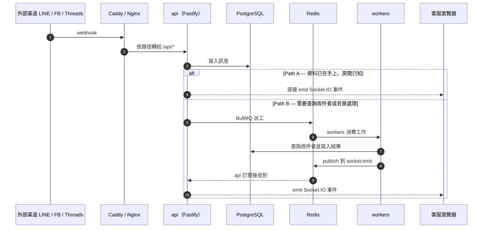

圖上 Redis 的生命線被穿越兩次：第 5 步收 BullMQ 的派工，第 9 步收 pub/sub 的發布。這兩次用途不同，`workers` 也為此開兩條連線。

客服瀏覽器載入頁面走的是另一條路徑：反向代理把不是 `/api/*` 的請求轉給 `web:3000`，與上圖的訊息推送無關。

### `web` — 兩套後台在同一個 Next.js 應用內

App Router 的頂層分成四區：

| 區段         | 子頁                                                                                                                                                   | 使用者                           |
| ------------ | ------------------------------------------------------------------------------------------------------------------------------------------------------ | -------------------------------- |
| `dashboard/` | `inbox`、`cases`、`contacts`、`automation`、`marketing`、`analytics`、`knowledge`、`line`、`notifications`、`plan`、`portal`、`settings`、`shortlinks` | 租戶的客服人員與管理員           |
| `admin/`     | `tenants`、`plans`、`plan-changes`、`usage`、`trial`、`login`、`lib`                                                                                   | 平台方，對應設計文件的平台授權層 |
| 認證與導流   | `login`、`trial`、`liff`、`line-login`、`fb-login`                                                                                                     | 未登入的訪客                     |
| 其他         | `chatbox`、`design-preview`                                                                                                                            | 內嵌對話框與設計預覽             |

`src/` 另有 `components`、`hooks`、`lib`、`providers` 四個目錄。`package.json` 的 `dev` 與 `build` 都會先執行 `sync:widget` 與 `sync:playcaptcha`，把外部產出的靜態檔複製進 `public/`。專案另外有 `playwright.shots.config.ts`，用於截圖測試。

### `widget` — 由 web 出貨的內嵌對話框

給終端訪客用的 Web Chat 對話框，不是給客服人員用的。4 個檔案：`index.ts`、`ui.ts`、`socket.ts`、`session.ts`。Vite 以 `lib` 模式打包成 IIFE 單檔，全域名稱 `Open333CRMWidget`，並把 `socket.io-client` 一起打包進去，因此嵌入用的 script 沒有外部相依。

`apps/web` 的 `sync:widget` 把 `dist/widget.js` 複製到 `public/webchat/widget.js`，對外路徑是 `/webchat/widget.js`。這解釋了為什麼 `Caddyfile.local` 把 `/webchat/*` 導到 `web:3000` 而不是 `api:3001`。

### `cli` — 唯一不相依 workspace 的 app

oclif 專案，發布名稱 `open333`。4 個指令：

| 指令     | 用途                            |
| -------- | ------------------------------- |
| `login`  | 登入並儲存 CLI 專用 token       |
| `status` | 檢查伺服器健康狀態與目前身分    |
| `apis`   | 列出 CLI token 可用的端點與能力 |
| `stats`  | 顯示目前 profile 的唯讀統計資料 |

`cli` 的 `package.json` 沒有任何 `@open333crm/*` 相依。它完全透過 HTTP 與 API 溝通，因此可以獨立安裝與發布。

### `video-worker` — 空目錄

`apps/video-worker/` 下只剩 `node_modules`，沒有原始碼，也沒有 `package.json`。`docker-compose.dev.yml` 仍為它保留 `nm_videoworker` volume 與掛載點。

### 已知落差

1. **`core` 在模組載入時就啟動一個 BullMQ consumer。** `packages/core/src/cases/case-service.ts` 第 253 行的註解寫著「for demonstration, would typically run in a separate worker process」，但下一行就在模組頂層執行 `new Worker("sla-monitoring", ...)`。`core/src/index.ts` 匯出這個檔案，所以任何載入 `@open333crm/core` 的程序都會啟動這個 consumer，`api` 與 `workers` 兩邊都會。這個佇列的 producer 也在同一個檔案內。這個佇列名稱是 `sla-monitoring`，與 `apps/workers` 消費的 `sla` 不同名，因此兩者不會互搶工作，但等於**專案同時存在兩套 SLA 機制**。
2. **`telegram` 外掛沒有註冊，因為它沒有可註冊的實例。** `packages/channel-plugins` 匯出 `linePlugin`、`fbPlugin`、`webchatPlugin`、`threadsPlugin` 四個實例，`apps/api/src/index.ts` 逐一把它們傳給 `registerChannelPlugin`。Telegram 只匯出 `TelegramPlugin` 類別，沒有對應的 `telegramPlugin` 實例，因此沒有東西可以傳給註冊函式。Telegram 的程式碼存在，執行時不會被載入。
4. **啟動 log 的外掛清單是寫死的字串，內容已經過時。** `apps/api/src/index.ts` 第 208 行印出 `'Registered channel plugins: LINE, FB, WEBCHAT'`。這行字串不讀註冊表，而同一個檔案第 121 行確實註冊了 `threadsPlugin`。log 少列了 THREADS。
3. **`api` 的 `*.worker.ts` 檔名與內容不符。** `automation.worker.ts` 與 `notification.worker.ts` 只建立 Queue producer，不建立 consumer。檔名容易讓人以為 API 程序也在消費佇列。

---

## 階段 3 — 共用套件 packages

`pnpm-workspace.yaml` 把 `packages/*` 全部納入 workspace。目前有 9 個 package，全部以 `@open333crm/` 為 scope，全部標記 `private`，不發布到 npm。app 透過 `workspace:*` 相依這些 package。

這 9 個 package 分成四種角色：

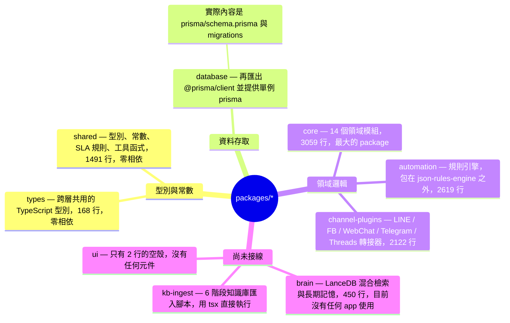

### 相依關係

箭頭方向是「A 相依 B」。這張圖只畫 `package.json` 宣告的 workspace 相依。

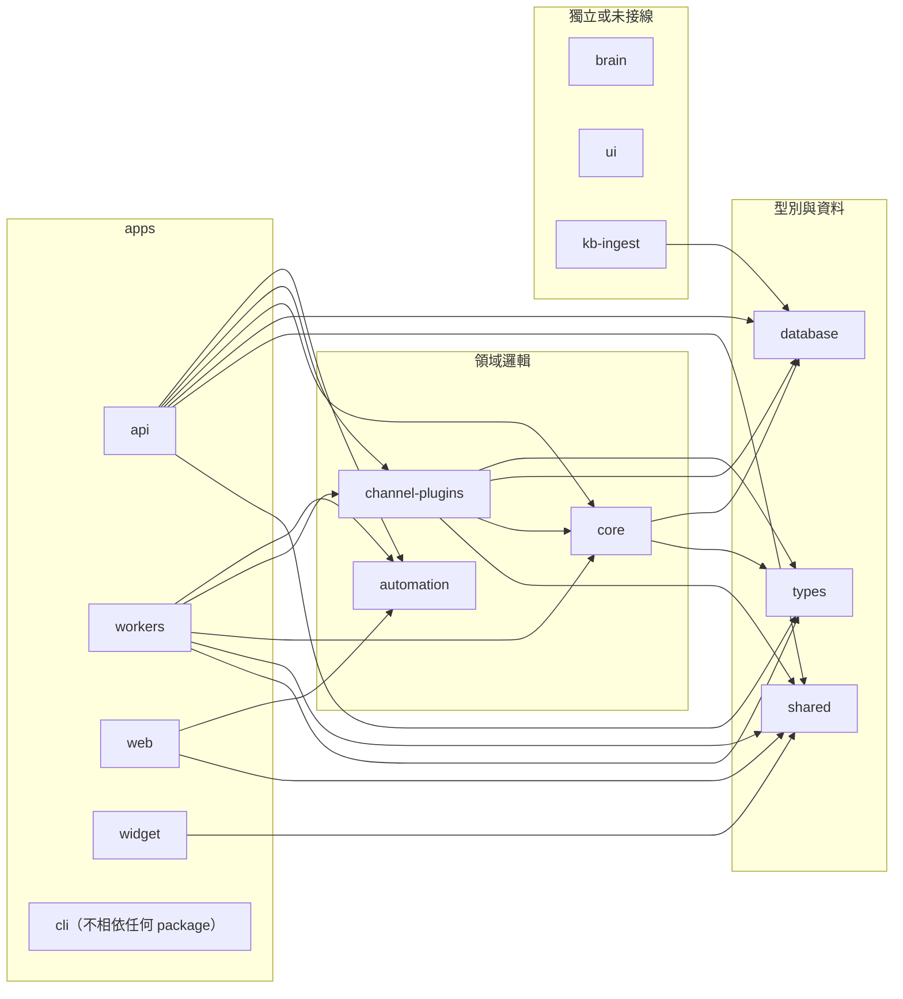

三個觀察：

1. **`types`、`shared`、`database` 是相依樹的葉節點**，這三個 package 不相依任何其他 workspace package。因此 `packages` 服務的建置順序從這三個開始。
2. **`automation` 也零相依**，但 `api`、`workers` 與 `web` 都使用它。`apps/web` 直接引用 `automation`，其他領域邏輯 package 都沒有被前端引用。
3. **`brain` 與 `ui` 沒有任何使用者**，`kb-ingest` 只被自己的腳本使用，不被任何 app 匯入。

### 套件對照表

| package           | 職責                                                                                                            | 檔案數 | 行數 | 相依的 workspace package              | 使用者                                               |
| ----------------- | --------------------------------------------------------------------------------------------------------------- | ------ | ---- | ------------------------------------- | ---------------------------------------------------- |
| `core`            | 領域服務：inbox、cases、contacts、canvas、templates、rbac、storage、license、logger、redis、event-bus、identity | 30     | 3059 | `database`、`types`                   | `api`、`workers`、`channel-plugins`                  |
| `automation`      | 規則引擎：規則評估、fact 建構、action 註冊、dispatcher、listener                                                | 22     | 2619 | 無                                    | `api`、`workers`、`web`                              |
| `channel-plugins` | 渠道轉接器：LINE、Facebook、WebChat、Telegram、Threads                                                          | 12     | 2122 | `types`、`database`、`core`、`shared` | `api`、`workers`                                     |
| `kb-ingest`       | 知識庫匯入的 6 階段離線腳本                                                                                     | 15     | 1719 | `database`                            | 無（用 `tsx` 直接執行）                              |
| `shared`          | 型別、常數、SLA 規則、LINE Flex 樣板、工具函式                                                                  | 18     | 1491 | 無                                    | `api`、`workers`、`web`、`widget`、`channel-plugins` |
| `brain`           | LanceDB 向量檢索、BM25、混合檢索、長期記憶、摘要、語音轉文字                                                    | 9      | 450  | 無                                    | 無                                                   |
| `types`           | 跨層共用的 TypeScript 型別定義                                                                                  | 1      | 168  | 無                                    | `api`、`workers`、`core`、`channel-plugins`          |
| `database`        | 再匯出 `@prisma/client`，並提供 `prisma` 單例                                                                   | 2      | 13   | 無                                    | `api`、`core`、`channel-plugins`、`kb-ingest`        |
| `ui`              | 預留的元件庫，目前只有一行 `export {}`                                                                          | 1      | 2    | 無                                    | 無                                                   |

行數只計 `src/**/*.ts`，不含 `dist`、測試資料與 Prisma schema。

### 各 package 的重點

#### `core` — 領域服務集散地

`packages/core/src/` 下有 14 個目錄，每個目錄是一個領域模組：

| 目錄                             | 內容                                                                                          |
| -------------------------------- | --------------------------------------------------------------------------------------------- |
| `inbox` / `cases` / `contacts`   | 三個主要領域服務                                                                              |
| `canvas`                         | 自動化流程執行器：`flow-runner`、`scheduler`、`smart-window`、`api-fetch-node`、`ai-gen-node` |
| `templates`                      | MJML 與 email 渲染、按鈕動作解析、WhatsApp HSM                                                |
| `rbac`                           | 權限模型，6 個檔案                                                                            |
| `identity`                       | 跨渠道身分縫合與合併建議                                                                      |
| `storage`                        | 儲存抽象層與 MinIO provider                                                                   |
| `license`                        | `LicenseService`，對應設計文件的平台授權層                                                    |
| `logger` / `redis` / `event-bus` | 基礎設施封裝                                                                                  |
| `channels`                       | `channel-adapter` 介面                                                                        |
| `automation`                     | 只有 `engine.ts`，且 `src/index.ts` 沒有匯出它                                                |

`core` 是唯一同時被 `api`、`workers` 與另一個 package（`channel-plugins`）使用的領域 package。

#### `automation` — 規則引擎

`automation` 把 `json-rules-engine` 包了一層。`src/contracts/` 定義規則的資料契約（events、facts、operators、actions、validation、UI 描述），因此 `apps/web` 可以直接引用同一份契約來繪製規則編輯介面。這是 `web` 相依 `automation` 的原因。

#### `channel-plugins` — 渠道轉接器

`src/index.ts` 定義 `ChannelPlugin` 介面與 webhook 的共用型別。各渠道的轉接器實作這個介面：

| 渠道     | 位置              | 附帶的 worker                                                                |
| -------- | ----------------- | ---------------------------------------------------------------------------- |
| LINE     | `src/line/`       | `worker-insight-sync`、`worker-media-download`、`worker-narrowcast-progress` |
| Facebook | `src/facebook/`   | 無                                                                           |
| WebChat  | `src/webchat/`    | 無                                                                           |
| Telegram | `src/telegram.ts` | 無                                                                           |
| Threads  | `src/threads.ts`  | 無                                                                           |

LINE 是唯一有專屬 worker 的渠道，也是唯一有 `builders.ts` 的渠道。

#### `database` — 薄封裝，重點在 schema

`src/` 只有 13 行：

```ts
export * from "@prisma/client";
export { prisma } from "./client.js";
```

這個 package 的實際內容在 `prisma/` 目錄：`schema.prisma`、`migrations/`、`seed.ts`、`seed-data/`。`src/client.ts` 建立的 `prisma` 單例是 **`prismaAdmin` 等級的連線，不套用 RLS**。應用程式碼必須從 Fastify 取得 client，規則寫在 `AGENTS.md` 的 Prisma Rules 一節。

#### `brain` — 已實作但尚未接線

9 個 service 類別：`BrainService`（協調者）、`LanceDBService`、`HybridSearchService`、`BM25Service`、`MemoryService`、`ChunkingService`、`SummarizationService`、`MarkitdownService`、`WhisperService`。相依 `@lancedb/lancedb`、`axios`、`zod`，不相依任何 workspace package。

`BrainService` 的定位是結合知識庫與長期記憶產生建議。目前沒有任何 app 的 `package.json` 列出 `@open333crm/brain`。

#### `kb-ingest` — 離線的 6 階段管線

每個階段是一個獨立 script，用 `pnpm --filter @open333crm/kb-ingest <階段>` 執行。六個階段依序串成一條線，只有第 3 與第 4 階段呼叫 LLM，只有第 6 階段寫入資料庫：

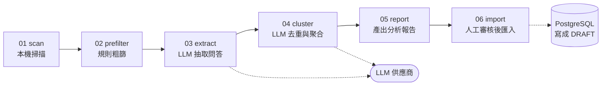

各階段的用途：

| 階段 | script      | 用途                                   |
| ---- | ----------- | -------------------------------------- |
| 01   | `scan`      | 純本機掃描，不呼叫 LLM                 |
| 02   | `prefilter` | 規則粗篩，降低 LLM 成本                |
| 03   | `extract`   | 用 LLM 抽取問答對，是成本最高的一步    |
| 04   | `cluster`   | 用 LLM 去重與聚合，把碎片合併成文章    |
| 05   | `report`    | 產出分析報告，不寫入資料庫             |
| 06   | `import`    | 人工審核後匯入知識庫，一律寫成 `DRAFT` |

`kb-ingest` 沒有 `build` 與 `dev` script，因為它用 `tsx` 直接執行 TypeScript 原始碼，不產生 `dist`。這對應階段 1〈開發環境的啟動鏈〉提到的監看落差。

### 已知落差

1. **`types` 與 `shared` 重複定義同一組型別。** `packages/types/src/index.ts` 定義 `ChannelType` 與 `MessageContentType`，`packages/shared/src/types/channel.types.ts` 也定義同名的兩個型別。前者是字面量聯集，後者是從 `CHANNEL_TYPE` 常數推導。兩者目前值相同，但沒有任何機制保證這兩份定義持續一致。`api` 與 `workers` 同時相依這兩個 package，因此開發者匯入時必須自行判斷該用哪一個。
2. **`channel-plugins` 的 `./fb` 子路徑匯出指向不存在的檔案。** `package.json` 宣告 `"./fb"` 對應 `./dist/fb/index.js`，但原始碼位於 `src/facebook/`，`tsc` 產生的是 `dist/facebook/`。`dist/fb/` 不存在，所以 `import '@open333crm/channel-plugins/fb'` 會解析失敗。目前沒有任何檔案匯入這個子路徑，因此這個問題尚未浮現。
3. **`brain` 沒有任何使用者。** 450 行、9 個 service 已經實作完成，但沒有 app 相依 `brain`。即使如此，`packages` 服務仍然建置並監看 `brain`。
4. **`ui` 是空殼。** `src/index.ts` 只有一行 `export {}`，`package.json` 卻宣告相依 `react` 與 `react-dom`，並在開發環境佔用一個 `tsc --watch` 程序。

---

## 階段 4 — 資料與基礎設施

四個外部服務。三個在所有環境都有（PostgreSQL、Redis、MinIO），Ollama 只在本機整合環境與正式環境有。

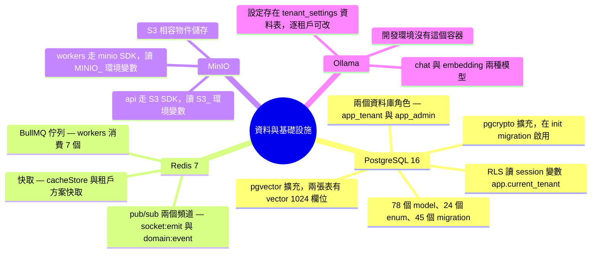

### PostgreSQL — 主資料庫

| 項目              | 值  | 來源                 |
| ----------------- | --- | -------------------- |
| Prisma model      | 78  | `schema.prisma`      |
| enum              | 24  | `schema.prisma`      |
| migration         | 45  | `prisma/migrations/` |
| 外鍵關聯          | 114 | `DATABASE-ERD.md`    |
| 啟用 RLS 的資料表 | 71  | `AGENTS.md`          |

擴充套件有兩個。`pgvector` 宣告在 `schema.prisma` 的 `datasource` 區塊，`pgcrypto` 在 `20260323021754_init` 這個 migration 啟用。向量欄位出現在 `km_articles` 與 `long_term_memories` 兩張表上。`schema.prisma` 宣告的型別是 `Unsupported("vector(1024)")`，`apps/api/src/modules/settings/embedding-settings.service.ts` 也用常數 `EMBEDDING_VECTOR_DIM = 1024` 記住這個數字。**但執行中的資料庫，這兩個欄位實際是 `vector(1536)`**，兩者不一致，詳見下面的〈已知落差〉。

租戶隔離靠兩個資料庫角色與一個 session 變數：

| 角色         | 特性                                     | 對應的 Prisma client                                   |
| ------------ | ---------------------------------------- | ------------------------------------------------------ |
| `app_tenant` | 套用 RLS，policy 讀 `app.current_tenant` | `fastify.prisma`、`request.tenantPrisma`、`withTenant` |
| `app_admin`  | `BYPASSRLS`                              | `fastify.prismaAdmin`，僅限白名單檔案                  |

資料表關聯圖在 [`DATABASE-ERD.md`](./DATABASE-ERD.md)，接線規則與排查步驟在 `postgres-rls-tenant-isolation` skill，兩者都不在本文件重複。

### Redis — 一個服務，三種用途

| 用途        | 使用者                     | 說明                                                                                                            |
| ----------- | -------------------------- | --------------------------------------------------------------------------------------------------------------- |
| BullMQ 佇列 | `api` 生產，`workers` 消費 | 7 個佇列，清單見階段 2                                                                                          |
| pub/sub     | 雙向                       | `workers` 發布到 `socket:emit`，`api` 的 `socket.plugin.ts` 訂閱後轉成 Socket.IO 事件；另有 `domain:event` 頻道 |
| 快取        | `api`                      | `lib/cacheStore.ts` 以 `CACHE_SEGMENT` 作為 key 前綴，另有租戶方案快取與授權快取                                |

`workers` 為此開兩條 Redis 連線：BullMQ 要求 `maxRetriesPerRequest: null`，而 pub/sub 發布用另一條，兩者不共用。

### MinIO — 兩套儲存實作並存

專案有**兩個各自獨立的儲存抽象層**，介面不同、SDK 不同、環境變數也不同：

|             | `packages/core/src/storage/`                                           | `apps/api/src/modules/storage/`                                                                    |
| ----------- | ---------------------------------------------------------------------- | -------------------------------------------------------------------------------------------------- |
| 介面        | `upload(bucket, key, file, contentType)`                               | `upload(buffer, key, mimeType)`，另有 `presignUpload`、`getSignedUrl`、`getObject`、`ensureBucket` |
| 實作        | `MinioStorageProvider`，用 `minio` SDK                                 | `S3StorageProvider`，用 S3 SDK                                                                     |
| 環境變數    | `MINIO_ENDPOINT`、`MINIO_PORT`、`MINIO_ACCESS_KEY`、`MINIO_SECRET_KEY` | `S3_ENDPOINT`、`S3_BUCKET`、`S3_ACCESS_KEY`、`S3_SECRET_KEY`、`S3_REGION`、`S3_PUBLIC_URL`         |
| bucket 模型 | 每次呼叫傳入 bucket 名稱                                               | 單一 bucket，用 `{tenantId}/{directory}/{uuid}.{ext}` 的 key 區分                                  |
| 取得方式    | 呼叫端直接 `new MinioStorageProvider()`                                | `getProvider()` 單例工廠                                                                           |
| 使用者      | `apps/workers` 的 `data-export`、`data-erasure` handler                | `apps/api` 的 storage 與 line-imagemap 路由                                                        |

`apps/api` 這一套有 `StorageDirectory` 的目錄約定：`media`、`templates`、`exports`、`avatars`、`imagemap`。

### Ollama — 本地 LLM 與 embedding

`apps/api/src/modules/ai/providers/` 有兩個 provider：`ollama.provider.ts` 與 `gemini.provider.ts`。模型設定不寫在環境變數，而是**存在 `tenant_settings` 資料表，每個租戶各自可改**：

| 欄位               | schema 預設值            |
| ------------------ | ------------------------ |
| `chatProvider`     | `ollama`                 |
| `chatModel`        | `qwen2.5:3b`             |
| `chatBaseUrl`      | `http://localhost:11434` |
| `embeddingModel`   | `bge-m3`                 |
| `embeddingBaseUrl` | `http://localhost:11434` |

compose 的 `ollama` 容器啟動時會依 `OLLAMA_CHAT_MODEL` 與 `OLLAMA_EMBED_MODEL` 自動下載模型，預設分別是 `qwen2.5:0.5b` 與 `bge-m3`。

### 已知落差

以下五點都由設定檔與原始碼靜態比對得出，我沒有實際啟動容器驗證。

1. **`workers` 上傳物件儲存時會連到自己。** `MinioStorageProvider` 的 endpoint 取自 `process.env.MINIO_ENDPOINT`，預設值是 `localhost`。專案裡**沒有任何 env 檔設定 `MINIO_*`**：compose 的 `MINIO_ROOT_USER` 與 `MINIO_ROOT_PASSWORD` 只給 `minio` 容器自己，沒有傳給 `workers`。因此在容器內，`workers` 的 `data-export` 與 `data-erasure` 會連向 `localhost:9000`，也就是 `workers` 容器自己，而不是 `minio` 容器。
2. **`.env.workers` 設定了 `workers` 用不到的變數。** 該檔案有 `S3_ENDPOINT=http://minio:9000` 等一整組 `S3_*`，但 `workers` 的儲存路徑走的是 `MinioStorageProvider`，讀的是 `MINIO_*`。`STORAGE_PROVIDER=minio` 這個變數則**沒有任何程式讀取**。
3. **`chatBaseUrl` 與 `embeddingBaseUrl` 的 schema 預設是 `localhost:11434`。** 在容器環境中，`localhost` 是 `api` 容器自己，`ollama` 容器的位址是 `http://ollama:11434`。新租戶的 `tenant_settings` 建立時會套用這個預設，因此必須有人手動改成 `ollama` 才連得到。
4. **compose 下載的模型與資料庫預設的模型不同。** compose 預設下載 `qwen2.5:0.5b`，`tenant_settings.chatModel` 的 schema 預設是 `qwen2.5:3b`，而沒有任何 env 檔設定 `OLLAMA_CHAT_MODEL`。兩邊要指向同一個模型才會一致。
5. **`apps/api/src/config/env.ts` 宣告的三個 `OLLAMA_*` 變數沒有程式讀取。** `OLLAMA_BASE_URL`、`OLLAMA_EMBED_MODEL`、`OLLAMA_CHAT_MODEL` 在 `env.ts` 有定義與預設值，但 `apps/api` 沒有任何檔案使用 `env.OLLAMA_*`。真正讀 `OLLAMA_*` 的只有 `packages/kb-ingest`，而且它直接讀 `process.env`。
6. **向量欄位的宣告維度與資料庫實際維度不一致。** `schema.prisma` 把 `km_articles.embedding` 與 `long_term_memories.embedding` 宣告為 `vector(1024)`，程式端的 `EMBEDDING_VECTOR_DIM` 也是 1024。查詢執行中的資料庫，這兩個欄位實際都是 `vector(1536)`。預設的 embedding 模型 `bge-m3` 產生 1024 維向量，把它寫進 1536 維的欄位會被資料庫拒絕。`DATABASE-ERD.md` 已記錄這項落差。

另外呼應階段 1：**開發環境沒有 `ollama` 容器**，因此在 `docker-compose.dev.yml` 下所有依賴本地 LLM 的功能都不能用，除非開發者另外在主機上跑 Ollama 並把設定改成主機位址。

---

## 階段 5 — 外部整合

系統對外連線分成四類：渠道平台、LLM 供應商、授權伺服器，以及本系統對客戶系統發出的 webhook。

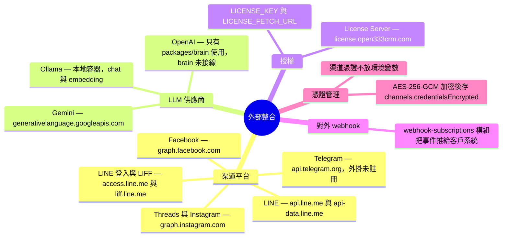

### 渠道平台

各渠道的轉接器在 `packages/channel-plugins`，路由在 `apps/api/src/modules/` 底下對應的模組。

| 渠道                 | 呼叫的網域                                   | 轉接器                           | 在 API 註冊 |
| -------------------- | -------------------------------------------- | -------------------------------- | ----------- |
| LINE                 | `api.line.me`、`api-data.line.me`            | `src/line/`                      | 是          |
| LINE 登入與 LIFF     | `access.line.me`、`liff.line.me`             | 由 `line-login`、`liff` 模組處理 | 是          |
| Facebook             | `graph.facebook.com`、`connect.facebook.net` | `src/facebook/`                  | 是          |
| Threads 與 Instagram | `graph.instagram.com`                        | `src/threads.ts`                 | 是          |
| WebChat              | 無外部網域                                   | `src/webchat/`                   | 是          |
| Telegram             | `api.telegram.org`                           | `src/telegram.ts`                | **否**      |

**渠道憑證不放在環境變數。** 每個租戶自己綁定渠道，憑證用 AES-256-GCM 加密後存進 `channels.credentialsEncrypted` 欄位，金鑰來自 `CREDENTIAL_ENCRYPTION_KEY`。因此 `.env.api.example` 裡看不到任何 LINE 或 Facebook 的 token。

### LLM 供應商

`apps/api/src/modules/ai/providers/` 只有兩個 provider：

| provider | 位置                 | 使用者                                |
| -------- | -------------------- | ------------------------------------- |
| Ollama   | `ollama.provider.ts` | `tenant_settings.chatProvider` 預設值 |
| Gemini   | `gemini.provider.ts` | 租戶自行切換                          |

OpenAI 的端點只出現在 `packages/brain` 的 `WhisperService` 與 `SummarizationService`，以及 `apps/api/src/services/license.ts` 的一筆設定資料。`brain` 目前沒有任何使用者，因此 OpenAI 這條路徑實際上沒有啟用。

租戶的 LLM API key 用與渠道憑證相同的 AES-256-GCM 機制加密，程式在 `apps/api/src/modules/ai/ai-key.service.ts`。

### 授權伺服器

設計上，客戶端用 `LICENSE_KEY` 向 `LICENSE_FETCH_URL` 拉取授權 JSON 並快取。之後 `license.guard.ts` 在每次 API 呼叫前檢查功能開關與額度。

`.env.workers` 有這三個變數：`LICENSE_KEY`、`LICENSE_FETCH_URL`、`LICENSE_SIGNATURE_SECRET`。`.env.api` 與 `.env.api.example` 都沒有。

### 對外 webhook

`apps/api/src/modules/webhook-subscriptions/` 是相反方向的整合：客戶系統訂閱本系統的事件，`webhook-dispatcher.ts` 在事件發生時把資料推給客戶系統。`modules/webhook/` 的方向相反，它接收渠道平台送來的 webhook。開發者不要混淆這兩個模組。

### 已知落差

1. **實際生效的 `LicenseService` 是寫死的假資料。** `apps/api/src/services/license.ts` 是 `license.guard.ts` 真正引用的實作，這個實作的 `initialize()` 有一行註解「Mocking the fetch based on v0.2.0 spec」。該方法接著直接組出一份寫死的功能設定，從不連線到授權伺服器。
2. **會連線的那份 `LicenseService` 沒有人用。** `packages/core/src/license/license-service.ts` 有完整的 `axios.get(LICENSE_FETCH_URL)` 實作，但除了 `core/src/index.ts` 的匯出之外，沒有任何檔案引用它。**兩份同名服務並存，跑的是假的那份。**
3. **`CREDENTIAL_ENCRYPTION_KEY` 有硬編碼的備援值。** `apps/api/src/modules/channel/channel.service.ts` 寫的是 `process.env.CREDENTIAL_ENCRYPTION_KEY ?? 'fallback-open333crm-key'`。環境變數若沒設定，程式不會失敗，而是用這個公開在原始碼裡的字串加密所有渠道憑證。

---

## 階段 6 — 開發與交付

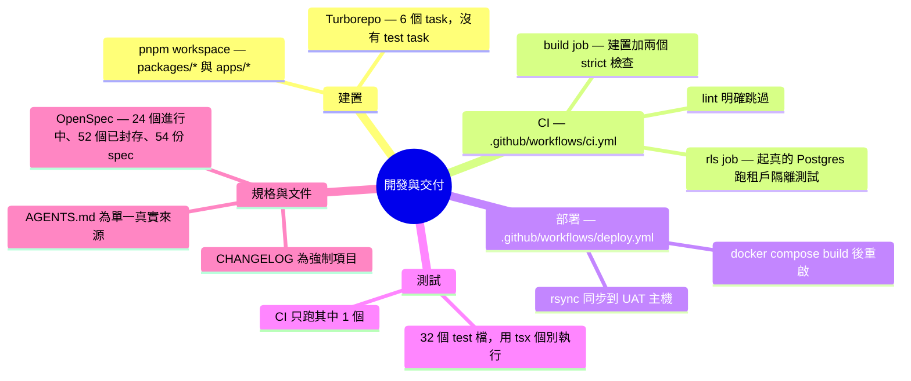

### 建置

`pnpm-workspace.yaml` 納入 `packages/*` 與 `apps/*`。Turborepo 定義 6 個 task：`build`、`dev`、`lint`、`db:generate`、`db:migrate`、`db:seed`。`build` 宣告 `dependsOn: ["^build"]`，因此 package 會依相依順序先建置。

`turbo.json` **沒有 `test` task**，根目錄的 `package.json` 也**沒有 `test` script**。

### CI

`.github/workflows/ci.yml` 在推到 `main` 或開 PR 時觸發，有兩個 job：

| job          | 內容                                                                                                                                                                |
| ------------ | ------------------------------------------------------------------------------------------------------------------------------------------------------------------- |
| `build`      | 安裝依賴、`prisma generate`、`pnpm build`，再跑 `check-tenant-scoping.mjs --strict` 與 `check-prisma-admin-usage.mjs --strict`                                      |
| RLS 隔離測試 | 起一個 `pgvector/pgvector:pg16` service、套 migration、設定 `app_tenant` 與 `app_admin` 的密碼、seed 兩個租戶的資料，再用這兩個角色的連線跑 `rls-isolation.test.ts` |

第二個 job 用真的資料庫與真的角色連線驗證跨租戶讀不到資料，不使用 mock。

`build` job 裡的 lint 步驟內容是 `echo "Linting skipped - configure ESLint in future"`。`eslint.config.js` 存在，`pnpm lint` 可以在本機執行，但 CI 不會擋。

### 部署

`.github/workflows/deploy.yml` 部署到 UAT：rsync 同步程式碼到 `/srv/open333crm`、確認 env 檔存在、清理 Docker build cache、`docker compose build`、重啟容器、驗證部署。UAT 用 nginx 佔用 port 80，所以這個流程會先改掉 caddy 的 port。

### 測試

專案有 32 個 `*.test.ts`。這些測試檔用 vitest 的 `import` 撰寫，但由 `tsx` 直接執行，專案沒有 vitest 設定檔。執行方式是逐一指定：

```bash
pnpm --filter @open333crm/api test:case
tsx apps/api/src/__tests__/smoke.test.ts
```

`apps/api/package.json` 有 5 個 `test:*` script（`test:case`、`test:broadcast`、`test:downstream`、`test:data-export`、`test:erasure`）。

### 規格與文件

| 項目                     | 數量或位置                                                                                                 |
| ------------------------ | ---------------------------------------------------------------------------------------------------------- |
| OpenSpec 進行中的 change | 24                                                                                                         |
| OpenSpec 已封存的 change | 52                                                                                                         |
| OpenSpec spec            | 54                                                                                                         |
| 單一真實來源             | `AGENTS.md`                                                                                                |
| 工具專屬補充檔           | `.claude/CLAUDE.md`、`.github/copilot-instructions.md`、`.agent/instructions.md`、`.gemini/`、`.kilocode/` |
| 變更紀錄                 | `CHANGELOG.md`，`feat`、`fix` 與架構變更皆為強制                                                           |

`AGENTS.md` 開頭明確要求其他指令檔不得複製專案事實，理由是兩份副本會分歧並互相矛盾。

### 已知落差

1. **32 個測試檔中，CI 只執行 1 個。** CI 只跑 `rls-isolation.test.ts`。沒有任何自動化流程執行其餘 31 個測試檔，專案也沒有統一的 `pnpm test` 指令可以一次跑完。
2. **CI 不執行 lint。** `eslint.config.js` 與 `pnpm lint` 都存在，但 CI 的 lint 步驟只印出一行字。程式碼風格與明顯錯誤不會在 PR 階段被擋下。
3. **測試框架與執行方式不一致。** 測試檔用 vitest 的 API 撰寫，卻靠 `tsx` 執行，專案沒有 vitest 設定檔。這代表 vitest 的功能（例如平行執行、覆蓋率、watch 模式）都用不到。

---

## 落差清單的執行時驗證

以上各階段的落差原本都由靜態比對得出。本節記錄實際啟動容器後的驗證結果。

- **驗證環境**：`docker compose -f docker-compose.dev.yml`（開發環境）
- **驗證日期**：2026-09-02
- **注意**：開發環境沒有 `ollama` 容器，因此與 Ollama 模型下載相關的項目只能部分驗證。

### 文件數字的核對

先確認本文件引用的數字與實際資料庫一致：

| 項目              | 文件記載           | 實際查詢結果                      | 一致 |
| ----------------- | ------------------ | --------------------------------- | ---- |
| 資料表            | 78                 | 78                                | 是   |
| enum              | 24                 | 24                                | 是   |
| 外鍵              | 114                | 114                               | 是   |
| 啟用 RLS 的資料表 | 71                 | 71（`ENABLE` 與 `FORCE` 都是 71） | 是   |
| 擴充套件          | pgvector、pgcrypto | `vector`、`pgcrypto`、`plpgsql`   | 是   |
| `app_tenant`      | 套用 RLS           | `rolbypassrls = false`            | 是   |
| `app_admin`       | `BYPASSRLS`        | `rolbypassrls = true`             | 是   |

沒有啟用 RLS 的 7 張資料表是 `model_pricings`、`plans`、`platform_audit_logs`、`platform_settings`、`platform_users`、`tenants`、`trial_signups`，與 `AGENTS.md` 列出的平台層資料表完全相同。

### 落差的驗證結果

| 落差                                       | 驗證方式                                                                        | 結果                                                                                                                                                                    |
| ------------------------------------------ | ------------------------------------------------------------------------------- | ----------------------------------------------------------------------------------------------------------------------------------------------------------------------- |
| 階段 4-1：`workers` 上傳物件儲存會連到自己 | 在 `workers` 容器內建立 `MinioStorageProvider` 並呼叫 `listBuckets()`           | **重現。** provider 的 endpoint 解析為 `localhost:9000`，連線回傳 `ECONNREFUSED`                                                                                        |
| 階段 4-2：`.env.workers` 的儲存變數用不到  | 讀取 `workers` 容器的環境變數                                                   | **確認。** `S3_ENDPOINT=http://minio:9000` 與 `STORAGE_PROVIDER=minio` 都有值，`MINIO_*` 一個都沒有                                                                     |
| 階段 3-2：`./fb` 子路徑無法解析            | 在 `api` 容器內逐一 `import()` 五個子路徑                                       | **重現。** 只有 `./fb` 回傳 `ERR_MODULE_NOT_FOUND`，`./line`、`./webchat`、`./telegram` 與主入口都正常                                                                  |
| 階段 2-1：兩套 SLA 機制並存                | 掃描 Redis 的 `bull:*` 鍵                                                       | **確認。** `sla` 與 `sla-monitoring` 兩個佇列同時存在。另外，在容器內 `import('@open333crm/core')` 會立刻印出 `Connected to Redis`，證實這個 package 在載入時就有副作用 |
| 階段 2-2：`telegram` 未註冊                | 在容器內重現 `apps/api/src/index.ts` 的註冊流程，再用 `hasChannelPlugin()` 檢查 | **確認，並找到更精確的原因。** LINE、FB、WEBCHAT、THREADS 都回傳已註冊，TELEGRAM 未註冊。`m.telegramPlugin` 是 `undefined`，模組只匯出 `TelegramPlugin` 類別            |
| 階段 2-4：啟動 log 的外掛清單過時          | 讀取 `api` 容器 log                                                             | **確認。** log 印出 `Registered channel plugins: LINE, FB, WEBCHAT`，但註冊表裡 THREADS 也在                                                                            |
| 階段 4-3：`chatBaseUrl` 預設指向容器自己   | 查 `tenant_settings` 的欄位預設值，再從 `api` 容器連 `localhost:11434`          | **重現。** 欄位預設是 `'http://localhost:11434'`，`api` 容器連這個位址得到 `Connection refused`                                                                         |
| 階段 4-4：compose 與資料庫的模型設定不一致 | 查 `tenant_settings.chatModel` 的欄位預設值                                     | **部分驗證。** 資料庫預設是 `qwen2.5:3b`，與 compose 的 `qwen2.5:0.5b` 不同。開發環境沒有 `ollama` 容器，因此沒有實際確認容器下載了哪個模型                             |
| 階段 4-5：`OLLAMA_*` 變數沒有程式讀取      | 讀取 `api` 容器的環境變數                                                       | **確認。** 容器內有 `OLLAMA_BASE_URL=http://ollama:11434`，但模型設定實際取自 `tenant_settings`，這個變數不影響行為                                                     |
| 階段 3-3：`brain` 沒有使用者               | 檢查容器內 `packages/brain/dist`                                                | **確認。** `dist/services` 存在，代表 `packages` 服務仍然建置並監看它                                                                                                   |
| 階段 3-4：`ui` 是空殼                      | 檢查容器內 `packages/ui/dist`                                                   | **確認。** `dist/index.d.ts` 存在，同樣佔用一次建置與一個監看程序                                                                                                       |
| 階段 3-5：`kb-ingest` 不產生 `dist`        | 檢查容器內 `packages/kb-ingest/dist`                                            | **確認。** 目錄不存在                                                                                                                                                   |
| 階段 4-6：向量欄位維度不一致               | 查詢 `pg_attribute` 取得兩個 `embedding` 欄位的實際型別                         | **重現。** `km_articles` 與 `long_term_memories` 的欄位都是 `vector(1536)`，`schema.prisma` 宣告的是 `vector(1024)`                                                     |
| 階段 5-1：`LicenseService` 是寫死的假資料  | 讀取 `api` 容器的環境變數與啟動 log                                             | **間接確認。** 容器內沒有任何 `LICENSE_*` 變數，log 也沒有任何授權抓取紀錄，但 `license.guard.ts` 仍正常運作，因為它讀的是寫死的設定                                    |

### 未在執行時驗證的項目

以下項目屬於原始碼與設定檔層級，啟動容器不會提供額外資訊，維持靜態比對的結論：

- 階段 1：`docs/02_SYSTEM_ARCHITECTURE.md` 與 compose 的四點差異
- 階段 2-3：`api` 的 `*.worker.ts` 檔名與內容不符
- 階段 3-1：`types` 與 `shared` 重複定義型別
- 階段 5-2：`packages/core` 的 `LicenseService` 沒有人引用
- 階段 5-3：`CREDENTIAL_ENCRYPTION_KEY` 的硬編碼備援值
- 階段 6：CI 只跑 1 個測試、CI 不執行 lint、測試框架與執行方式不一致
