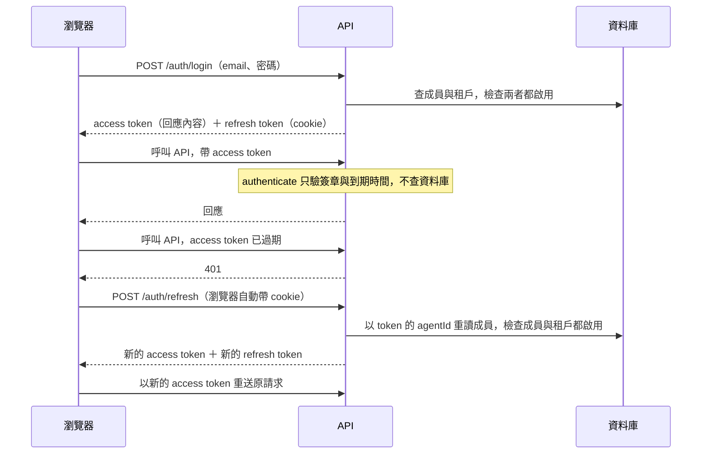

# 認證與憑證

本文件說明 API 怎麼確認呼叫者是誰：系統發出哪些憑證、每種憑證在哪裡驗證、驗證後在請求上留下哪些欄位，以及停用或撤銷之後多久生效。權限碼怎麼計算、渠道可見範圍怎麼判斷，見[人員與角色](../features/tenant/MEMBERS.md#角色與權限)；平台帳號的登入流程見[平台帳號認證](../features/platform/AUTH.md)。

- **資料來源**：`apps/api/src/plugins/auth.plugin.ts`、`apps/api/src/plugins/socket.plugin.ts`、`apps/api/src/plugins/chatbox.plugin.ts`、`apps/api/src/guards/rbac.guard.ts`、`apps/api/src/modules/auth/*`、`apps/api/src/modules/mcp/*`、`apps/api/src/modules/portal/portal-auth.service.ts`、`apps/api/src/modules/portal/portal-public.routes.ts`、`apps/api/src/modules/chatbox/chatbox.service.ts`、`apps/api/src/modules/webchat/webchat.socket.ts`、`apps/api/src/modules/identity-binding/email-registration.*`、`apps/api/src/modules/webhook/webhook.service.ts`、`apps/api/src/config/env.ts`
- **核對日期**：2026-09-30

## 這份文件回答的問題

| 問題 | 章節 |
| --- | --- |
| 系統有哪些憑證？各由誰取得、在哪裡驗證？ | [憑證一覽](#憑證一覽) |
| 我的路由該掛哪個認證裝飾器？驗證後 `request.agent` 有哪些欄位？ | [認證裝飾器](#認證裝飾器) |
| 客服登入之後，token 過期時怎麼換發？ | [客服的登入與換發](#客服的登入與換發) |
| Socket 連線怎麼認證？ | [Socket 連線](#socket-連線) |
| 停用成員、停用租戶或撤銷 token 之後，多久生效？ | [停用與撤銷什麼時候生效](#停用與撤銷什麼時候生效) |
| 哪些憑證共用同一把密鑰？ | [密鑰](#密鑰) |
| 沒有登入的對外端點怎麼確認呼叫者？ | [對外端點](#對外端點) |
| 新增路由時，認證要注意什麼？ | [新增路由時的規則](#新增路由時的規則) |
| 目前有哪些已知問題？ | [目前的限制](#目前的限制) |

## 先讀這一段

系統用下列方式確認呼叫者：

1. **簽章 token（JWT）**：伺服器只驗證簽章與到期時間，不查資料庫。驗證快，但 token 發出之後無法撤銷，也反映不了帳號後來的狀態。客服的 access token 與 refresh token、平台 JWT、粉絲 token、MCP 確認 token 屬於這一種。
2. **查表的 token**：token 是一串隨機字元，資料庫只存雜湊值。每個請求都查一次資料庫，所以可以撤銷，也可以同時檢查帳號狀態。CLI token、Partner API 金鑰與 Chatbox session 屬於這一種。
3. **外部簽章**：渠道平台以雙方共用的秘密，對 webhook 的內容簽章。

認證只回答「呼叫者是誰」，結果寫在 `request.agent`、`request.platformUser`、`request.fan` 或 `socket.data`。之後的權限檢查回答「呼叫者能做什麼」，讀的就是認證寫下的欄位。**認證沒有填某個欄位，權限檢查就會拿到空值**。下文的已知問題多半出在這裡。

## 憑證一覽

| 憑證 | 持有者 | 取得方式 | 格式與儲存 | 驗證位置 | 有效期 |
| --- | --- | --- | --- | --- | --- |
| 客服 access token | 成員（網頁） | 密碼或 Passkey 登入、`POST /auth/refresh` | JWT，以 `JWT_SECRET` 簽發 | `authenticate` 等裝飾器、socket 連線 | `ACCESS_TOKEN_EXPIRES_IN` |
| 客服 refresh token | 成員（網頁） | 與 access token 同時發出 | JWT，同一把密鑰，另帶 `rememberMe`。存在 httpOnly、`SameSite=strict` 的 cookie | `POST /auth/refresh` | `REFRESH_TOKEN_EXPIRES_IN`。沒勾「記住我」時 cookie 不設期限，瀏覽器關閉就清除 |
| 平台 JWT | 平台帳號 | `POST /platform/auth/login` | JWT，以 `PLATFORM_JWT_SECRET` 簽發，註冊在 `platform` namespace | `authenticatePlatformSuperuser` | `PLATFORM_JWT_EXPIRES_IN` |
| CLI token | 成員（CLI、MCP） | `POST /auth/cli/login`，或在設定頁 `POST /settings/cli-sessions` | `cli_` 開頭的隨機字元。`CliSession` 存雜湊值與 scope | `authenticateCliSession`、`authenticateJwtOrCliSession` | 預設 30 天，見 `cli-session.service.ts` 的 `DEFAULT_EXPIRES_DAYS` |
| Partner API 金鑰 | 外部夥伴系統 | 設定頁 `POST /settings/api-keys` | `pk_` 開頭的隨機字元。`PartnerApiKey` 存雜湊值 | `authenticateJwtOrPartnerKey` | 建立時指定；不指定就不會過期 |
| 粉絲 token | LINE 粉絲 | 目前沒有。原本的 `POST /fan/auth` 已在 `481452a` 刪除，`signFanToken()` 沒有呼叫端 | JWT，以 `JWT_SECRET` 簽發，`sub` 為 `'fan'` | `portal-public.routes.ts` 的 `authenticateFan()` | 24 小時，寫死在 `signFanToken()` |
| MCP 確認 token | MCP 客戶端 | 呼叫 LINE 發送或群發工具、但沒帶確認 token 時，工具回傳預覽與這個 token | JWT，以 `JWT_SECRET` 簽發 | `verifyLineMcpConfirmation()`，比對操作種類、租戶、成員與 CLI session | 5 分鐘 |
| Chatbox session 與 claim token | 網站訪客 | `POST /chatbox/sessions` 建立 session，`POST /chatbox/sessions/verify` 取得 claim token | session ID 是加密字串；`ChatboxSession` 存 session，claim token 的 HMAC 存在 Redis | `chatboxSessionVerifier`，REST 與 `/visitor` socket 共用 | `CHATBOX_SESSION_TTL_MINUTES`，程式上限 3 天 |
| 試用驗證 token | 試用申請者 | 送出試用申請後寄到信箱 | 隨機字元。`TrialSignup` 存 SHA-256 | `GET /trial/verify` | 試用政策的 `verifyTokenTtlHours` |
| Email 登記 token | 客人 | 客人在對話中傳送 email 登記關鍵字，或客服代發登記連結 | 32 bytes 隨機值（base64url）。存在 Redis，綁定租戶、渠道身分與對話 | `/api/v1/public/email-registration/:token`，成功送出 email 時以 `GETDEL` 取出 | 30 分鐘 |

各有效期的預設值在 `apps/api/src/config/env.ts`。

Passkey 不是另一種 token。Passkey 驗證成功後，系統發出的是一般的 access token 與 refresh token。Passkey 的 challenge 存在 Redis，有效期是 `WEBAUTHN_CHALLENGE_TTL_SECONDS`。

## 認證裝飾器

租戶的路由從下列裝飾器擇一使用。裝飾器驗證成功後寫入 `request.agent`，但**各裝飾器填入的欄位不同**：

| 裝飾器 | 接受的憑證 | `id` | `tenantId` | `role` | `roleId` | 其他欄位 | 使用的路由 |
| --- | --- | --- | --- | --- | --- | --- | --- |
| `authenticate` | 以 `JWT_SECRET` 簽發的任何 JWT | token 的 `agentId` | token 的 `tenantId` | token 的 `role` | token 的 `roleId` | 無 | 租戶後台的絕大多數路由 |
| `authenticateCliSession` | CLI token | 成員 ID | 成員的租戶 | 成員的 `role` | **不填** | `isCliSession`、`cliSession`（含 scope） | `cli.routes.ts`、`POST /auth/cli/logout` |
| `authenticateJwtOrCliSession` | `cli_` 開頭走 CLI，其他走 JWT | CLI 分支是成員 ID | CLI 分支是成員的租戶 | CLI 分支是成員的 `role` | **兩個分支都不填** | CLI 分支有 `isCliSession`、`cliSession` | `GET /auth/me`、MCP 端點 |
| `authenticateJwtOrPartnerKey` | `pk_` 開頭走金鑰，其他走 JWT | 金鑰分支是建立者的 ID | 金鑰的租戶 | 金鑰分支固定為 `SUPERVISOR` | **兩個分支都不填** | 金鑰分支有 `isPartnerKey`、`apiKeyId` | `POST /knowledge/partner-ingest` |
| `authenticatePlatformSuperuser` | 平台 JWT | 寫入 `request.platformUser`，不寫 `request.agent` | | | | | `/api/v1/platform/*` |

「JWT 或其他憑證」的裝飾器，JWT 分支填入的 `id`、`tenantId`、`role` 與 `authenticate` 相同，只少了 `roleId`，見 `../system/AUDIT.md` 的 AUTH-06。

驗證之後，下列程式讀這些欄位：

| 讀取者 | 讀的欄位 | 怎麼使用 |
| --- | --- | --- |
| `requirePermission()`、`requireAnyPermission()` | `isPartnerKey`、`isCliSession`、`roleId` | `isPartnerKey` 為真時，只放行 `PARTNER_KEY_ALLOWED` 列出的權限碼。`isCliSession` 為真時直接放行。`roleId` 為空時權限集合為空，一律回 403 |
| 渠道可見範圍（`channel-visibility.ts` 的 `resolveRoleId()`） | `id` | 以 `id` 查成員再取角色。`id` 為 `undefined` 時，Prisma 忽略這個條件，查到租戶內任一成員。目前每個認證入口都會填入 `id`，因此不會發生 |
| 工單自動指派、通知收件人等業務規則 | `role` | 見 `../system/AUDIT.md` 的 RBAC-03 |
| `request.tenantPrisma` | `tenantId` | 沒有 `request.agent` 時拋出錯誤 |

`authenticate`、兩個「JWT 或其他憑證」裝飾器的 JWT 分支，以及 socket 的連線驗證，都只接受客服的 access token：payload 的 `typ` 要是 `access`，而且帶 `agentId` 與 `tenantId`（`apps/api/src/lib/agent-token.ts` 的 `isAgentAccessToken()`）。refresh token、粉絲 token、MCP 確認 token 與沒有 `typ` 的舊格式 access token 都會被拒絕。`POST /auth/refresh` 反過來只接受 refresh token；過渡期也接受沒有 `typ` 的舊格式 refresh token。

## 客服的登入與換發



前端的 `apps/web/src/lib/api.ts` 收到 401 時自動呼叫 `/auth/refresh`，成功後重送原請求。

換發時，新 token 的 `role` 與 `roleId` 取自資料庫的現值，不沿用舊 token。所以改了成員的角色之後，成員最晚在下一次換發時拿到新角色；在那之前，路由的權限檢查仍依舊 token 的 `roleId`。

角色本身的權限碼改變時，生效較快。`permission.service.ts` 把有效權限快取在 Redis，角色或方案變更時主動清除快取；清除失敗時，快取最多保留 10 分鐘。

`POST /auth/logout` 只清掉 refresh token 的 cookie。已發出的 access token 與 refresh token 在到期前都仍然有效。

## Socket 連線

Socket.IO 的每個 namespace 各自認證：

| namespace | 使用者 | 認證 | 連線後自動加入的房間 | 其他房間 |
| --- | --- | --- | --- | --- |
| 預設（`/`） | 客服 | `socket.plugin.ts` 的 `io.use()` 以 `JWT_SECRET` 驗證 handshake 的 token，把 `agentId`、`tenantId`、`role`、`roleId` 寫入 `socket.data` | `tenant:<tenantId>`、`agent:<agentId>` | 送出 `subscribe` 時由 `authorizeSocketRoom()` 查資料庫授權，並限制頻率 |
| `/visitor` | 網站訪客 | `webchat.socket.ts` 以 `chatboxSessionVerifier` 驗證 session ID 與 claim token，並以來源 IP 限制連線頻率 | `visitor:<channelId>:<visitorToken>` | 無 |

客服的 socket 只在 handshake 驗證一次。連線建立之後，系統不會重新驗證，也不會在成員或租戶停用時主動斷線。

`tenant:<tenantId>` 房間會收到整個租戶的 `message.new`，不經過渠道可見範圍的檢查，見 `../system/AUDIT.md` 的 RBAC-04。

## 停用與撤銷什麼時候生效

| 動作 | 客服 access token | 客服 refresh token | 客服 socket 連線 | CLI token | Partner API 金鑰 |
| --- | --- | --- | --- | --- | --- |
| 停用成員 | 有效到過期 | 換發時被擋下 | 不中斷 | 立即失效 | 不受影響 |
| 永久刪除成員 | 有效到過期 | 換發時被擋下 | 不中斷 | 隨成員刪除 | 不受影響 |
| 停用租戶 | 有效到過期 | 換發時被擋下 | 不中斷 | **不受影響** | **不受影響** |
| 改成員的角色 | 沿用舊角色到過期 | 換發時取得新角色 | 沿用舊角色 | 不看角色 | 不看角色 |
| 登出 | 有效到過期 | cookie 清除，token 本身仍有效 | 前端斷線 | 以 `POST /auth/cli/logout` 撤銷 | 不適用 |
| 撤銷該憑證 | 無法撤銷 | 無法撤銷 | 無法撤銷 | 立即失效 | 立即失效 |

「有效到過期」的上限是 `ACCESS_TOKEN_EXPIRES_IN`。登出與改密碼都不會讓 refresh token 失效，持有 refresh token 的人可以一直換發到 `REFRESH_TOKEN_EXPIRES_IN`，見 `../system/AUDIT.md` 的 AUTH-08。

CLI token 與 Partner API 金鑰每次請求都查資料庫，但檢查的項目不同：

| 檢查項目 | CLI token（`verifyCliSession()`） | Partner API 金鑰（`verifyPartnerApiKey()`） |
| --- | --- | --- |
| 憑證是否撤銷 | 檢查 `revokedAt` | 只查 `isActive` 為真的金鑰 |
| 憑證是否過期 | 檢查 | 檢查 |
| 成員是否啟用 | 檢查 | 不檢查。`createdById` 沒有外鍵，建立者被清除之後金鑰仍可使用 |
| 租戶是否啟用 | 不檢查 | 不檢查 |

平台帳號不在上表：`authenticatePlatformSuperuser` 每個請求都回查 `platform_users`，停用立即生效。改密碼則不會讓已發出的平台 JWT 失效，見 `../system/AUDIT.md` 的 AUTH-03。

## 密鑰

| 密鑰 | 用途 |
| --- | --- |
| `JWT_SECRET` | 客服 access token、refresh token、粉絲 token、MCP 確認 token。`CHATBOX_SESSION_SECRET` 沒有設定時，Chatbox session 的加密與 HMAC 也用它 |
| `PLATFORM_JWT_SECRET` | 平台 JWT。沒有設定時，平台後台停用，登入回 503 `PLATFORM_DISABLED` |
| `CHATBOX_SESSION_SECRET` | Chatbox session。`.env.api.example` 沒有列出這個變數，所以未特別設定的部署都會退回 `JWT_SECRET` |
| 渠道憑證（`channelSecret`、`appSecret`） | 驗證渠道平台送來的 webhook 簽章，加密存在 `Channel.credentialsEncrypted` |

平台 JWT 與租戶 JWT 用不同的密鑰，兩邊的 token 無法互相通過。租戶端的各種 JWT 共用一把密鑰，驗證端以 payload 的欄位區分種類：客服 token 看 `typ`，粉絲 token 看 `sub`，MCP 確認 token 看 `v` 與 `op`。

## 對外端點

下列端點不接受客服登入，各自確認呼叫者。這些端點在確認租戶之前就要查資料，因此使用 `prismaAdmin`，租戶隔離完全靠查詢條件。

| 端點 | 呼叫者 | 怎麼確認呼叫者 | 租戶從哪裡來 |
| --- | --- | --- | --- |
| `/api/v1/webhooks/line/:channelId`、`/fb/:channelId`、`/threads/:channelId` | 渠道平台 | `webhook.service.ts` 以渠道的外掛 `verifySignature()` 驗證原始內容的簽章 | 路徑的 `channelId` 對應的渠道 |
| `/api/v1/chatbox/*`、`/api/v1/webchat/:channelId/*` | 網站訪客 | Chatbox session 加 claim token。瀏覽器指紋與建立時差異過大時拒絕 | session 所屬的渠道 |
| `/api/v1/fan/*` | LINE 粉絲 | 粉絲 token。系統目前不簽發粉絲 token，因此這組路由目前無法使用 | token 的 `tenantId` |
| `/api/v1/trial/*` | 試用申請者 | 信箱驗證 token | 驗證成功時才建立租戶 |
| `/api/v1/auth/line/*`、`/api/v1/auth/fb/*` | 客人 | OAuth 的 state | state 記錄的渠道 |
| `/s/:slug`、`/s/track` | 點擊短連結的人 | 無 | 短連結所屬的租戶 |
| `/line-imagemap/:tenantId/…` | LINE 平台 | 無 | 路徑參數 |

渠道外掛的簽章規則見[渠道管理](../features/tenant/CHANNELS.md#webhook)；本系統送給外部的 Webhook 怎麼簽章，見[稽核、資料權利與對外整合](../features/tenant/GOVERNANCE.md#對外-webhook)。

## 新增路由時的規則

1. **租戶後台的路由用 `fastify.authenticate`，再掛 `requirePermission()`。** 只有 `authenticate` 會填 `roleId`，權限檢查才算得出權限集合。
2. **不要把 `authenticateJwtOrCliSession` 與 `requirePermission()` 放在同一條路由。** CLI 分支會被 `requirePermission()` 直接放行，JWT 分支會因為沒有 `roleId` 而一律 403。同一條路由，CLI 失效開放，網頁失效關閉。CLI 路由改用 `hasCliScope()` 檢查 scope。
3. **要讓 Partner API 金鑰呼叫新路由，就把權限碼加進 `rbac.guard.ts` 的 `PARTNER_KEY_ALLOWED`。** 沒有列入的權限碼，金鑰一律 403。
4. **公開端點的租戶與身分，要從驗證過的憑證推導。** 不要接受呼叫端在 body 或 query 指定 `tenantId`、`contactId` 或渠道身分。`/auth/line/authorize` 沒有遵守這條規則，見下一節。已刪除的 `/fan/auth` 也是因為違反這條規則而刪除。
5. **確認新路由有沒有速率限制。** 速率限制外掛由各模組自己註冊，沒有全站設定。`auth`、`trial`、`platform` 以 `global: false` 註冊，只有個別設定 `config.rateLimit` 的路由受限。`chatbox`、`webchat` 對模組內每條路由套用同一個上限。其他模組沒有註冊外掛，在這些模組設定 `config.rateLimit` 不會生效，也不會報錯。見 `../system/AUDIT.md` 的 SEC-03。

## 目前的限制

| 限制 | 詳見 `../system/AUDIT.md` |
| --- | --- |
| 租戶的帳號鎖定只依 email 計數，知道 email 的人可以讓該成員無法以密碼登入 | SEC-06 |
| CLI token 只看 scope，不看角色與方案天花板；`requirePermission()` 對 CLI 直接放行 | RBAC-02 |
| 停用租戶不中斷 socket 連線，也不影響 CLI token 與 Partner API 金鑰 | AUTH-02 |
| `authenticateJwtOrCliSession` 與 `authenticateJwtOrPartnerKey` 的 JWT 分支不填 `roleId`，網頁登入的成員即使有權限也呼叫不了 `partner-ingest` | AUTH-06 |
| 登出、改密碼或重設密碼都不會讓已發出的 refresh token 失效 | AUTH-08 |
| `config/env.ts` 的 `JWT_EXPIRES_IN` 沒有讀取端 | AUTH-07 |
| 租戶端沒有忘記密碼流程 | AUTH-01 |

## 自己驗證的方法

```bash
# 每個認證裝飾器被哪些路由使用
grep -rn "authenticateCliSession\|authenticateJwtOrCliSession\|authenticateJwtOrPartnerKey" apps/api/src/modules

# 以 JWT_SECRET 簽發或驗證 token 的位置
grep -rn "JWT_SECRET\|jwt.sign\|jwtVerify\|jwt.verify" apps/api/src

# 沒有掛認證的路由檔（公開端點）
grep -L "authenticate" apps/api/src/modules/*/*.routes.ts
```
