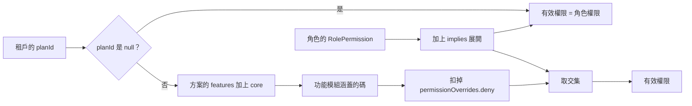

# 權限計算

本文件說明租戶後台怎麼決定一個成員能做什麼：權限碼從哪裡來、有效權限怎麼算、快取什麼時候失效、渠道可見範圍怎麼判斷，以及新增權限碼時要做哪些事。呼叫者的身分怎麼確認，見[認證與憑證](./AUTHENTICATION.md)；角色與權限頁的操作規則（防越權、管理員鎖定、防自鎖），見[人員與角色](../features/tenant/MEMBERS.md#角色與權限)。

- **資料來源**：`packages/core/src/rbac/*`、`apps/api/src/guards/rbac.guard.ts`、`apps/api/src/services/permission.service.ts`、`apps/api/src/services/tenant-plan.cache.ts`、`apps/api/src/services/channel-visibility.ts`、`apps/api/src/modules/socket/socket-room-authorization.ts`、`apps/api/src/modules/role/role.service.ts`、`apps/api/src/index.ts`、`scripts/reconcile-system-role-permissions.mjs`、`packages/database/prisma/seed-data/rbac-roles.ts`、`apps/web/src/providers/AuthProvider.tsx`、`apps/web/src/components/layout/Sidebar.tsx`
- **核對日期**：2026-09-30

## 這份文件回答的問題

| 問題 | 章節 |
| --- | --- |
| 一個請求通過認證之後，還要經過哪些檢查？ | [先讀這一段](#先讀這一段) |
| 權限碼定義在哪裡？`dependsOn` 與 `implies` 有什麼差別？ | [權限碼的註冊表](#權限碼的註冊表) |
| 成員的有效權限怎麼算？方案怎麼限制它？ | [有效權限怎麼算](#有效權限怎麼算) |
| 改了角色或方案之後，多久生效？ | [快取與失效](#快取與失效) |
| 路由怎麼檢查權限碼？ | [路由的檢查](#路由的檢查) |
| 成員看得到哪些渠道？層級不足時回什麼？ | [渠道可見範圍](#渠道可見範圍) |
| 成員可以訂閱哪些 socket 房間？ | [Socket 房間](#socket-房間) |
| 新租戶的角色有哪些權限？新增權限碼之後，既有租戶怎麼取得？ | [預設角色與新增權限碼](#預設角色與新增權限碼) |
| 前端怎麼決定顯示哪些選單？ | [前端的顯示](#前端的顯示) |
| 目前有哪些已知問題？ | [目前的限制](#目前的限制) |

## 先讀這一段

請求通過認證之後，系統用下列互不相關的機制決定成員能做什麼：

1. **權限碼**：角色被授予哪些權限碼，再扣掉方案不允許的部分。路由以 `requirePermission()` 檢查。
2. **渠道可見範圍**：同一個租戶內，成員看得到哪些渠道，以及在每個渠道能做到哪個層級。收件匣與工單的路由以 `assert*ChannelVisible()` 檢查。
3. **舊的角色列舉 `role`**：`ADMIN`、`SUPERVISOR`、`AGENT`。不用來擋請求，但工單自動指派、通知收件人等業務規則依它決定對象，見 `../system/AUDIT.md` 的 RBAC-03。

三者各自獨立。有 `inbox.reply` 權限碼、但渠道層級只有 `read_only` 的成員，回覆會被擋下；反過來，渠道層級是 `full`，也不會因此多出任何權限碼。**一條路由掛了哪幾種檢查，由路由自己決定**；對話與工單的路由兩種都檢查，知識庫的讀取路由兩種都沒有，見 `../system/AUDIT.md` 的 RBAC-01。

跨租戶的隔離不在這三者之內，由 RLS 與查詢的 `tenantId` 負責，見 [AGENTS.md 的多租戶一節](../../../AGENTS.md#multi-tenancy-two-enforcement-layers-critical)。

## 權限碼的註冊表

所有權限碼宣告在 `packages/core/src/rbac/permissions.ts` 的 `PERMISSIONS`，這是唯一的來源。每個權限碼有下列欄位：

| 欄位 | 作用 |
| --- | --- |
| `code` | 權限碼。兩段以上的小寫片段，以 `.` 分隔，第一段是資源；片段可含 `-` 與 `_`，例如 `channel.view_all` |
| `feature` | 所屬的功能模組。方案以功能模組為單位開關，見下一節。功能模組定義在 `features.ts` 的 `FEATURES` |
| `group`、`label`、`description` | 角色與權限頁的分組與顯示文字 |
| `dependsOn` | 前置權限。勾選這個碼時，前置的碼也必須勾選。只能一層：前置的碼本身不能再有 `dependsOn`，因為角色與權限頁只處理一層。`rbac-registry.test.ts` 檢查這條限制 |
| `implies` | 隱含權限。擁有這個碼時，計算有效權限會自動加上隱含的碼 |
| `adminLock` | `admin` 系統角色不能移除這個碼 |
| `selfLock` | 成員不能從自己目前的角色移除這個碼 |

`dependsOn` 與 `implies` 的差別：

| | `dependsOn` | `implies` |
| --- | --- | --- |
| 例子 | `inbox.reply` 需要 `inbox.view` | `case.assign` 隱含 `agent.view`（指派時要列出成員） |
| 存進資料庫 | 是，兩個碼都寫進 `RolePermission` | 否，只存明確勾選的碼 |
| 何時生效 | 儲存角色時由 `setRolePermissions()` 檢查 | 每次計算有效權限時由 `resolveImplied()` 展開，會遞迴 |
| 角色與權限頁 | 勾選時連動 | 唯讀說明 |

API 啟動時做兩個檢查，任一項失敗就拒絕啟動：

| 檢查 | 位置 | 內容 |
| --- | --- | --- |
| `validatePermissionRegistry()` | `index.ts` 建立 Fastify 之前 | 權限碼不重複；`feature` 存在；`dependsOn` 與 `implies` 指向存在的碼；同一個碼不同時出現在兩者；`implies` 沒有循環；至少有一個 `selfLock` 碼 |
| `validateRouteCodes()` | `index.ts` 註冊完所有路由之後 | `requirePermission()` 用到的碼都存在於註冊表 |

檢查只有單向：註冊表裡的碼沒有任何路由使用，不會產生警告，見 `../system/AUDIT.md` 的 RBAC-01。

## 有效權限怎麼算

```text
有效權限 = （角色授予的碼 ＋ implies 展開） ∩ （方案功能模組的碼 − 方案的 deny 清單）
```



計算由 `permission.service.ts` 的 `getEffectiveTenantPermissions()` 執行，步驟如下：

1. `roleId` 為空時，直接回傳空集合。
2. `getEffectivePermissions()` 讀角色的 `RolePermission`，以 `resolveImplied()` 展開 `implies`。
3. `tenant-plan.cache.ts` 的 `getTenantPlanId()` 取得租戶的方案。租戶沒有方案（`planId` 為 `null`）時不套天花板，直接回傳角色展開後的權限碼。
4. 取方案的 `features`，加上恆開的 `core`，由 `permsForFeatures()` 換算成權限碼的集合，再扣掉 `permissionOverrides.deny`。這個集合稱為方案天花板。
5. 角色展開後的權限碼與方案天花板取交集。

`implies` 在交集之前展開，所以隱含的碼同樣受天花板限制。例如 `marketing.manage` 隱含 `contact.view`，而 `contact.view` 屬於 `inbox` 功能模組；方案不含 `inbox` 時，`contact.view` 會在交集時被扣掉。

天花板與 `permissionOverrides` 的設定方式見[方案與上限](../features/platform/PLANS.md)。AI 功能不在任何功能模組內，不受天花板限制，見 `../system/AUDIT.md` 的 PLAN-12。

## 快取與失效

| 快取的內容 | 存放位置 | 有效期 | 誰清除 |
| --- | --- | --- | --- |
| 角色權限（已展開 `implies`） | Redis `perms:role:<roleId>` | 10 分鐘 | `invalidateRolePermissions()`：儲存或刪除角色時 |
| 有效權限 | Redis `perms:tenant:<roleId>:<planId>` | 10 分鐘 | `invalidateRolePermissions()`；`invalidatePlanPermissions()`：修改方案、核准方案異動、試用轉正式、平台修改租戶方案時 |
| 租戶的方案 | API 行程記憶體 | 60 秒 | `invalidateTenantPlan()`：只清除處理這個請求的行程，其他 API 行程最多延遲 60 秒 |
| 成員的 `roleId` | access token | token 的有效期 | 換發 token 時重讀，見[認證與憑證](./AUTHENTICATION.md#客服的登入與換發) |
| 前端的權限集合 | 瀏覽器記憶體 | 到重新載入頁面為止 | 登入或重新載入頁面時重新取得 |

因此各種變更的生效時間不同：

| 變更 | 路由的檢查 | 側欄的顯示 |
| --- | --- | --- |
| 修改角色的權限碼 | 立即 | 重新載入頁面後 |
| 把成員改成另一個角色 | 成員換發 token 之後 | 重新載入頁面後 |
| 修改方案或租戶的方案 | 立即；多個 API 行程時最多 60 秒 | 重新載入頁面後 |
| 執行 reconcile 腳本 | 最多 10 分鐘，腳本不清除 Redis 快取 | 重新載入頁面後 |

Redis 快取清除失敗時不會報錯，改由 10 分鐘的有效期兜底。

## 路由的檢查

`guards/rbac.guard.ts` 提供兩個檢查，都要放在認證裝飾器之後：

| 函式 | 放行條件 |
| --- | --- |
| `requirePermission(code)` | 有效權限含 `code` |
| `requireAnyPermission(codes)` | 有效權限含 `codes` 其中一個。目前只有 `analytics` 模組使用 |

兩者遇到下列請求時，不計算有效權限：

- **Partner API 金鑰**：只放行 `PARTNER_KEY_ALLOWED` 列出的碼，其他一律 403。
- **CLI token**：直接放行，見 `../system/AUDIT.md` 的 RBAC-02。

檢查可以掛在單一路由的 `preHandler`，也可以用 `addHook('preHandler', …)` 掛在整個模組。以 `addHook` 掛在整個模組的有：`settings`、`portal`、`platform` 的 plan-change、`line` 的 rich-menu、`marketing` 的兩個路由檔、`sla`、`analytics`。這些模組內的每條路由至少需要那個碼，路由再另外加嚴。

權限不足時回 403，`error.details.requiredPermission`（或 `requiredAnyOf`）記錄缺少的碼。新增權限碼後忘了執行 reconcile，就會出現這種 403，見[預設角色與新增權限碼](#預設角色與新增權限碼)。

舊的 `requireRole()`、`requireAdmin()`、`requireSupervisor()` 仍然匯出，但沒有任何路由使用。新路由一律用 `requirePermission()`。

有效權限需要 `request.agent.roleId`，而只有 `authenticate` 會填這個欄位。各認證裝飾器填入哪些欄位，見[認證與憑證](./AUTHENTICATION.md#認證裝飾器)。

## 渠道可見範圍

渠道可見範圍讓同一個租戶內的成員只看得到被授權的渠道，用於「總店與分店」的情境。規則集中在 `services/channel-visibility.ts`，REST 與 socket 共用。

成員對一個渠道的層級，由下列來源決定，多個來源時取最高：

| 來源 | 層級 |
| --- | --- |
| 有效權限含 `channel.view_all` | 所有渠道都是 `full` |
| 直接綁給成員（`AgentChannelAccess`） | 綁定時指定 |
| 綁給成員所屬的團隊（`ChannelTeamAccess`） | 綁定時指定 |
| 渠道沒有綁定這個成員（包括完全沒有綁定的渠道） | 看不到 |

2026-10-05 之前，完全沒有綁定的渠道所有成員都看得到（`full`）。這個相容分支已移除（change `channel-visibility-fail-closed`），當時既有的這類渠道由 migration `20261005120000_backfill_unbound_channel_access` 綁給所有啟用中的成員。之後新增的渠道與成員，在建立時指定可見範圍。

層級由低到高是 `read_only`、`reply_only`、`full`。停用的渠道一律看不到。收件匣的每個操作需要哪個層級，見[收件匣與對話](../features/tenant/INBOX.md#誰看得到哪些對話)。

程式分兩種用法：

| 用途 | 函式 | 行為 |
| --- | --- | --- |
| 清單查詢 | `resolveChannelVisibility()` 取得可見的渠道集合，`channelIdWhereFilter()` 轉成 `where` 條件 | 持有 `channel.view_all` 時不加條件；集合為空時查不到任何資料 |
| 單筆操作 | `assertConversationChannelVisible()`、`assertCaseChannelVisible()` | 看不到回 404；看得到但層級不足回 403。看不到時不回 403，是為了不透露其他分店的資料是否存在 |

對話綁了團隊時，`assertConversationChannelVisible()` 另外要求成員是負責人或該團隊的成員。`Conversation.teamId` 沒有寫入端，這段檢查目前不會觸發；團隊本身也沒有建立的途徑。兩者都見 `../system/AUDIT.md` 的 TEAM-01。

聯絡人清單與合併、AI 輔助與租戶房間的即時事件沒有套用可見範圍，見 `../system/AUDIT.md` 的 RBAC-04。聯絡人的對話、工單與時間軸有套用。

## Socket 房間

客服的 socket 連線建立時自動加入 `tenant:<tenantId>` 與 `agent:<agentId>`，這兩個房間不經過授權。其他房間要送出 `subscribe`，由 `authorizeSocketRoom()` 判斷：

| 房間 | 可以訂閱的條件 |
| --- | --- |
| `tenant:<id>` | 是自己的租戶 |
| `agent:<id>` | 是自己；或持有 `channel.view_all`，而且對方在同一個租戶。訂閱他人的房間會收到對方的 `notification.new` |
| `team:<id>` | 是團隊成員；或持有 `channel.view_all` |
| `channel:<id>` | 渠道看得到（任何層級） |
| `conversation:<id>` | 對話的渠道看得到；對話綁了團隊時，還要是負責人或團隊成員。持有 `channel.view_all` 時直接放行 |

`channel.view_all` 在這裡以同一套有效權限計算，也受方案天花板限制。

## 預設角色與新增權限碼

開通租戶時，`platform-tenant.service.ts` 呼叫 `seedRolesForTenant()`，建立三個系統角色並寫入 `default-roles.ts` 的 `DEFAULT_ROLE_PERMISSIONS`：

| 系統角色 | 預設權限 |
| --- | --- |
| `admin` | 註冊表的全部權限碼 |
| `supervisor` | `default-roles.ts` 的 `SUPERVISOR_CODES` |
| `agent` | `default-roles.ts` 的 `AGENT_CODES` |

開通之後，租戶的管理員可以修改系統角色的權限碼。

**新增權限碼時，既有租戶的角色不會自動取得。** 連 `admin` 也不會，因為 `admin` 的「全部權限」是開通當下的全部。要讓既有租戶取得新的碼，必須手動執行 `scripts/reconcile-system-role-permissions.mjs`。這個腳本對每個租戶重新執行 `seedRolesForTenant()`，而 `seedRolesForTenant()` 先刪除系統角色的所有權限碼，再依預設值重建。租戶管理員對系統角色做過的修改會被覆蓋，見 `../system/AUDIT.md` 的 RBAC-05。

新增一個權限碼的步驟：

1. 在 `permissions.ts` 加入權限碼，指定 `feature`，需要時加上 `dependsOn` 或 `implies`。
2. 在 `default-roles.ts` 決定哪些系統角色預設擁有它。`packages/database/prisma/seed-data/rbac-roles.ts` 另有一份給 demo 資料用的預設值，兩份要一起改，見 `../system/AUDIT.md` 的 RBAC-06。
3. 在路由掛 `requirePermission()`。要讓 Partner API 金鑰使用，加進 `PARTNER_KEY_ALLOWED`。
4. 需要在側欄控制顯示時，在 `Sidebar.tsx` 的 `NAV_TREE` 設定 `perm`。
5. 部署後執行 reconcile 腳本，並清除 Redis 的 `perms:*` 快取。

## 前端的顯示

成員以密碼或 Passkey 登入、或重新載入頁面時，前端呼叫 `GET /auth/me/permissions` 取得有效權限（已套用方案天花板），存在 `AuthProvider.tsx`。載入失敗時權限集合是空的。元件以 `usePermission()` 判斷，側欄以 `NAV_TREE` 每一項的 `perm` 決定是否顯示。

前端的判斷只影響顯示，不擋請求。側欄與 API 的權限碼不一定一致，兩者不一致的例子見[租戶後台](../features/tenant/README.md#側欄顯示與-api-權限)。

角色與權限頁（`RolePermissionMatrix.tsx`）的行為由主規格 `role-settings-page` 規定：

- 勾選一個碼時，頁面一併勾選它的 `dependsOn`。群組的「全開」「全關」也一併處理其他群組的前置與相依權限。
- `admin` 系統角色的 `adminLock` 碼，以及這些碼的前置權限，在頁面上鎖定。
- 頁面不預先停用越權與自我鎖定的變更。儲存時由後端拒絕，頁面顯示後端的錯誤訊息。

角色與權限頁顯示的是角色本身的權限碼，沒有套用方案天花板，因此畫面上勾選的碼不一定生效，見 `../system/AUDIT.md` 的 PLAN-08。

## 目前的限制

| 限制 | 詳見 `../system/AUDIT.md` |
| --- | --- |
| 知識庫的讀取路由不檢查 `knowledge.view`；`agent.delete`、`billing.view` 沒有強制點 | RBAC-01 |
| CLI token 只看 scope，`requirePermission()` 對 CLI 直接放行 | RBAC-02 |
| 業務規則看舊的 `role`，不看細粒度角色 | RBAC-03 |
| 渠道可見範圍沒有套用在租戶房間、聯絡人清單與合併、AI 輔助 | RBAC-04 |
| reconcile 腳本會覆蓋租戶對系統角色的修改，也不清除快取 | RBAC-05 |
| 預設角色的權限有兩份，內容已經不同；demo 資料的 `supervisor` 多了 `channel.view_all` | RBAC-06 |
| 角色與權限頁不套方案天花板 | PLAN-08 |
| 功能天花板只在掛了 `requirePermission()` 的路由生效；行銷、知識庫、粉絲活動仍有路由沒掛 | PLAN-04 |
| AI 不在功能天花板內 | PLAN-12 |
| 團隊沒有建立的途徑；`Conversation.teamId` 沒有寫入端 | TEAM-01 |
| 「JWT 或其他憑證」裝飾器的 JWT 分支沒有 `roleId`，有效權限為空 | AUTH-06 |

## 自己驗證的方法

```bash
# 每個權限碼被哪些路由檢查
grep -rn "requirePermission\|requireAnyPermission" apps/api/src/modules

# 註冊表的權限碼有沒有被任何路由使用
grep -o "code: '[a-z_.]*'" packages/core/src/rbac/permissions.ts | cut -d"'" -f2 \
  | while read c; do grep -rq "'$c'" apps/api/src/modules apps/api/src/services || echo "未使用：$c"; done

# 兩份預設角色是否都給了某個權限碼（以 channel.view_all 為例）
grep -n "channel.view_all" packages/core/src/rbac/default-roles.ts packages/database/prisma/seed-data/rbac-roles.ts
```
