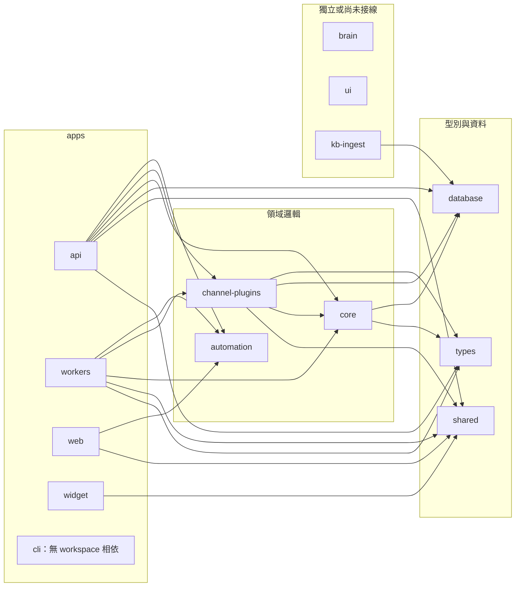
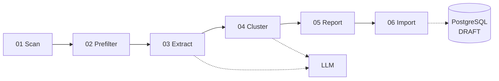

# 應用程式與共用套件

本文件說明 `apps/*`、`packages/*` 的職責及程式碼相依。部署方式請看[部署與執行環境](./DEPLOYMENT.md)。

- **資料來源**：`pnpm-workspace.yaml`、各 `package.json`、各 app 與 package 的進入點

## 應用程式

| app | 技術 | 進入點 | 出貨方式 | 主要 workspace 相依 |
| --- | --- | --- | --- | --- |
| `api` | Fastify 5、Socket.IO | `src/index.ts` | 容器 | `automation`、`channel-plugins`、`core`、`database`、`shared`、`types` |
| `web` | Next.js 15、React 19 | App Router | 容器 | `automation`、`shared` |
| `workers` | BullMQ、ioredis | `src/index.ts` | 容器 | `automation`、`channel-plugins`、`core`、`shared`、`types` |
| `widget` | Vite、socket.io-client | `src/index.ts` | `web` 靜態檔案 | `shared` |
| `cli` | oclif | `src/index.ts` | npm CLI | 無 |
| `video-worker` | 尚未實作 | 無 | 無 | 無 |

### API

`apps/api/src/index.ts` 依序執行四類工作：

1. 驗證權限註冊表。
2. 註冊 Fastify plugins。
3. 註冊渠道外掛。
4. 掛載 `/api/v1` 下的功能路由。


Plugin 註冊順序如下。後面的 plugin 依賴前面的能力。

```text
multipart → cors → errorHandler → prisma → cookie → auth → socket → chatbox
```

大多數功能模組採用三件式結構：

| 檔案 | 職責 |
| --- | --- |
| `<name>.routes.ts` | 宣告路由與 handler |
| `<name>.schema.ts` | 驗證請求與回應結構 |
| `<name>.service.ts` | 執行商業邏輯 |

`plugins/` 提供 Fastify 基礎設施；`guards/` 提供 RBAC 與授權檢查；`lib/` 放租戶資料庫、快取等接線；`services/` 放跨模組服務；`events/` 放程序內 event bus。

API 外掛的封裝模式與請求生命週期請看 [`../API-PLUGIN-ARCHITECTURE.md`](../API-PLUGIN-ARCHITECTURE.md)。

### Workers

`apps/workers` 消費以下 BullMQ 佇列：

| 佇列 | handler | 用途 |
| --- | --- | --- |
| `sla` | `sla.handler.ts` | 輪詢 SLA 逾時並升級 |
| `notification` | `notification.handler.ts` | 送出通知 |
| `automation` | `automation.handler.ts` | 執行自動化規則 |
| `rich-menu-bind` | `rich-menu-bind.handler.ts` | 綁定 LINE Rich Menu |
| `data-erasure` | `data-erasure.handler.ts` | 處理資料刪除請求 |
| `data-export` | `data-export.handler.ts` | 匯出資料 |
| `data-export-cleanup` | `data-export.handler.ts` | 清理過期匯出檔 |

Workers 使用兩條 Redis 連線。一條供 BullMQ 使用；另一條發布 pub/sub 訊息。Workers 無法存取 API 程序的 `fastify.io`，因此透過 `socket:emit` 將 Socket 事件送回 API。

API 中的 `automation.worker.ts` 與 `notification.worker.ts` 只建立 Queue producer，不消費工作。

### Web、Widget 與 CLI

`web` 的 App Router 包含四區：

| 區段 | 使用者 | 主要內容 |
| --- | --- | --- |
| `dashboard/` | 租戶客服與管理員 | Inbox、案件、聯絡人、自動化、行銷、分析、設定 |
| `admin/` | 平台管理者 | 租戶、方案、用量與試用管理 |
| 認證與導流 | 未登入訪客 | Login、Trial、LIFF、LINE Login、Facebook Login |
| 其他 | 特定頁面使用者 | Chatbox、Design Preview |

`web` 執行 `dev` 或 `build` 前，會先同步 Widget 與 PlayCaptcha 的靜態資源。

`widget` 打包為 IIFE 單檔 `widget.js`，由 `web` 的 `/webchat/widget.js` 提供。它是終端訪客使用的 Web Chat，不是客服工作台。

`cli` 提供 `login`、`status`、`apis`、`stats`。CLI 不匯入 workspace package，只透過 HTTP 與 API 溝通。

## 共用套件

| package | 角色 | 主要使用者 |
| --- | --- | --- |
| `types` | 跨層 TypeScript 型別 | API、Workers、Core、渠道外掛 |
| `shared` | 型別、常數、SLA 規則與工具 | API、Workers、Web、Widget、渠道外掛 |
| `database` | 再匯出 Prisma client 與 schema | API、Core、渠道外掛、KB Ingest |
| `core` | 領域服務 | API、Workers、渠道外掛 |
| `automation` | 規則引擎與前後端共用契約 | API、Workers、Web |
| `channel-plugins` | 渠道轉接器 | API、Workers |
| `brain` | 向量檢索與長期記憶 | 尚未接線 |
| `kb-ingest` | 離線知識庫匯入 | 自己的 scripts |
| `ui` | 預留的元件庫 | 尚未接線 |

### 程式碼相依

箭頭表示「A 的 `package.json` 宣告相依 B」。



`types`、`shared`、`database` 與 `automation` 不相依其他 workspace package。`web` 直接匯入 `automation` 的契約，以便顯示規則編輯介面。

### 領域套件摘要

- `core`：Inbox、案件、聯絡人、Canvas、範本、RBAC、身分縫合、Storage、License、Logger、Redis 與 event bus。
- `automation`：包裝 `json-rules-engine`，並定義事件、Facts、Operators、Actions 與 UI 描述。
- `channel-plugins`：提供 LINE、Facebook、WebChat、Telegram 與 Threads 轉接器。LINE 另有專用背景工作。
- `database`：`src/` 是 Prisma 的薄封裝；主要內容位於 `prisma/schema.prisma` 與 migrations。應用程式必須遵守 `AGENTS.md` 的 Prisma client 規則。
- `brain`：包含 LanceDB、BM25、混合檢索、記憶、摘要與語音轉文字服務，目前沒有 app 匯入。
- `ui`：目前只有空匯出。

### KB Ingest 管線

`kb-ingest` 用 `tsx` 直接執行六個階段。只有 Extract 與 Cluster 呼叫 LLM；Import 經人工審核後才寫入資料庫。



元件接線中已知的異常集中在[實作落差與驗證紀錄](./AUDIT.md)。

