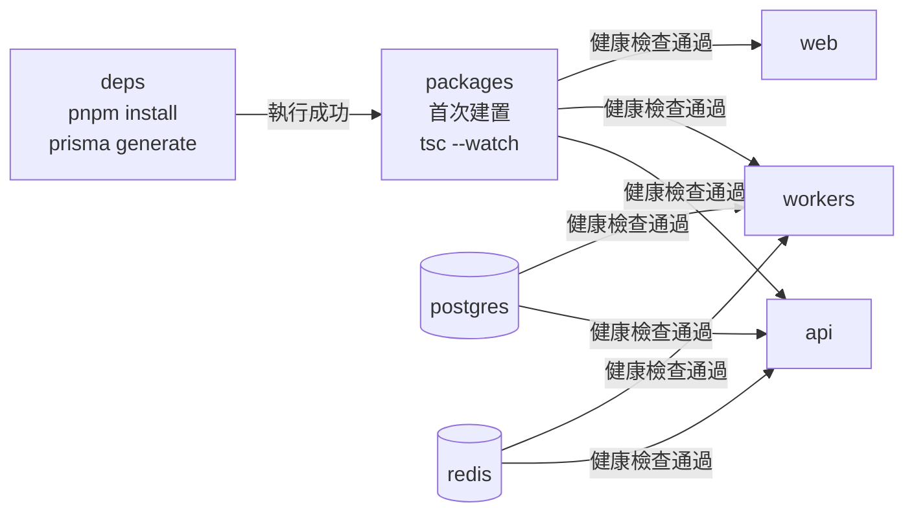

# 部署與執行環境

本文件比較三個 Compose 環境，並說明開發環境特有的啟動流程。

- **資料來源**：`docker-compose*.yml`、`Dockerfile*`、`Caddyfile.local`、Nginx 設定
- **名稱約定**：本機整合環境、開發環境、正式環境的定義見[系統總覽](./README.md)。

## 環境差異

| 項目 | 本機整合環境 | 開發環境 | 正式環境 |
| --- | --- | --- | --- |
| Compose 檔案 | `docker-compose.yml` | `docker-compose.dev.yml` | `docker-compose.prod.yml` |
| 程式碼來源 | 建置進 image | bind mount 主機目錄 | 建置進 image |
| 反向代理 | Caddy | 無 | Nginx + Certbot |
| Ollama | 有 | 無 | 有 |
| 對外 port | 80、3000、3001、5433、6380、9000、9001、11434 | 3000、3001、5433、6380、9000、9001 | 80、443 |
| 主要用途 | 驗證正式建置 | 日常開發 | 部署到伺服器 |

## 服務分布

| 服務 | 本機整合 | 開發 | 正式 | 對外 port |
| --- | --- | --- | --- | --- |
| `postgres` | 有 | 有 | 有 | 5433；正式環境不開放 |
| `redis` | 有 | 有 | 有 | 6380；正式環境不開放 |
| `minio` | 有 | 有 | 有 | 9000、9001；正式環境不開放 |
| `ollama` | 有 | 無 | 有 | 11434；正式環境不開放 |
| `api` | 有 | 有 | 有 | 3001；正式環境不開放 |
| `workers` | 有 | 有 | 有 | 不開放 |
| `web` | 有 | 有 | 有 | 3000；正式環境不開放 |
| `caddy` | 有 | 無 | 無 | 80 |
| `nginx`、`certbot` | 無 | 無 | 有 | 80、443 |
| `deps`、`packages` | 無 | 有 | 無 | 不開放 |

正式環境的服務設定 `restart: unless-stopped`。啟動前，`.env.prod` 必須提供 `DOMAIN` 與 `CERTBOT_EMAIL`。

## 開發環境啟動鏈

開發環境增加 `deps` 與 `packages`。這兩個服務不提供產品功能，只負責準備相依套件與編譯輸出。



### `deps`

`deps` 在容器完成掛載後執行：

```bash
pnpm install --frozen-lockfile
pnpm --filter @open333crm/database exec prisma generate
```

開發環境需要這個服務，原因有二：

1. Repo 的 bind mount 會遮蔽 image 內的 `/app`。巢狀 `node_modules` volume 無法取得 image 原有的依賴。
2. macOS 主機與 Linux 容器不能共用 `esbuild`、Prisma engine、`next-swc` 等平台專屬檔案。

`Dockerfile.dev` 在建置時用 `--ignore-scripts` 預先填入 pnpm store。store 位於 `/app` 外，不會被 bind mount 遮蔽。`deps` 可以從 store 建立連結，減少後續啟動時間。

### `packages`

`packages` 先按相依順序建置，再啟動 watch mode：

```bash
pnpm -r --filter './packages/*' build
pnpm -r --parallel --filter './packages/*' run dev
```

健康檢查等待以下輸出：

```text
packages/core/dist/index.js
packages/shared/dist/index.js
packages/types/dist/index.js
```

`api` 與 `workers` 的 `tsx watch` 會在 package 輸出改變後重新載入。`web` 使用 Next.js Fast Refresh。

`database` 有 `build`，但沒有 `dev`；修改 `packages/database/src` 後，開發者必須手動重建或重啟 `packages`。`kb-ingest` 以 `tsx` 執行原始碼，不產生 `dist`。

本機整合與正式環境在 image build 階段已完成依賴安裝及 package 編譯，因此不需要 `deps` 與 `packages`。

## 反向代理

本機整合環境的 Caddy 路由如下：

| 路徑 | 目標 |
| --- | --- |
| `/api/*`、`/mcp`、`/socket.io/*`、`/s/*` | `api:3001` |
| `/webchat/*` | `web:3000` |
| 其他路徑 | `web:3000` |

正式環境改用 Nginx。Nginx entrypoint 讀取 `nginx.conf.template` 產生設定，Certbot 負責申請與續約 Let's Encrypt 憑證。

## 與早期設計稿的差異

`docs/02_SYSTEM_ARCHITECTURE.md` 的 Compose 服務清單是規劃稿。現在的實作有四項主要差異：

1. 現在只有一個 `workers` 容器，不再分成三種 worker 容器。
2. 本機整合與正式環境加入 Ollama。
3. `widget` 由 `web` 提供靜態檔案，不是獨立服務。
4. 本機整合環境使用 Caddy；正式環境使用 Nginx 與 Certbot。

具體的設定問題與執行時驗證結果集中在[實作落差與驗證紀錄](./AUDIT.md)。

