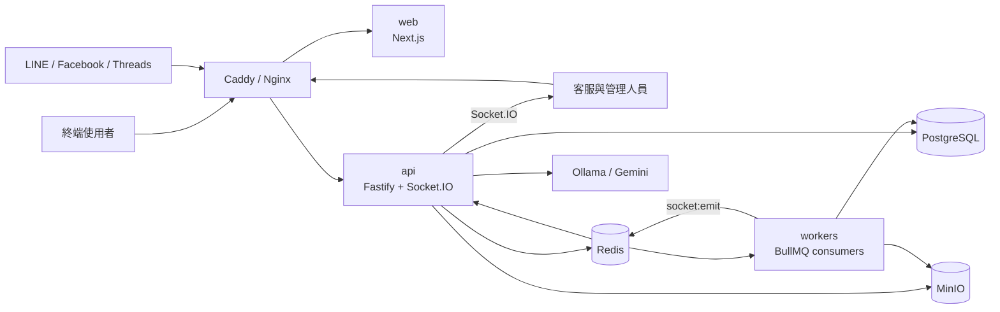
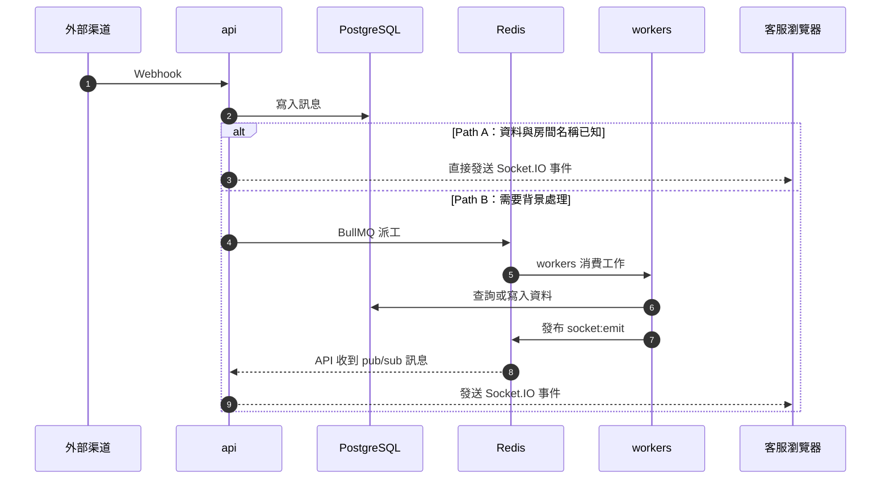

# open333CRM 系統總覽

本目錄描述 open333CRM 目前的實作。內容以原始碼、Compose 設定與各套件的 `package.json` 為準，不代表未完成的設計規劃。

## 先理解三件事

1. `web` 提供客服與平台管理介面，`api` 處理 HTTP、Webhook 與 Socket.IO。
2. `api` 處理同步請求；需要背景查詢或副作用時，`api` 透過 Redis 將工作交給 `workers`。
3. PostgreSQL 儲存主資料；Redis 同時負責 BullMQ、快取與 Socket 事件轉送；MinIO 儲存檔案。

## 系統執行圖

箭頭表示主要請求、資料或事件流向。這張圖不表示 package 的程式碼相依。

## 核心元件

| 元件 | 職責 | 執行形式 |
| --- | --- | --- |
| `apps/api` | API、Webhook、認證、Socket.IO、Queue producer | 容器 |
| `apps/web` | 客服工作台、平台後台、WebChat 靜態資源 | 容器 |
| `apps/workers` | 消費背景工作，透過 Redis 發布 Socket 事件 | 容器 |
| `apps/widget` | 終端訪客使用的 Web Chat 元件 | 由 `web` 提供靜態檔案 |
| `apps/cli` | 透過 HTTP 操作 open333CRM | npm CLI |
| `packages/*` | 共用型別、資料存取與領域邏輯 | 由 apps 匯入 |
| PostgreSQL | 主資料、向量資料與租戶隔離 | 基礎設施容器 |
| Redis | BullMQ、快取與 pub/sub | 基礎設施容器 |
| MinIO | S3 相容物件儲存 | 基礎設施容器 |
| Ollama | 本地 Chat 與 Embedding 模型 | 部分環境使用的容器 |

## 兩條 Socket 事件路徑

API 已持有資料及房間名稱時，直接發送 Socket.IO 事件。需要查詢收件者、執行副作用或處理背景工作時，API 將工作交給 `workers`。

`eventBus` 是 API 程序內的 EventEmitter，不會跨程序。`workers` 無法存取 `fastify.io`，因此必須透過 Redis pub/sub 將事件送回 API。

## 三種執行環境

| 名稱 | Compose 檔案 | 用途 |
| --- | --- | --- |
| 本機整合環境 | `docker-compose.yml` | 在本機用正式建置驗證整套系統 |
| 開發環境 | `docker-compose.dev.yml` | 以 bind mount 與 watch mode 進行日常開發 |
| 正式環境 | `docker-compose.prod.yml` | 透過 Nginx 與 TLS 部署到伺服器 |

三個環境不能互相取代。詳細差異與啟動順序請看[部署與執行環境](./DEPLOYMENT.md)。

## 深入閱讀

| 文件 | 適合解答的問題 |
| --- | --- |
| [部署與執行環境](./DEPLOYMENT.md) | 三個 Compose 檔案有什麼差異？開發容器如何啟動？ |
| [應用程式與共用套件](./COMPONENTS.md) | 每個 app 與 package 負責什麼？彼此如何相依？ |
| [基礎設施與外部整合](./INFRASTRUCTURE.md) | PostgreSQL、Redis、MinIO、LLM 與渠道如何接線？ |
| [開發與交付](./DELIVERY.md) | 專案如何建置、測試、執行 CI 及部署？ |
| [實作落差與驗證紀錄](./AUDIT.md) | 哪些實作與設定不一致？哪些問題已在執行時重現？ |

資料表關聯請看 [`../DATABASE-ERD.md`](../DATABASE-ERD.md)。API 外掛模式請看 [`../API-PLUGIN-ARCHITECTURE.md`](../API-PLUGIN-ARCHITECTURE.md)。開發規則請看 [`../../../AGENTS.md`](../../../AGENTS.md)。

