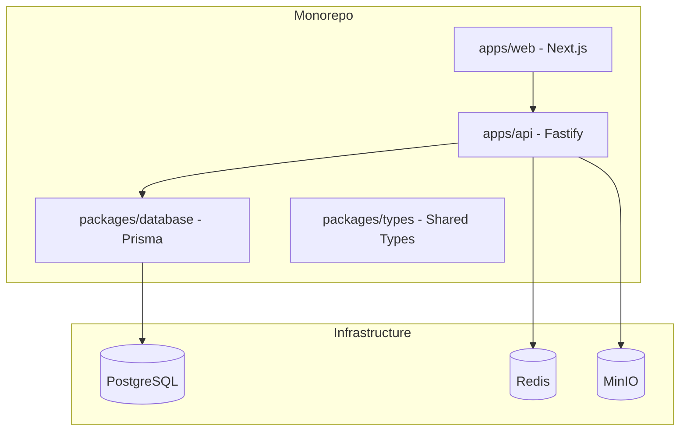

## Overview

The infrastructure setup establishes a modern **Monorepo** foundation using `pnpm` workspaces and `Turborepo`. This allows for a clean separation between the Backend (Fastify), Frontend (Next.js), and shared packages (Prisma Client, shared types). The entire environment is containerized using Docker Compose to ensure consistency across development, staging, and production.

## Architecture



- **Task Orchestration**: Turborepo manages parallel execution of `dev`, `build`, and `lint` tasks.
- **Shared packages**: `packages/database` exports the generated Prisma client to be used by both `apps/api` and potentially `apps/web` (for server components).

## Data Model

The core schema is defined in `packages/database/prisma/schema.prisma`:

```prisma
model Contact {
  id        String   @id @default(uuid())
  name      String?
  createdAt DateTime @default(now())
  updatedAt DateTime @updatedAt
  messages  Message[]
}

model Conversation {
  id        String   @id @default(uuid())
  contactId String
  contact   Contact  @relation(fields: [contactId], references: [id])
  messages  Message[]
}

model Message {
  id             String       @id @default(uuid())
  content        String
  conversationId String
  conversation   Conversation @relation(fields: [conversationId], references: [id])
  contactId       String
  contact         Contact      @relation(fields: [contactId], references: [id])
}

model Case {
  id        String   @id @default(uuid())
  status    String   // open, in_progress, resolved, closed
  createdAt DateTime @default(now())
}
```

## Interfaces

- **Backend (API)**: Fastify server exposed at `localhost:3001`.
- **Frontend (Web)**: Next.js server exposed at `localhost:3000`.
- **Design System**: `shadcn/ui` components located in `apps/web/components/ui`.

## User Flow

1. **Development**: Developer runs `pnpm dev`.
2. **Setup**: Turbo starts Docker Compose, runs Prisma migrations, and starts dev servers.
3. **Access**: Developer accesses `http://localhost:3000` to see the admin dashboard.

## Failure Modes

- **Database Unreachable**: API service will fail to start or return 500. Handled by Fastify error hooks and container restart policies.
- **Docker Compose Failure**: Local development cannot start. Requires Docker Desktop/Daemon to be running.
- **Monorepo Link Issues**: `pnpm install` must be run at the root to ensure workspace links are established.
